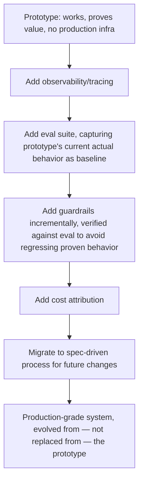
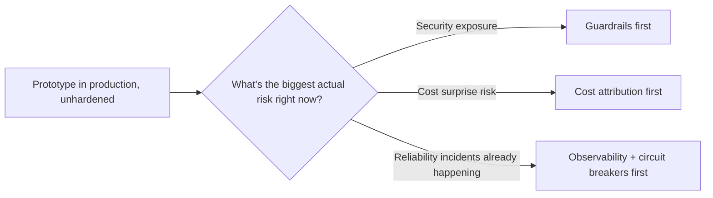

A prototype agent — built fast to prove product value, with none of the infrastructure covered across this blog's series on guardrails, evaluation, or infrastructure — succeeding well enough to justify real investment creates a specific temptation: throw it away and rewrite properly from scratch, now that the requirements and value are proven. This is usually the wrong call. The proven business logic and prompt behavior the prototype embodies has real value that a full rewrite risks losing or subtly changing, and there's a more incremental path that preserves it.

## Incremental Hardening Instead of a Rewrite



The key insight: capture the prototype's *current* behavior as the eval baseline before making any hardening changes, the same current-behavior-spec discipline from the legacy migration posts earlier in this blog, applied here to a prototype rather than a legacy system. This makes every subsequent hardening step measurable against "did this preserve what was working," rather than hardening changes silently altering behavior that was actually part of what made the prototype successful in the first place.

## Why a Rewrite Risks More Than It Seems To

```python
def capture_prototype_baseline(prototype_agent, sample_size: int = 200) -> list[dict]:
    """Before any hardening work begins — this becomes the regression baseline."""
    production_samples = sample_recent_production_interactions(prototype_agent, sample_size)
    return [
        {"input": s["input"], "output": s["output"], "user_reaction": s.get("feedback")}
        for s in production_samples
    ]
```

A rewrite, even a well-intentioned one, tends to "improve" things along the way — cleaner prompts, more principled architecture — and each individual improvement can subtly shift behavior in ways that weren't the point of the rewrite but happen anyway. Without a captured baseline to check against, there's no way to know whether the rewritten system actually preserves what made the prototype work until it's already in production and users start noticing something feels different, at which point the specific cause is hard to isolate from a full rewrite's worth of simultaneous changes.

## Prioritize Hardening Steps by Actual Risk, Not by a Fixed Order



The ordering in the incremental hardening diagram above is a reasonable default, not a fixed sequence — if the prototype is already causing cost surprises or reliability incidents, address the most acute actual risk first rather than following hardening steps in a generic order that doesn't reflect what's actually hurting right now.

## Communicate This as Evolution, Not Rebuild, to Stakeholders

Framing this work internally as "hardening the proven system" rather than "rebuilding it" matters for more than morale — it sets the right expectation that behavior should stay largely consistent throughout the process (checkable against the baseline), rather than stakeholders anticipating a wholesale change in how the system behaves, which a genuine rewrite would imply and an incremental hardening process specifically avoids.

## Key Takeaways

1. **A full rewrite risks losing the proven behavior that made the prototype succeed in the first place** — usually not worth the risk
2. **Capture the prototype's current behavior as an eval baseline before any hardening work begins**, the same discipline as legacy migration current-behavior specs
3. **Every hardening step should be checkable against that baseline** — did this preserve what was working, not just did this add the intended new capability
4. **Prioritize hardening steps by actual current risk**, not a generic fixed order — address what's actually hurting first

---

*Part of the [Scaling AI Engineering series](/tags/scaling-ai-series/) — running agentic systems responsibly once they're past the prototype stage.*
