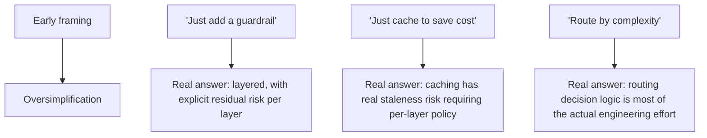

Six months of daily posts across agentic architecture, RAG, agent skills, evaluation, guardrails, spec-driven development, agent infrastructure, and now security and cost at scale. Ahead of the final two posts closing out this series, this is the honest look back — not a highlight reel, but what actually held up under real operation versus what the early posts got wrong or oversimplified.

## What Held Up Consistently

**Layered defense, as a general principle** — first argued for guardrails specifically, it turned out to be the right mental model for nearly everything in the later security and reliability posts: no single check, however well-built, is sufficient alone. This wasn't specific to guardrails; it was a property of defending against any sufficiently adversarial or unpredictable input.

**Attribution before optimization** — cost attribution, eval-category breakdown, per-tool retry policy: in every case, knowing *where* a problem actually lived, specifically, mattered more than any specific optimization technique. Teams that skipped attribution and optimized based on intuition consistently spent effort on the wrong things.

**The model decides, infrastructure enforces** — the throughline from the agent infrastructure series: keep the model responsible for reasoning about *what* to do, and keep deterministic code responsible for *how* it's done safely (credentials, idempotency, rate limits, circuit breakers). Every case where this boundary blurred — letting the model influence a security-relevant decision — was a source of risk.

## What the Early Posts Oversimplified

The pattern across all three: early posts in a topic area tend to state the intuitive version of an idea, and later posts (often written after the intuitive version had already been tried and found wanting) supply the actual nuance. This is probably unavoidable for any blog written as understanding develops in real time rather than after the fact — worth naming explicitly rather than pretending the early framing was complete when it wasn't.

## The Biggest Genuine Surprise

The consistent thread connecting security, cost, and reliability turned out to be less about any specific technique and more about **visibility as a prerequisite for everything else** — you can't secure, evaluate, cost-optimize, or reliably scale a system you can't see the trajectory of. Nearly every "what went wrong" case study across this series traced back to a visibility gap (no eval coverage for a case, no cost attribution for a spend category, no audit trail for an action) more often than a technique gap. This wasn't the framing at the start of this series and became unavoidable by the end of it.

## What's Left for the Final Post

The next and final post in this series closes the loop explicitly — from the [very first post's architecture questions](/posts/from-chatbot-to-agent-architecture/) in April to where a mature platform actually stands six months later, and what a maturity self-assessment for a team reading this in one sitting should actually look like.

## Key Takeaways

1. **Layered defense, attribution before optimization, and the model-decides/infrastructure-enforces boundary held up as consistently correct across every domain this series touched**
2. **Early posts in any topic area tended to oversimplify** before the actual complexity showed up in later posts — probably unavoidable when writing as understanding develops
3. **Visibility (eval coverage, cost attribution, audit trails) was the recurring prerequisite behind nearly every "what went wrong" case study**, more than any specific missing technique
4. **The pattern connecting six months of posts: name the intuitive version early, supply the real nuance once it's actually been tested against production reality**

---

*Part of the [Scaling AI Engineering series](/tags/scaling-ai-series/) — running agentic systems responsibly once they're past the prototype stage.*
