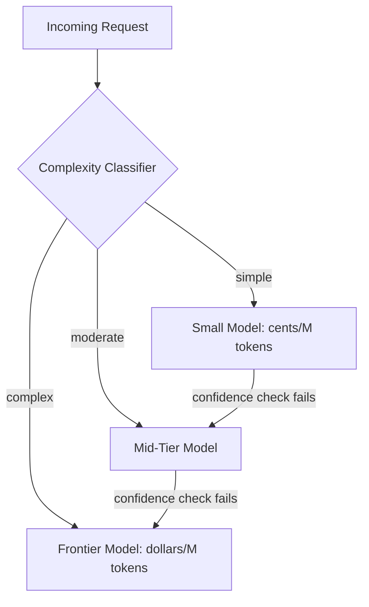

The TokenOps post covered visibility and attribution — knowing where the money goes. This post covers the single highest-leverage lever for actually reducing it: **model routing**, the practice of dynamically choosing which model handles a given request based on how complex that request actually is, rather than sending everything to the same model by default.

## The Economics That Make This Worth Doing

The cost differential between a frontier model and a small, efficient one runs to roughly 100–300x on a per-token basis — a gap wide enough that even a modest fraction of traffic routed to a cheaper tier moves the aggregate bill meaningfully. Organizations running systematic routing report 40–85% cost reductions with no visible quality loss, because the insight routing exploits is simple: **most requests don't need the most capable model available.** A classification task, a simple lookup-and-format response, or a well-defined narrow agent step doesn't benefit from frontier-model reasoning the way a genuinely ambiguous or multi-step task does — it just costs more to answer the same way.



## Building a Complexity Classifier

The routing decision itself needs to be cheap — if classifying which model to use costs as much as just calling the expensive model, the whole exercise is pointless. A lightweight classifier, often a small model itself or even a simple heuristic, handles this:

```python
import re

def classify_complexity(query: str, context: dict) -> str:
    # Heuristic signals that correlate with needing a stronger model
    signals = {
        "multi_step": len(re.findall(r"\band\b|\bthen\b", query, re.I)) >= 2,
        "long_context_required": context.get("retrieved_docs_count", 0) > 5,
        "ambiguous_phrasing": query.count("?") > 1 or len(query.split()) > 40,
        "high_stakes_category": context.get("category") in {"legal", "financial", "medical"},
    }

    if signals["high_stakes_category"]:
        return "frontier"  # never route high-stakes categories to a cheaper tier by heuristic alone
    if signals["multi_step"] or signals["long_context_required"]:
        return "mid"
    if signals["ambiguous_phrasing"]:
        return "mid"
    return "small"
```

Note the explicit carve-out for high-stakes categories — routing is a cost optimization for the bulk of ordinary traffic, not a blanket policy applied without regard for what's actually at stake if the cheaper model gets it wrong.

## Cascades: Escalate on Low Confidence, Don't Pre-Judge Everything

A pure classify-then-route approach fails when the classifier itself misjudges a request's difficulty. A cascade adds a safety net: start cheap, and escalate automatically if the cheap model's own response signals low confidence, rather than trusting the upfront classification alone:

```python
def cascade_call(query: str, context: dict) -> dict:
    small_response = call_model("small-tier-model", query, context)

    if small_response.confidence >= CONFIDENCE_THRESHOLD:
        return {"response": small_response.text, "model_used": "small", "escalated": False}

    mid_response = call_model("mid-tier-model", query, context)
    if mid_response.confidence >= CONFIDENCE_THRESHOLD:
        return {"response": mid_response.text, "model_used": "mid", "escalated": True}

    frontier_response = call_model("frontier-model", query, context)
    return {"response": frontier_response.text, "model_used": "frontier", "escalated": True}
```

A well-implemented cascade that routes the bulk of queries to the cheap tier while escalating the genuinely hard ones is what production teams cite getting the 80%+ cost reductions — the escalation path is what keeps quality from dropping on the requests that actually needed the stronger model.

## Where Small Language Models Fit

For narrow, well-defined agent steps — classification, structured extraction, a single tool-call decision — small language models (typically in the 1B–14B parameter range) are increasingly the right default rather than a compromise. They cost cents rather than dollars per million tokens, respond in tens of milliseconds rather than hundreds, and for a multi-agent system built from several narrow, specialized steps, a set of small models each handling one step reliably tends to be cheaper, faster, and easier to debug than routing every step through one frontier-model call:

```python
AGENT_STEP_MODELS = {
    "classify_intent": "small-tier-model",       # narrow, well-defined
    "extract_structured_fields": "small-tier-model",  # narrow, well-defined
    "draft_response": "mid-tier-model",           # needs more nuance
    "handle_escalation": "frontier-model",        # genuinely open-ended reasoning
}

def get_model_for_step(step_name: str) -> str:
    return AGENT_STEP_MODELS.get(step_name, "mid-tier-model")
```

This is a genuinely different design decision than routing — it's choosing the model per *agent step*, based on what that step actually requires, rather than per *request* based on overall complexity. Most production systems benefit from combining both: route the overall request, and within a multi-step agent trajectory, assign a model per step according to what that specific step needs.

## Semantic Caching: The Other Half of the Lever

Routing controls which model answers a query; semantic caching controls whether you need to call a model at all. For queries that are semantically similar to ones already answered — not identical, but close enough that the cached answer is still correct — a cache hit costs nothing:

```python
def get_cached_or_call(query: str, context: dict, similarity_threshold: float = 0.95) -> dict:
    cached = semantic_cache.find_similar(query, threshold=similarity_threshold)
    if cached:
        return {"response": cached.response, "cache_hit": True, "cost": 0}

    result = cascade_call(query, context)
    semantic_cache.store(query, result["response"])
    return {**result, "cache_hit": False}
```

The similarity threshold is the parameter to tune carefully — too loose, and semantically different queries return a stale, wrong cached answer; too tight, and the cache rarely hits. Start conservative (high threshold) and loosen it only after measuring that near-misses genuinely produce equivalent answers for your specific query distribution.

## Measuring Whether Routing Actually Held Quality

The whole point of routing is that it shouldn't cost you quality — which means it needs the same evaluation discipline as anything else in this blog's [evaluation series](/posts/evaluating-agent-skills-framework/). Run your golden eval set through the routed system and compare against the frontier-only baseline before declaring the routing policy safe to ship:

```python
def evaluate_routing_quality_delta(golden_set: list[dict], routed_system, frontier_baseline) -> dict:
    routed_results = [routed_system.invoke(item["input"]) for item in golden_set]
    baseline_results = [frontier_baseline.invoke(item["input"]) for item in golden_set]

    routed_score = score_against_golden_set(routed_results, golden_set)
    baseline_score = score_against_golden_set(baseline_results, golden_set)

    return {
        "routed_score": routed_score,
        "baseline_score": baseline_score,
        "quality_delta": routed_score - baseline_score,
        "cost_savings": estimate_cost_savings(routed_results, baseline_results),
    }
```

## Key Takeaways

1. **Most requests don't need the most capable model** — the 100-300x cost gap between tiers is the leverage point, and routing exploits it directly
2. **Cascade on low confidence rather than trusting classification alone** — the escalation path is what keeps quality from dropping on genuinely hard requests
3. **Carve out high-stakes categories explicitly** — routing is a cost optimization for ordinary volume, not a blanket policy regardless of what's at stake
4. **Assign small models per agent step for narrow, well-defined work**, distinct from routing per request — most systems benefit from combining both
5. **Measure the quality delta against a frontier-only baseline before shipping** — the goal is cost reduction with no visible quality loss, and that has to be verified, not assumed

The final post in this series steps back from any single technique to ask the broader question a lead engineer actually needs answered — where does your team's AI engineering practice actually stand?

---

*Part of the [Scaling AI Engineering series](/tags/scaling-ai-series/) — running agentic systems responsibly once they're past the prototype stage.*
