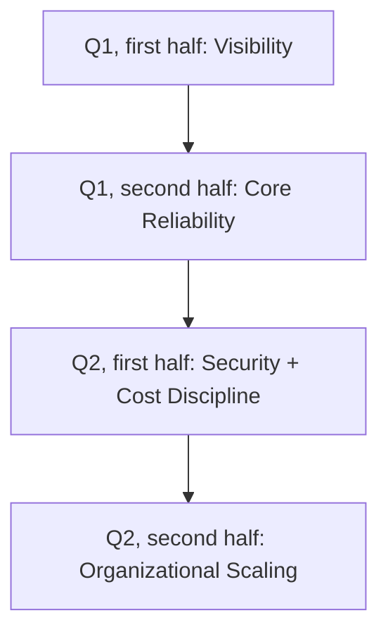
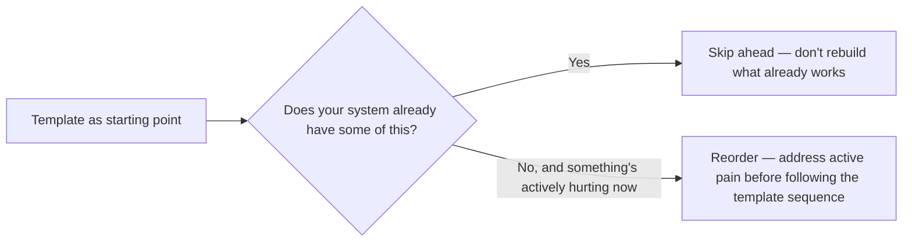

Six months of posts across this blog cover a lot of ground a single platform team can't tackle simultaneously. This is a practical roadmap template — synthesizing the maturity checkpoints from across the series into a sequenced two-quarter plan — for a team that's read all of this and needs to decide what to actually prioritize first.

## The Sequencing Logic



This ordering follows directly from the retrospective's biggest finding: visibility is the prerequisite for everything downstream. Building security or cost controls before you can see what's actually happening produces controls calibrated on guesswork rather than observed reality — the same mistake the SLO-setting post warned against, applied to an entire roadmap.

## Quarter 1, First Half: Visibility

```markdown
- [ ] Request-level logging: retrieved context, tool calls, not just final answer
- [ ] Cost attribution: per-team, per-feature tagging enforced at the gateway
- [ ] Basic tracing across agent/tool/MCP boundaries
- [ ] Golden eval dataset: initial 50-100 cases, sourced from production sampling
```

## Quarter 1, Second Half: Core Reliability

```markdown
- [ ] Circuit breakers on external tool calls
- [ ] Idempotency for write-operation tools
- [ ] SLOs set from measured Q1H1 baseline, not aspirational guessing
- [ ] On-call runbook covering quality-regression triage
```

## Quarter 2, First Half: Security + Cost Discipline

```markdown
- [ ] Threat model completed, agent-specific categories included
- [ ] Layered guardrails: input classification, output validation, at minimum
- [ ] Cost anomaly detection wired to the Q1 attribution data
- [ ] First red-team exercise, findings converted to regression tests
```

## Quarter 2, Second Half: Organizational Scaling

```markdown
- [ ] Platform team scope defined (if not already), or governance council
      stood up if platform maturity warrants it
- [ ] Chargeback model designed, if cost attribution data supports it
- [ ] Production-readiness checklist formalized and applied to next launch
- [ ] Capacity planning model updated to compute-equivalent units
```

## Adapt the Template, Don't Follow It Blindly



This is a starting shape, not a mandate — a team that already has solid observability but zero cost attribution should skip the parts they've already solved and prioritize the actual gap, and a team facing an active security or reliability incident right now should address that before continuing to follow a generic sequence that doesn't reflect their actual current risk.

## Revisit the Roadmap Each Quarter

Following the periodic-review discipline argued for throughout this series — for SLOs, for buy-vs-build decisions, for eval datasets — this roadmap itself should be revisited each quarter against what was actually learned, not treated as a fixed plan set once and executed unchanged regardless of what the visibility work from Q1 actually revealed.

## Key Takeaways

1. **Sequence around the retrospective's core finding: visibility before security/cost controls, or those controls get calibrated on guesswork**
2. **Each quarter's work is designed to inform the next** — SLOs come from measured reliability data, not the reverse
3. **Adapt the template to actual current state and active pain** — it's a starting shape, not a mandate to follow blindly regardless of context
4. **Revisit the roadmap itself each quarter**, incorporating what was actually learned rather than executing a fixed plan unchanged

---

*Part of the [Scaling AI Engineering series](/tags/scaling-ai-series/) — running agentic systems responsibly once they're past the prototype stage.*
