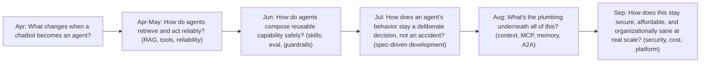
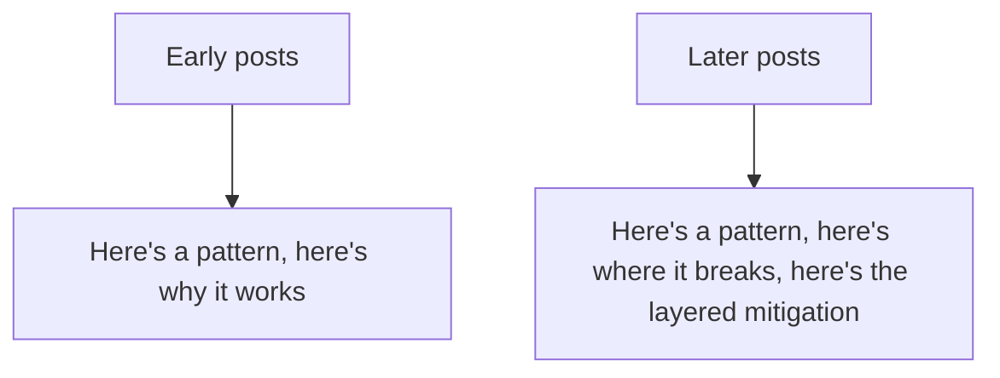

This blog's very first post, back in April, asked what changes in architecture going from a chatbot to an agent. Six months and over 180 posts later, this traces the direct line from that opening question to everything that followed — not a full recap, but the specific thread connecting where this started to where it ends, one day before the closing maturity-model post.

## The Thread, Traced

Each stage's questions were only askable once the previous stage's questions had reasonably good answers — you can't meaningfully ask "how does this stay affordable at scale" before you have the attribution infrastructure from the "plumbing" stage, and you can't design that plumbing sensibly before you know, from the reliability stage, what actually needs to be reliable and why.

## The Architecture Question, Answered With Six Months of Hindsight

The opening post's question — what changes going from chatbot to agent — has a more complete answer now than it did in April: not just "the system can now take actions," but everything that actually taking actions safely and reliably requires — the tool-call reliability patterns, the guardrail layers, the spec discipline keeping behavior intentional, the infrastructure making cross-system and cross-organization action trustworthy, and the security and cost discipline that makes running all of it at real scale sustainable rather than a slowly-accumulating liability.

## What Changed in How This Blog Approached the Topic

The retrospective two posts ago named this directly — early posts tended toward the clean, intuitive version of an idea; later posts supplied the nuance that only showed up once the clean version had actually been tried against real, messy production conditions. Reading the series start to end reflects that arc directly, which is itself a useful thing for a reader to know going in: the early posts are a reasonable starting mental model, not the complete picture the later posts eventually build toward.

## One Thing Worth Stating Plainly Before Tomorrow's Close

Nothing in this series claims to be a complete or final answer — the field this blog covers changes fast enough that some of what's written here will need revision within the next six months, the same way the early April posts needed the nuance the later ones supplied. The maturity model closing this series out tomorrow is explicitly a snapshot and a self-assessment tool, not a claim that any system reaching its top stage is "done."

## Key Takeaways

1. **Each stage of this six-month series only became askable once the previous stage had reasonably good answers** — the sequence wasn't arbitrary
2. **The opening architecture question has a fuller answer now**: not just "agents take actions," but everything safe, reliable action at scale actually requires
3. **Early posts in this series were intentionally the simple starting model; later posts supplied the real-world nuance** — that arc is itself worth knowing as a reader
4. **Nothing here is final** — treat this series as a snapshot of current best understanding, not a permanently complete answer

---

*Part of the [Scaling AI Engineering series](/tags/scaling-ai-series/) — running agentic systems responsibly once they're past the prototype stage.*
