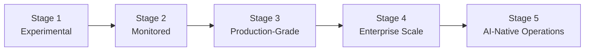

This series has covered [agentic security](/posts/owasp-agentic-ai-top-10-field-guide/), [memory poisoning defense](/posts/defending-memory-context-poisoning/), [cost visibility](/posts/tokenops-finops-llm-agent-cost-management/), and [model routing](/posts/model-routing-cascades-cutting-llm-costs/) — on top of the [infrastructure series](/tags/agent-infra-series/) before it on context, protocols, and memory. The natural question a lead engineer actually needs answered isn't "did we cover topic X," it's **where does our team actually stand**, across all of it. That's what a maturity model is for, and it's the right note to close both series on.

## The Five Stages

**Stage 1 — Experimental.** Manual prompt testing, no structured observability, no cost attribution. This is the vibe-coded-prototype stage from [earlier this year's Spec-Driven Development series](/posts/vibe-coding-vs-spec-driven-development/) — appropriate for exploring an idea, not for anything with real users depending on it.

**Stage 2 — Monitored.** Basic log aggregation exists — latency and error-rate dashboards are up, but evaluation is still ad hoc and cost is tracked in aggregate at best, not attributed per feature.

**Stage 3 — Production-Grade.** Automated evaluation pipelines run in CI, embedding-based drift detection catches quality regressions before users report them, guardrails from the [OWASP field guide](/posts/owasp-agentic-ai-top-10-field-guide/) are implemented and tested, and agentic observability — full trajectory tracing, not just request/response logging — is standard.

**Stage 4 — Enterprise Scale.** Automated fine-tuning or continuous improvement pipelines feed back from production data, cost optimization (routing, caching, the practices from [the model routing post](/posts/model-routing-cascades-cutting-llm-costs/)) runs across the organization rather than per-team, and A/B testing frameworks let teams validate changes against real traffic before full rollout.

**Stage 5 — AI-Native Operations.** LLMOps is fully integrated into the software development lifecycle — self-healing systems and continuous evaluation drive automatic updates, and the distinction between "the AI system" and "the software system" has mostly dissolved.

Very few organizations are honestly at Stage 5 today, and that's fine — the value of the model isn't reaching the top, it's knowing precisely where you are and what the next concrete step looks like, rather than a vague sense that you should be doing more.

## Self-Assessment Checklist

Score your own systems honestly against each of these — the gap between where you *think* you are and where a specific checklist item says you are is usually where the actual risk lives:

| Capability                                        | Stage 2 | Stage 3 | Stage 4 |
| ------------------------------------------------- | :-----: | :-----: | :-----: |
| Latency/error dashboards exist                    |    ✅    |    ✅    |    ✅    |
| Full agent trajectory tracing (not just req/resp) |    ❌    |    ✅    |    ✅    |
| Automated eval suite gates CI                     |    ❌    |    ✅    |    ✅    |
| Cost attributed per feature/team                  |    ❌    | Partial |    ✅    |
| Model routing implemented and quality-verified    |    ❌    | Partial |    ✅    |
| Guardrails tested against an adversarial test set |    ❌    |    ✅    |    ✅    |
| Memory writes tracked with provenance             |    ❌    | Partial |    ✅    |
| Cost circuit breakers, not just alerts            |    ❌    |    ❌    |    ✅    |
| Continuous fine-tuning from production feedback   |    ❌    |    ❌    |    ✅    |

The most common honest result: a team scores solidly at Stage 3 on the practices that got attention recently (whatever the last incident forced them to fix) and Stage 1 on everything else. Maturity isn't uniform by default — it's uniform only when someone deliberately makes it so.

## Why 40% of Agentic Projects Get Cancelled

Industry analysis puts the agentic-AI project cancellation rate over the next couple of years at above 40%, and unclear ROI or inadequate governance are the recurring causes cited — which, read against this maturity model, tracks: a project stuck at Stage 1 or 2 has no reliable way to demonstrate the ROI it's actually delivering, because it has no automated evaluation pipeline generating that evidence, and no cost attribution showing what it costs to generate it. The projects that survive scrutiny are disproportionately the ones that invested in Stage 3 observability and evaluation early, not the ones that shipped the flashiest initial demo.

## Prioritizing the Climb

Not every capability in the checklist is equally urgent, and the honest prioritization for a team that's mostly at Stage 2 looks like this:

1. **Agentic observability first** — you cannot improve, secure, or cost-optimize what you can't see. Full trajectory tracing is the prerequisite for almost everything else on the list.
2. **Automated evaluation gating CI second** — this is what turns "we think it's working" into a number, and it's the evidence base that protects a project from the cancellation risk above.
3. **Cost attribution and guardrail testing in parallel** — neither depends on the other, and both are cheap relative to the risk they mitigate.
4. **Routing, continuous fine-tuning, and org-wide cost optimization last** — these are genuine Stage 4 capabilities, and investing in them before Stage 3 observability exists means optimizing a system you can't yet properly measure.

## Key Takeaways

1. **Maturity is specific, not a vibe** — score against concrete capabilities, not a general sense of "we're doing pretty well with AI"
2. **Teams are rarely uniform across the checklist** — recent incidents shape which practices get attention; deliberate assessment is what catches the rest
3. **Observability is the prerequisite for almost everything else** — you can't secure, evaluate, or cost-optimize a system you can't see the trajectory of
4. **The projects surviving the ~40% cancellation rate are the ones with evaluation evidence**, not the ones with the best initial demo
5. **Climb in order** — observability, then evaluation gating, then cost/guardrail parity, then the Stage 4 organization-wide practices

This closes out both the [Agent Infrastructure](/tags/agent-infra-series/) and [Scaling AI Engineering](/tags/scaling-ai-series/) series — from the plumbing that makes agents work, through the security and cost discipline that makes them trustworthy to run at real scale.

---

*Part of the [Scaling AI Engineering series](/tags/scaling-ai-series/) — running agentic systems responsibly once they're past the prototype stage.*
