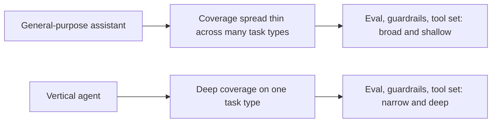

A year into serious enterprise agent deployment, the pattern is consistent enough to state plainly: the agentic systems actually delivering value are not general-purpose assistants that can do anything reasonably well. They're narrow tools built for one specific job — support ticket triage, sales research, procurement document processing, IT operations — that do that one job very well, with the general-purpose assistant framing increasingly reserved for demos rather than production deployments.

## Why "Does Everything" Loses to "Does One Thing Reliably"

A general-purpose assistant's tool set, guardrails, and evaluation coverage all have to span an open-ended range of possible tasks — which means each individual task gets a thinner slice of that coverage than a narrow agent built specifically for it. A procurement agent's guardrails can be written knowing exactly what a procurement request looks like; a general assistant's guardrails have to anticipate procurement, HR, engineering, and everything else at once, with correspondingly less depth on any one of them.



## The Metric Shift That Explains This

Enterprises evaluating agents in 2026 increasingly measure execution outcomes — did the support loop close, did the document get routed and reconciled correctly, did the procurement request actually complete — rather than how capable or articulate the agent sounds in conversation. A narrow agent's success is directly measurable against a specific business process; a general assistant's "helpfulness" is a much softer, harder-to-attribute signal that doesn't map cleanly to a dollar figure a business stakeholder can point to.

```python
# The question that actually gets asked in a vendor evaluation now
def evaluate_agent_candidate(agent, business_process: str) -> dict:
    return {
        "task_completion_rate": measure_against(agent, business_process),
        "human_escalation_rate": measure_escalations(agent, business_process),
        "time_to_resolution_vs_baseline": compare_to_manual_process(agent, business_process),
        # Notably absent: "how good does it sound in conversation"
    }
```

## This Doesn't Mean Multi-Agent Systems Are Going Away

Narrow doesn't mean isolated — the orchestration layer (covered in the next post in this series) is exactly what lets several narrow, vertical agents combine into something that handles a broader workflow, without any single agent needing to become a generalist. A support-triage agent, a sales-research agent, and a procurement agent can each stay narrow and still compose into a broader automated pipeline through an orchestration layer that routes between them.

## What This Means for Teams Building Agents Now

The temptation to build a broad, flexible agent platform first and narrow it down later gets the sequencing backwards relative to what's actually working in 2026. The pattern that succeeds: build the narrowest possible agent that solves one real, measurable business process completely, prove it, then expand scope deliberately — not the reverse.

## Key Takeaways

1. **Vertical agents win because their guardrails, tools, and eval coverage go deep on one task instead of spreading thin across many**
2. **The evaluation shift from "how capable does it sound" to "did it close the loop" favors narrow, measurable agents structurally**
3. **Narrow agents compose through orchestration** — this isn't an argument against multi-agent systems, just against any single agent trying to be a generalist
4. **Build narrow and prove it before expanding scope**, not the reverse

---

*Part of the [Agent Economy series](/tags/agent-economy-series/) — where agentic AI is actually showing up in commerce, work, and daily use in late 2026.*
