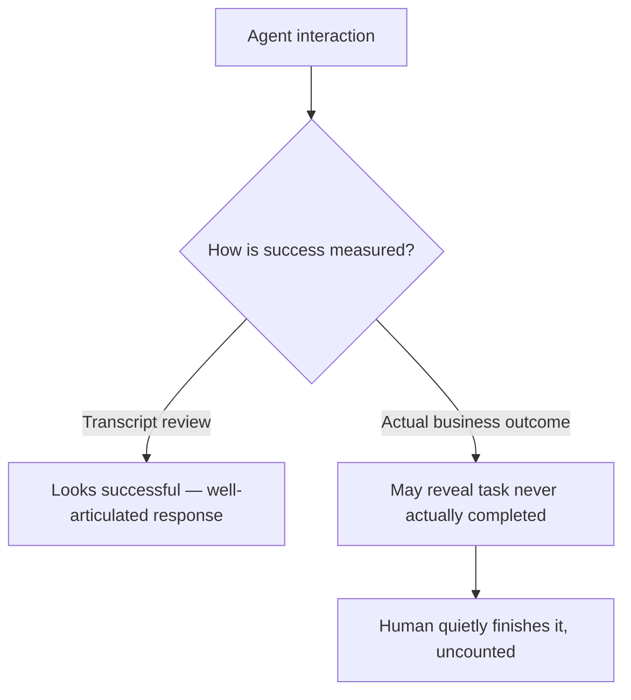

A year ago, an agent's demo success was measured by how naturally it conversed. In 2026, the question enterprises actually ask is narrower and harder to fake: did the support loop close, did the document get routed and reconciled, did the workflow actually complete end to end without a human quietly finishing it afterward. This is a real shift in what "good" means for an agent, and it changes what's worth building and measuring.

## Conversation Quality and Task Completion Are Different Metrics

A response that reads as helpful, well-reasoned, and articulate can still fail to actually resolve the underlying task — the conversation "feels" successful while the ticket stays open, the document stays unrouted, the workflow stalls somewhere the transcript doesn't reveal. Measuring conversation quality alone systematically overstates how well an agent is actually doing its job.

```python
def measure_execution_outcome(session: dict) -> dict:
    return {
        "task_completed": check_actual_business_outcome(session),  # not "did it respond well"
        "required_human_completion": check_manual_intervention_after(session),
        "time_to_actual_resolution": measure_end_to_end(session),
        # Conversation quality is a diagnostic signal, not the success metric
        "conversation_quality_score": judge_llm.score(session, rubric="helpfulness"),
    }
```

## Why This Distinction Got Harder to Ignore

As more agents moved from pilot to production in 2026, the gap between "sounds good" and "actually works" became visible in a way it wasn't during earlier demo-stage evaluation — a stakeholder measuring a pilot by transcript review sees articulate responses; a stakeholder measuring the same system by actual ticket-closure rate over a month sees a different, often less flattering number. The second number is the one that determines renewal.



## The Uncounted Human Completion Is the Hidden Cost

The specific failure mode worth naming: an agent that produces a plausible-looking response, gets marked as "handled" in a support queue, and then a human quietly finishes the actual work later — off the books, not tracked as an agent failure, because nothing in the system flags it as one. This inflates apparent success rates and hides exactly where an agent needs improvement.

```python
def detect_silent_human_completion(session: dict, followup_window_hours: int = 48) -> bool:
    # A ticket marked "resolved by agent" that gets reopened or manually
    # touched again shortly after is a strong signal of silent completion
    followup_actions = get_actions_after(session["ticket_id"], session["resolved_at"], followup_window_hours)
    return any(a["actor_type"] == "human" and a["action"] in ("reopened", "manual_edit") for a in followup_actions)
```

## Building Execution Metrics Into the Eval Loop From the Start

The eval infrastructure covered earlier on this blog — golden datasets, CI gating, production sampling — needs execution outcome as its primary label, not conversation quality. A golden dataset case should be marked pass/fail based on whether the actual business process completed, with conversation quality tracked as a secondary, diagnostic signal for *why* a case failed, not what determines whether it passed.

## Key Takeaways

1. **Conversation quality and task completion are different metrics, and conflating them overstates real agent performance**
2. **The gap between the two became visible specifically as agents moved from pilot demos to sustained production measurement**
3. **Silently-completed-by-a-human tasks inflate apparent success rates** — detect them explicitly, don't assume "marked resolved" means resolved
4. **Eval infrastructure should label pass/fail by actual execution outcome**, with conversation quality as a diagnostic signal, not the primary metric

---

*Part of the [Agent Economy series](/tags/agent-economy-series/) — where agentic AI is actually showing up in commerce, work, and daily use in late 2026.*
