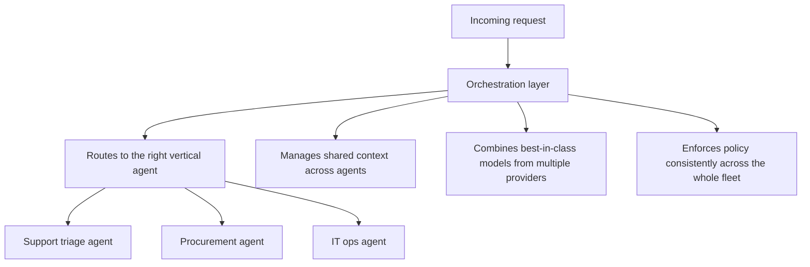
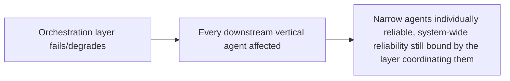

The previous post in this series argued for narrow, vertical agents over general-purpose ones. The natural follow-up question: if every agent is narrow, what actually coordinates them into something that handles a real business workflow spanning more than one narrow task? That's the orchestration layer, and it's increasingly where enterprises report the actual value concentrating — not in any single agent's individual capability.

## What the Orchestration Layer Actually Does



Four functions recur across mature 2026 orchestration deployments: routing a request to the right narrow agent, managing context that needs to persist or transfer across agents within one broader task, combining models from multiple vendors rather than committing to one, and enforcing policy (the guardrails, escalation rules, and audit requirements covered extensively earlier on this blog) consistently across every agent in the fleet rather than each agent implementing its own version.

## Why Vendor Diversity Happens at the Orchestration Layer, Not Per-Agent

Individually equipping every narrow agent with its own multi-model fallback and routing logic duplicates that infrastructure N times, inconsistently, the same maintenance-cost argument made earlier on this blog for the agent gateway. Centralizing model selection at the orchestration layer means a single, consistently-applied policy decides which provider handles which request type, and a provider outage or pricing change is handled once, not reimplemented per agent.

```python
class OrchestrationLayer:
    def route_request(self, request: dict) -> dict:
        agent = self.select_vertical_agent(request["task_type"])
        model_config = self.select_model_for_agent(agent, request)  # vendor selection centralized here
        shared_context = self.context_store.get_relevant(request["session_id"])
        return agent.execute(request, model_config=model_config, context=shared_context)
```

## The Risk: Orchestration Becomes the New Single Point of Failure

Centralizing routing, context, and policy into one layer concentrates real operational risk there too — exactly the tradeoff already worked through for the agent gateway pattern earlier on this blog. A poorly-scaled orchestration layer bounds the reliability of every vertical agent behind it, regardless of how well each individual agent performs on its own.



## Measuring Orchestration Value Separately From Agent Value

Given the metric shift from the previous post — measuring execution outcomes, not conversation quality — orchestration's contribution needs its own attribution: how much of the end-to-end task completion improvement comes from better individual agents versus better routing and coordination between them. Without separating these, it's easy to over-credit individual agent improvements for gains that were actually orchestration-layer fixes, or vice versa.

## Key Takeaways

1. **Orchestration handles routing, shared context, multi-vendor model selection, and consistent policy enforcement** — four functions that don't belong duplicated per agent
2. **Centralizing vendor selection at the orchestration layer avoids reimplementing multi-provider fallback logic N times inconsistently**
3. **This concentrates real operational risk in one place** — the same single-point-of-failure tradeoff already covered for the agent gateway pattern
4. **Attribute value gains to orchestration or to individual agents separately** — conflating them misdirects where future investment should actually go

---

*Part of the [Agent Economy series](/tags/agent-economy-series/) — where agentic AI is actually showing up in commerce, work, and daily use in late 2026.*
