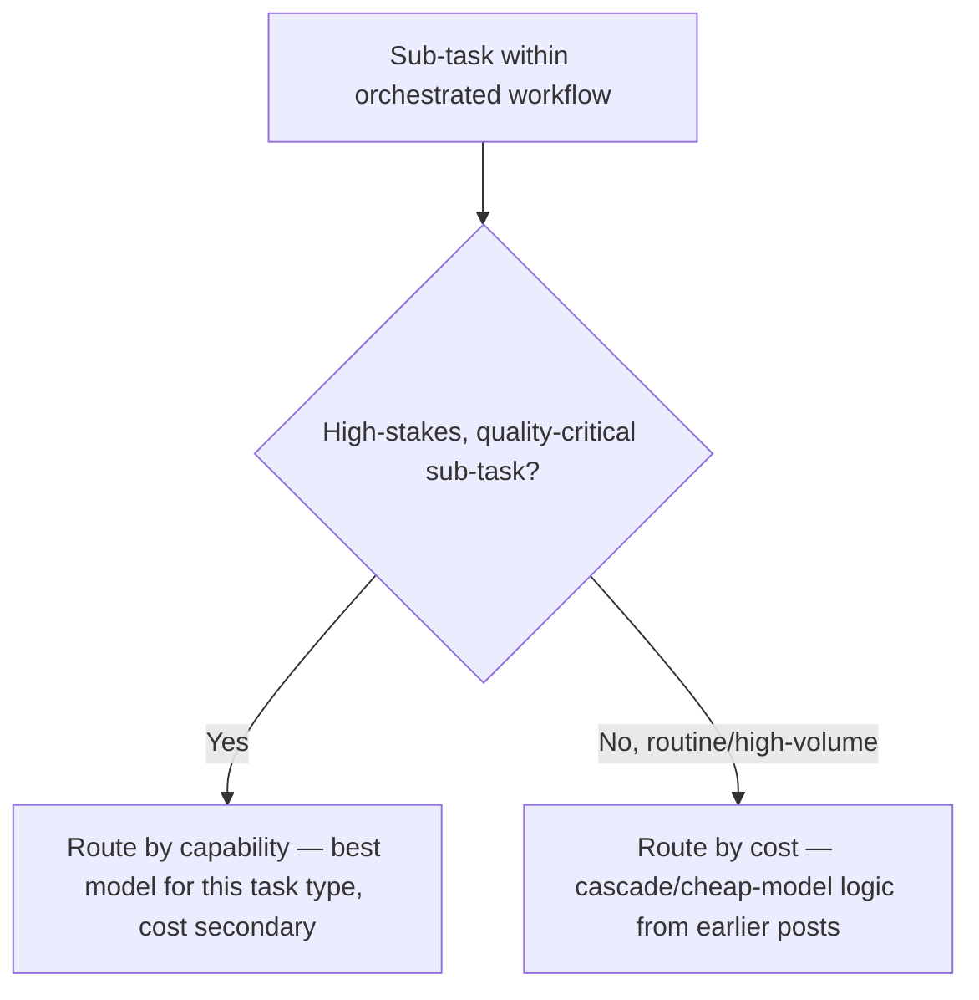

Earlier posts on this blog covered model routing and multi-provider redundancy primarily through a cost and reliability lens — cheap model for simple requests, fallback chain for outages. Inside a mature orchestration layer, routing gets a third dimension: different vendors' models genuinely have different relative strengths, and a single workflow spanning several narrow agents can route each agent's calls to whichever model is actually best suited for that specific sub-task, not just whichever is cheapest or currently available.

## Capability-Based Routing, Not Just Cost-Based

```python
CAPABILITY_ROUTING = {
    "code_generation": {"preferred_vendor": "vendor_a", "model": "coding-optimized-model"},
    "long_document_synthesis": {"preferred_vendor": "vendor_b", "model": "long-context-model"},
    "structured_extraction": {"preferred_vendor": "vendor_c", "model": "fast-structured-output-model"},
    "nuanced_judgment": {"preferred_vendor": "vendor_a", "model": "frontier-reasoning-model"},
}

def route_by_capability(sub_task_type: str, request: dict) -> dict:
    config = CAPABILITY_ROUTING.get(sub_task_type, DEFAULT_ROUTING)
    return invoke_model(config["preferred_vendor"], config["model"], request)
```

This is a different decision axis than the cost-based routing covered earlier — a capability-based router might send a request to a *more* expensive model specifically because that vendor's model has a measured quality edge on this sub-task type, accepting the cost because the orchestration layer's overall workflow value depends on getting that specific sub-task right.

## Combining Capability and Cost Routing Without Contradicting Each Other



The two routing strategies from this blog aren't in conflict — they apply to different sub-task categories within the same workflow. A procurement-document-extraction sub-task, high volume and well-defined, reasonably uses cost-based cascade routing; a final risk-assessment sub-task in that same workflow, lower volume and higher stakes, reasonably uses capability-based routing to the vendor with the strongest track record on that specific judgment call.

## Evaluating Vendor Capability Claims Empirically, Not by Reputation

Vendor marketing about which model is "best" for a given task type isn't a substitute for the same eval infrastructure covered throughout this blog — running your own golden dataset, scoped to your actual sub-task, against each candidate vendor's model, is what determines the capability routing table, not a vendor's own benchmark claims about their model's strengths.

```python
def build_capability_routing_table(sub_task_types: list[str], candidate_vendors: list, golden_dataset: dict) -> dict:
    table = {}
    for task_type in sub_task_types:
        scores = {v: run_eval(v, golden_dataset[task_type]) for v in candidate_vendors}
        table[task_type] = max(scores, key=scores.get)
    return table
```

## Revisit the Routing Table as Models Update

The same periodic-reevaluation discipline argued for throughout this blog applies directly — a vendor's relative strength on a specific sub-task type shifts as models update, and a capability routing table built once and never revisited will eventually route to a model that's no longer actually the best choice for that sub-task, silently, until someone happens to re-run the comparison.

## Key Takeaways

1. **Capability-based routing is a distinct decision axis from cost-based routing**, applying to different sub-task categories within the same orchestrated workflow
2. **High-stakes, judgment-heavy sub-tasks reasonably route by capability; routine, high-volume ones reasonably route by cost** — both belong in the same system
3. **Build the capability routing table from your own eval data, not vendor marketing claims about relative model strength**
4. **Revisit the routing table periodically** — vendor relative strength shifts as models update, and a stale table silently misroutes

---

*Part of the [Agent Economy series](/tags/agent-economy-series/) — where agentic AI is actually showing up in commerce, work, and daily use in late 2026.*
