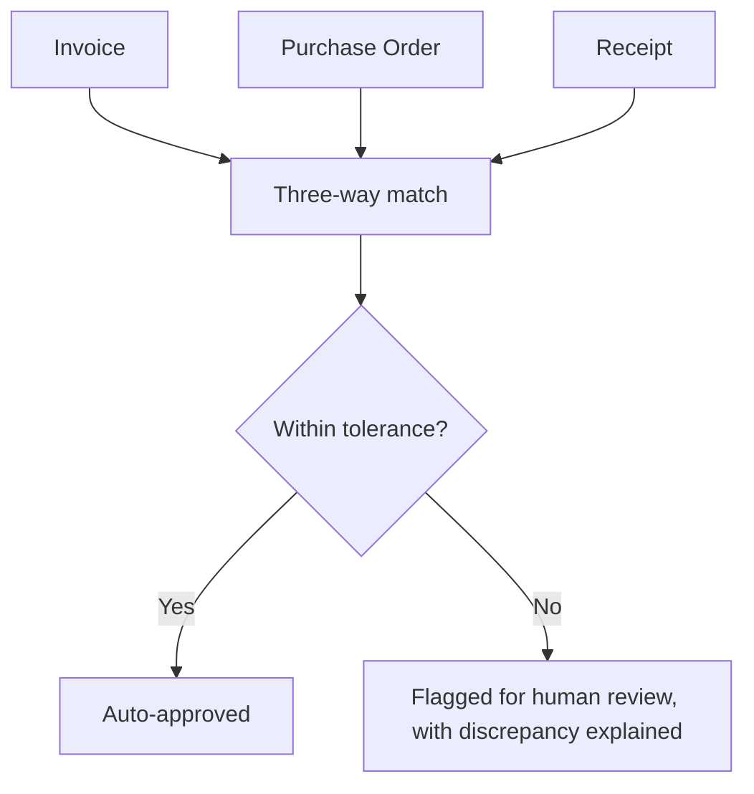

No one demos a procurement agent at a keynote. It's not the use case that generates headlines. It's also, quietly, one of the most widely and successfully deployed categories of vertical agent in 2026 — precisely because it's the opposite of a flashy general-purpose assistant: a narrow, well-defined, high-volume, document-heavy workflow with an unambiguous success criterion.

## Why This Use Case Fits the Vertical-Agent Thesis So Well

The characteristics that make procurement a strong agent candidate are exactly the ones argued for earlier in this series: a bounded task (match an invoice to a purchase order and a receipt, flag discrepancies), high volume (worth the investment), and a success criterion that isn't ambiguous (the three documents either reconcile or they don't, within defined tolerance). There's no equivalent of "did the response sound helpful" to muddy the evaluation — it either matched correctly or it didn't.



## The Engineering Reality Behind "Just Match Three Documents"

```python
def three_way_match(invoice: dict, purchase_order: dict, receipt: dict, tolerance_pct: float = 2.0) -> dict:
    discrepancies = []
    if abs(invoice["amount"] - purchase_order["amount"]) / purchase_order["amount"] * 100 > tolerance_pct:
        discrepancies.append({"field": "amount", "invoice": invoice["amount"], "po": purchase_order["amount"]})
    if invoice["item_count"] != receipt["item_count"]:
        discrepancies.append({"field": "item_count", "invoice": invoice["item_count"], "receipt": receipt["item_count"]})
    return {
        "matched": len(discrepancies) == 0,
        "discrepancies": discrepancies,
        "auto_approvable": len(discrepancies) == 0 and invoice["amount"] < AUTO_APPROVE_THRESHOLD,
    }
```

The actual engineering difficulty isn't the matching logic — it's document extraction upstream of it. Invoices arrive as scanned PDFs, emails with inconsistent formatting, and vendor portals with no standard schema, and the extraction step (structured-output extraction from unstructured or semi-structured documents, the same discipline from the schema-validation posts earlier on this blog) is where most of the actual engineering investment goes, not the reconciliation logic itself.

## Why This Use Case Tolerates Less Model Sophistication Than It Might Seem

A procurement agent doesn't need frontier-level reasoning — it needs reliable extraction and deterministic matching logic, which connects directly to the small-model and cost-routing discussions elsewhere on this blog. This is a strong candidate for the cheap-model-first cascade pattern: most invoices match cleanly and can be handled by a smaller, cheaper model or even non-LLM extraction pipeline, with only genuinely ambiguous discrepancies escalated to a more capable model or a human.

## The Boring Use Case Is the Trust-Building Use Case

There's a strategic argument beyond the immediate ROI: a procurement agent's narrow, measurable, low-drama success record is exactly the kind of track record that builds organizational trust for expanding agent deployment into higher-stakes areas later — the same governance-as-enabler dynamic covered in the governance trend research behind this series. Nobody gets promoted for shipping the procurement agent, and it's often the deployment that actually earns the organization's confidence to try something more ambitious next.

## Key Takeaways

1. **Procurement and document reconciliation fit the vertical-agent thesis precisely because success is unambiguous and volume is high**
2. **The real engineering difficulty is document extraction upstream, not the matching logic itself**
3. **This use case tolerates cheaper models and cascade routing well** — reliable extraction matters more than frontier reasoning
4. **An unglamorous, low-drama deployment builds the organizational trust that makes more ambitious agent deployments possible later**

---

*Part of the [Agent Economy series](/tags/agent-economy-series/) — where agentic AI is actually showing up in commerce, work, and daily use in late 2026.*
