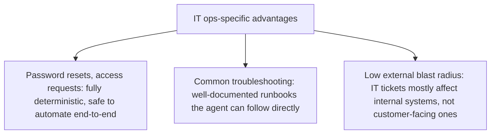

The previous post covered procurement as an unglamorous but effective proving ground for vertical agents. IT operations ticket triage — categorizing, routing, and often resolving common IT support requests — is the second consistent example of the same pattern, sharing procurement's structural advantages while adding a few of its own that make it a particularly good early deployment target.

## Shared Structural Advantages With Procurement

Bounded task, high volume, measurable success — the same three properties that made procurement a strong candidate apply directly here: a ticket either gets correctly categorized and routed (or resolved) or it doesn't, there's enough ticket volume in most organizations to justify the investment, and "did this ticket actually get resolved" is a clean, unambiguous outcome metric distinct from how articulate the resolution message sounds.

## What Makes IT Ops Specifically Well-Suited



A meaningful fraction of IT tickets — password resets, standard access requests, known troubleshooting steps documented in existing runbooks — are close to fully deterministic once correctly identified, which makes them safe to automate end-to-end rather than just triage-and-route. And because most IT tickets affect internal systems rather than customer-facing ones, the blast radius of an occasional mishandled ticket is generally lower than an equivalent mistake in a customer-facing agent.

```python
IT_TICKET_ROUTING = {
    "password_reset": {"auto_resolve": True, "tool": "reset_password_tool"},
    "standard_access_request": {"auto_resolve": True, "tool": "grant_standard_access_tool", "requires_approval_check": True},
    "known_troubleshooting": {"auto_resolve": True, "tool": "run_documented_runbook"},
    "novel_or_ambiguous": {"auto_resolve": False, "route_to": "human_it_specialist"},
}
```

## Where This Connects to Earlier Guardrail and Escalation Posts

The `requires_approval_check` on standard access requests directly applies the policy-based escalation pattern from earlier on this blog — even a request type that's largely deterministic should still route through a policy check for anything touching access control, since access grants are exactly the kind of consequential action that the escalation design posts argued should never be fully autonomous regardless of how routine the request looks.

## Measuring Success the Same Way, Consistently

```python
def evaluate_it_ops_agent(tickets: list[dict]) -> dict:
    return {
        "auto_resolution_rate": pct(t["resolved_without_human"] for t in tickets),
        "correct_routing_rate": pct(t["routed_correctly"] for t in tickets if not t["auto_resolved"]),
        "reopened_rate": pct(t["reopened_within_48h"] for t in tickets),  # catches silent failures, per the earlier post
        "time_to_resolution_vs_baseline": compare_to_manual(tickets),
    }
```

The `reopened_rate` metric applies the silent-human-completion detection logic from earlier in this series directly — a ticket the agent marked resolved and which gets reopened shortly after is the IT ops equivalent of the uncounted human completion problem, and tracking it prevents an inflated apparent success rate.

## Why This Is Often the Second Deployment, Not the First

Organizations that start with procurement often move to IT ops next specifically because the trust and tooling patterns transfer directly — the same three-way-match-style deterministic-where-possible, escalate-the-rest architecture, the same execution-outcome measurement discipline, applied to a different but structurally similar domain. This sequencing (boring, measurable win first; second boring, measurable win second) is a deliberate and reasonable path toward the higher-stakes deployments covered later in this blog.

## Key Takeaways

1. **IT ops ticket triage shares procurement's structural advantages** — bounded task, high volume, unambiguous success criterion
2. **A meaningful fraction of IT tickets are safe to fully automate**, not just triage, given documented runbooks and lower external blast radius
3. **Even deterministic-seeming access requests should route through policy-based escalation**, since access control is a consequential action regardless of how routine it looks
4. **Track reopened-ticket rate explicitly** — it's the IT ops version of catching silently-uncompleted "resolved" tasks

---

*Part of the [Agent Economy series](/tags/agent-economy-series/) — where agentic AI is actually showing up in commerce, work, and daily use in late 2026.*
