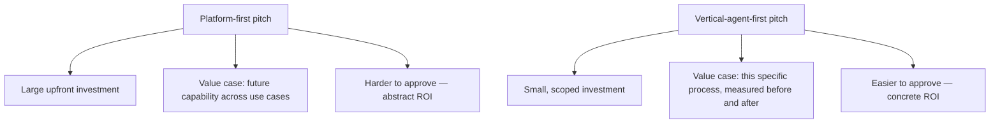

The first six posts in this series argued for narrow, vertical agents over general platforms, on both technical and trust-building grounds. This closes out the week with the practical question that actually determines whether any of this gets funded: how do you pitch a single vertical agent in a way that gets approved, when the instinct in many organizations is still to ask for platform-level investment upfront.

## Why the Platform-First Pitch Is Harder to Approve

A platform pitch asks for investment before any specific, measurable outcome exists to point to — the value case rests on projected future capability across use cases that haven't been built yet. A single vertical agent pitch asks for a much smaller investment against one specific, current, measurable business process, which is a fundamentally easier thing for a budget owner to evaluate and approve.



## The Template

```markdown
## Vertical Agent Business Case: [Process Name]

### Current State (Baseline, Measured)
- Volume: [X requests/month]
- Current time-to-resolution: [Y hours/days]
- Current cost per resolution: [Z, including labor]
- Current error/rework rate: [%]

### Proposed Scope
- Specific task: [narrow, bounded description]
- Explicitly out of scope: [what this agent will NOT attempt]

### Projected Outcome
- Target auto-resolution rate: [%, conservative estimate]
- Target time-to-resolution: [projected]
- Break-even timeline: [based on build + eval cost vs. per-resolution savings]

### Measurement Plan
- How success will be measured post-launch (execution outcome, per
  the earlier post in this series — not conversation quality)
- Review checkpoint: [date] to confirm projected vs. actual
```

The **explicitly out of scope** section matters as much as the proposed scope — it's what keeps the pitch narrow and prevents scope creep from turning a fundable, well-bounded vertical agent proposal into an unfundable platform ask by accretion during the approval process itself.

## Use the Baseline to Make the Case Concrete

```python
def build_roi_case(baseline: dict, projected: dict, build_cost: float) -> dict:
    monthly_savings = baseline["cost_per_resolution"] * baseline["volume"] * projected["auto_resolution_rate"]
    return {
        "monthly_savings_estimate": monthly_savings,
        "break_even_months": build_cost / monthly_savings if monthly_savings > 0 else float("inf"),
    }
```

A concrete break-even estimate, built from measured current-state numbers rather than industry-average claims from a vendor deck, is far more persuasive to a budget owner than a qualitative pitch about agentic AI's general potential — and it sets up the post-launch measurement plan to be a direct check against a specific number, not a vague "did it help" retrospective.

## Let the First Vertical Agent's Track Record Do the Platform Pitching Later

The strategic sequencing from the previous IT-ops post applies at the funding level too — a successful, measured vertical agent deployment is what actually earns the credibility to make a platform-level pitch later, backed by real numbers instead of projected ones. Skipping straight to the platform pitch trades that credibility-building step for a harder, more abstract ask upfront.

## Key Takeaways

1. **A narrow, scoped vertical agent pitch is structurally easier to approve than a platform pitch** — concrete current-state baseline vs. abstract future capability
2. **Explicitly state what's out of scope** — it's what keeps the pitch fundable and prevents approval-process scope creep
3. **Build the ROI case from your own measured baseline**, not vendor-average industry claims
4. **A successful vertical agent's track record is what earns the credibility for a platform-level ask later** — not a substitute for it, a prerequisite

---

*Part of the [Agent Economy series](/tags/agent-economy-series/) — where agentic AI is actually showing up in commerce, work, and daily use in late 2026.*
