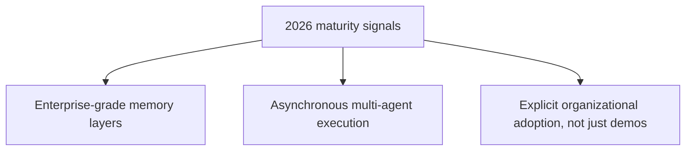

The earliest computer-use agent demos — a model clicking through a browser, filling a form, narrating its reasoning — were genuinely impressive and, in production terms, fragile: slow, easily confused by dynamic page layouts, and not something most enterprises trusted with anything consequential. What's shipping in 2026 is a meaningfully different maturity level, and it's worth being specific about what actually changed rather than treating "computer-use agents got better" as a vague, unfalsifiable claim.

## Three Concrete Maturity Signals



**Enterprise-grade memory** means a browser agent remembering a specific site's layout, login flow, and quirks across sessions rather than re-discovering the same page structure from scratch every single time — directly applying the agent-memory architecture covered earlier on this blog to a computer-use-specific use case, where "memory" now includes learned UI navigation patterns, not just conversational facts.

**Asynchronous multi-agent execution** means running many browser sessions concurrently rather than one agent working through tasks serially — a structural throughput improvement, not just a per-task speed improvement, and one that connects directly to the rate-limiting and fair-share infrastructure covered earlier in this blog, now applied to concurrent browser session capacity instead of tool-call capacity.

**Organizational adoption** is the signal that actually distinguishes 2026 from the demo era — mid-size companies evaluating or piloting browser agents as a real operational category, not a curiosity, with early adopters reporting back-office processes running 30-50% faster than manual baselines.

## Where the Real Engineering Investment Went

```python
class BrowserAgentSession:
    def __init__(self, site_memory_store, max_concurrent_sessions: int = 10):
        self.site_memory = site_memory_store  # learned navigation patterns per site
        self.session_limiter = TokenBucket(max_concurrent_sessions)  # async capacity control

    async def navigate_and_complete(self, site_url: str, task: dict) -> dict:
        known_layout = self.site_memory.get(site_url)  # skip re-discovery if already learned
        if known_layout:
            return await self.execute_with_known_layout(site_url, task, known_layout)
        result = await self.explore_and_complete(site_url, task)
        self.site_memory.update(site_url, result["learned_layout"])  # improve for next time
        return result
```

The gap between the early demos and 2026 production systems isn't primarily a smarter underlying model — it's this kind of infrastructure: memory that compounds across sessions, concurrency control that lets many sessions run safely at once, and the observability and guardrail layers (covered extensively elsewhere on this blog) applied specifically to an agent that's now clicking real buttons on real websites rather than just generating text.

## What Hasn't Fully Matured Yet

The next post in this series covers this in more depth, but it's worth flagging here: dynamic pages, CAPTCHAs, and genuinely ambiguous UI remain real failure points even in 2026's more mature systems. The maturity gains are real and specifically in the infrastructure surrounding the core navigation capability, not a claim that computer-use agents have become uniformly reliable across every possible website.

## Key Takeaways

1. **The 2026 maturity gap from early demos is mostly infrastructure**: memory, concurrency, and organizational trust, not primarily a smarter core model
2. **Site-specific learned navigation memory avoids re-discovering the same page structure every session** — a direct application of agent memory architecture to this domain
3. **Async multi-session execution is a throughput architecture change**, not just a per-task speed improvement
4. **Real organizational adoption, not demo polish, is the actual signal separating 2026 systems from the earlier generation**

---

*Part of the [Agent Economy series](/tags/agent-economy-series/) — where agentic AI is actually showing up in commerce, work, and daily use in late 2026.*
