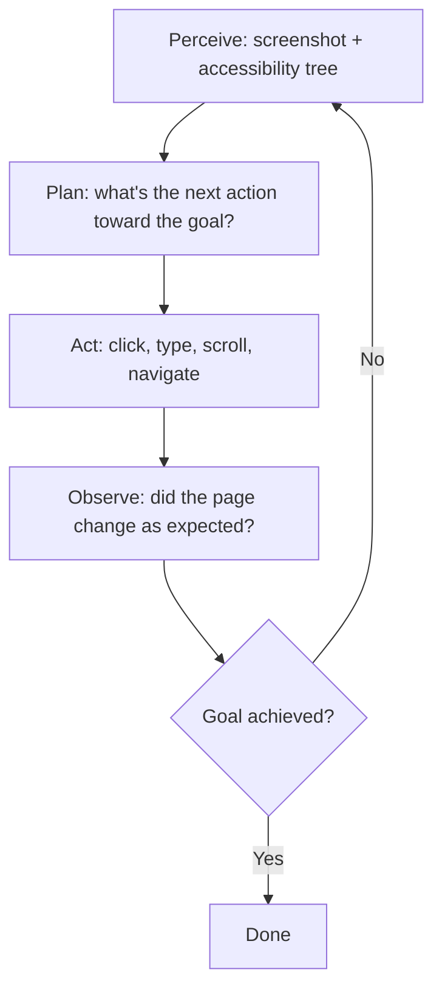
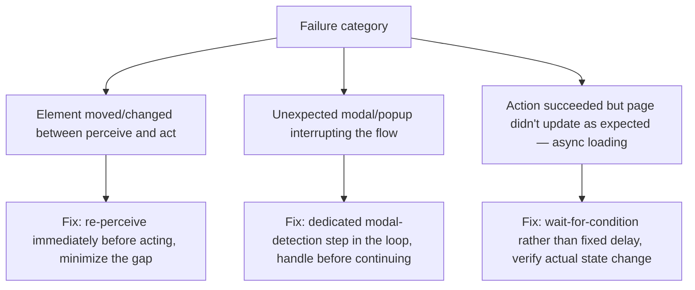

The core loop underneath an agentic browser — perceive the page, decide the next action, act, observe the result — is straightforward to describe and genuinely hard to make reliable, because the interesting engineering lives almost entirely in error recovery, not the happy-path sequence of clicks that a demo shows.

## The Core Loop



**Perception** combines a visual screenshot with the page's accessibility tree (the structured, semantic representation browsers already expose for screen readers) — the accessibility tree is often more reliable for identifying specific elements to interact with than pure visual analysis, since it gives element roles and labels directly rather than requiring the model to infer them from pixels.

```python
def perceive_page(page) -> dict:
    return {
        "screenshot": page.screenshot(),
        "accessibility_tree": page.accessibility.snapshot(),  # structured, more reliable for element targeting
        "url": page.url,
        "title": page.title(),
    }
```

## Where the Happy Path Breaks

```python
def act_with_verification(page, action: dict) -> dict:
    pre_state = perceive_page(page)
    execute_action(page, action)
    post_state = perceive_page(page)

    if not state_changed_as_expected(pre_state, post_state, action):
        return {"success": False, "reason": "action had no expected effect", "retry_needed": True}
    return {"success": True}
```

Verifying that an action actually produced its expected effect — not just executing it and assuming success — is what separates a fragile agent from a reliable one. A click that lands on the wrong element (a page that shifted layout between perception and action, a modal that appeared unexpectedly) fails silently unless the agent explicitly checks the resulting state against what it expected before moving on.

## Common Failure Categories and Their Fixes



The fixed-delay anti-pattern (`sleep(2)` after every action, hoping the page settled) is common in early implementations and unreliable — pages load at different speeds under different conditions, and a fixed delay is either too short (racing the page) or wastefully long (slowing down every action for a worst-case that rarely happens). Waiting for an actual, specific state condition — a particular element appearing, a network-idle signal — is slower to implement and meaningfully more reliable.

## Idempotency Matters Here Too

The idempotency discipline from the earlier tool-call reliability post applies directly to browser actions with side effects — a form submission retried after an ambiguous failure (did it submit or not?) risks a duplicate submission, the same correctness risk as a duplicate API call. Where possible, check for confirmation state (a "submitted successfully" page, an order confirmation number) before considering an action complete, rather than assuming success from the click alone.

## Key Takeaways

1. **The accessibility tree is often more reliable than pure visual analysis for identifying interactive elements**
2. **Verify that every action produced its expected effect** — executing an action isn't the same as confirming it worked
3. **Fixed delays are an unreliable anti-pattern** — wait for actual state conditions, not an arbitrary sleep duration
4. **Browser actions with side effects need the same idempotency discipline as any other tool call** — an ambiguous failure risks a duplicate submission

---

*Part of the [Agent Economy series](/tags/agent-economy-series/) — where agentic AI is actually showing up in commerce, work, and daily use in late 2026.*
