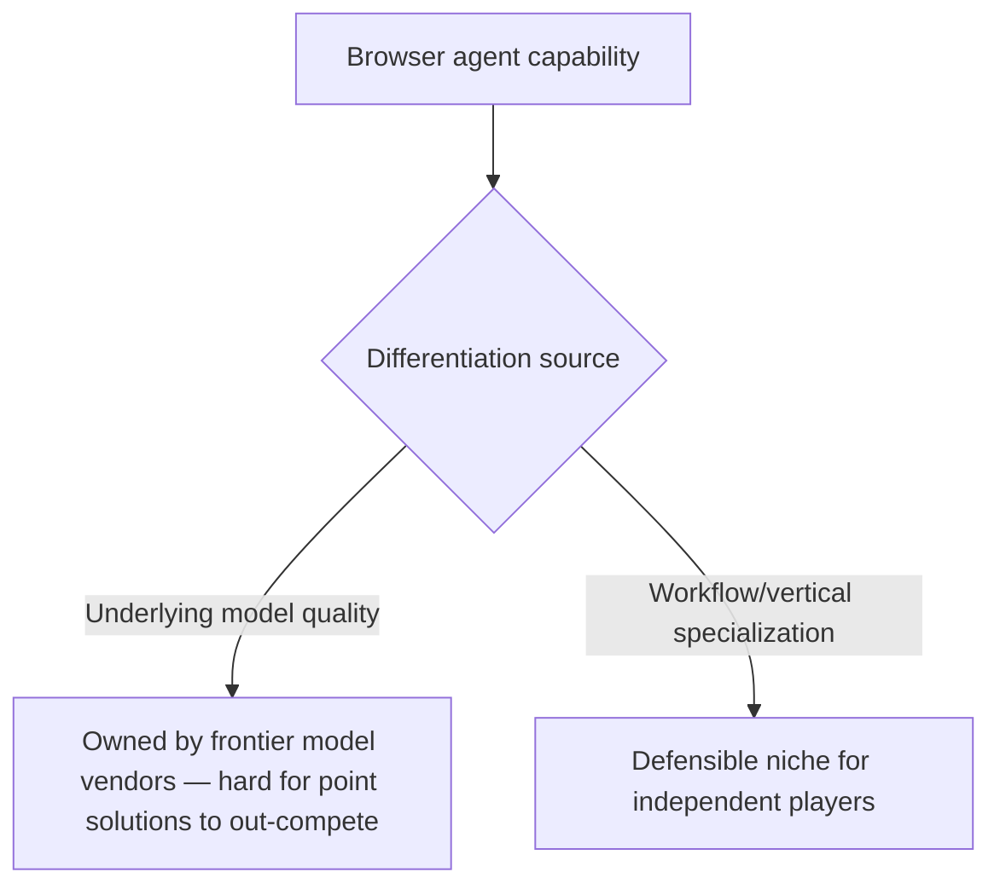

Manus's acquisition earlier this year is a specific event, and it's also a useful lens on a broader pattern across the browser-agent landscape in 2026: a market that started with many independent point-solution browser agents is consolidating, as large platform players (Anthropic's computer-use capabilities, OpenAI's Operator, and others) build the same category of capability natively, and independent players either get acquired, get absorbed as a feature, or find a genuinely differentiated niche.

## Why This Category Consolidates Faster Than Some Others



Browser agent quality is heavily bound by the underlying model's visual and reasoning capability — a point-solution browser agent built on top of a third-party model is structurally dependent on that model's own improvement pace, while a frontier model vendor building computer-use natively can iterate the model and the browsing capability together. This bounds how much independent differentiation is available on raw navigation capability alone, which pushes independent players toward vertical specialization (a browser agent built specifically for insurance-claims data entry, say) as the more defensible position.

## What This Means for Teams Building on Browser Agent Platforms

```python
def evaluate_browser_agent_vendor_risk(vendor: dict) -> dict:
    return {
        "acquisition_risk": vendor.get("is_independent_point_solution", False),
        "platform_dependency": vendor.get("built_on_third_party_model", False),
        "vertical_differentiation": vendor.get("has_defensible_niche", False),
        "migration_cost_if_vendor_changes": estimate_switching_cost(vendor),
    }
```

The vendor-lock-in discipline from earlier on this blog applies here directly, with browser-agent-specific stakes — a workflow built tightly around one independent point-solution's specific API and behavior carries real risk if that vendor gets acquired and the product's roadmap, pricing, or API changes as a result (which is a common outcome of this kind of consolidation, not a hypothetical one). The same thin-abstraction-layer mitigation from the earlier vendor lock-in post is worth applying proactively here.

## Reading Consolidation as a Buy Signal, Not Just a Risk Signal

The other side of this pattern: consolidation into fewer, better-resourced platforms often means the surviving browser-agent capability gets more investment, not less — a feature absorbed into a frontier model vendor's core offering typically receives more sustained engineering investment than an independent startup's standalone product could support alone. For a team evaluating whether to build on browser-agent capability now versus waiting, this cuts toward "the capability is stabilizing into something more dependable," not just "there's vendor risk to manage."

## The Practical Takeaway for Late 2026

Build the workflow-specific logic (what forms need filling, what data needs extracting, what verification is required) behind an abstraction that doesn't assume any single vendor's specific API shape, following the same pattern already established for vector databases and MCP servers earlier on this blog — not because a specific acquisition is imminent, but because this market's consolidation pattern makes vendor-shape changes a real, recurring likelihood over the coming year.

## Key Takeaways

1. **Browser agent capability is heavily bound to underlying model quality**, which pushes independent point solutions toward vertical specialization as their more defensible position
2. **Consolidation carries real vendor-lock-in risk for workflows built tightly around one point solution's specific API**
3. **Consolidation into better-resourced platforms often means more sustained investment in the surviving capability**, not less — a mixed signal, not purely a risk one
4. **Apply the same thin-abstraction-layer discipline used for vector databases and MCP servers** to browser-agent integrations, given how likely vendor-shape changes are in this specific market right now

---

*Part of the [Agent Economy series](/tags/agent-economy-series/) — where agentic AI is actually showing up in commerce, work, and daily use in late 2026.*
