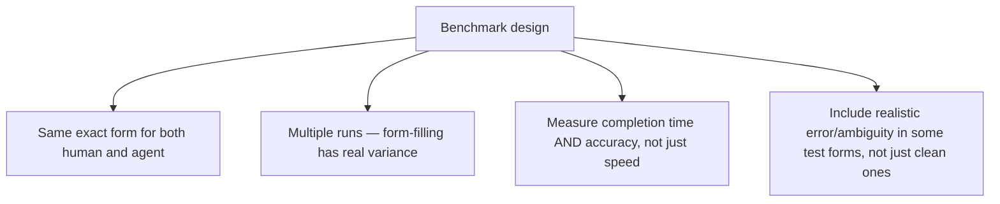
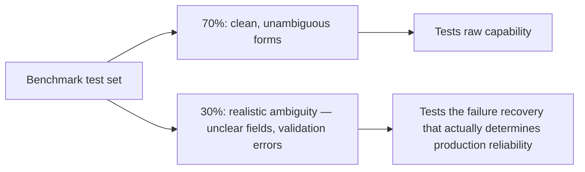

"Browser agents now fill 30-field forms in 90 seconds" is the kind of headline number that's genuinely useful as a rough industry signal and not something to trust as a prediction for your own specific forms without measuring it yourself — form complexity, field validation logic, and layout quirks vary enormously, and a benchmark run on a different form than yours tells you relatively little about what to expect on your own.

## Designing a Fair Comparison



A benchmark measuring speed alone without accuracy is measuring the wrong thing — a browser agent that fills a form in 60 seconds with three incorrect fields isn't actually faster than a human who takes 3 minutes and gets it right, once the cost of correcting those errors downstream is accounted for.

## A Practical Benchmark Harness

```python
def benchmark_form_completion(form_url: str, test_data: dict, agent, human_baseline_time: float) -> dict:
    start = time.monotonic()
    result = agent.complete_form(form_url, test_data)
    agent_time = time.monotonic() - start

    accuracy = compare_submitted_to_expected(result["submitted_values"], test_data)

    return {
        "agent_time_seconds": agent_time,
        "human_baseline_seconds": human_baseline_time,
        "speedup_factor": human_baseline_time / agent_time,
        "field_accuracy_pct": accuracy["correct_fields"] / accuracy["total_fields"] * 100,
        "required_manual_correction": accuracy["correct_fields"] < accuracy["total_fields"],
    }
```

## Test With Realistic Ambiguity, Not Just Clean Data

A benchmark run exclusively with perfectly clean, unambiguous test data overstates real-world performance — real forms encounter ambiguous field labels, optional fields with unclear conventions, and validation errors that need correction and resubmission. Include a meaningful fraction of test cases with genuine ambiguity (a field that could reasonably be interpreted two ways, a validation error requiring the agent to recognize and correct it) to get a benchmark number that predicts real deployment performance rather than best-case demo performance.



## Run the Comparison on Your Own Forms Before Committing

The methodology here matters more than the specific 90-second headline figure — running this benchmark against your organization's actual highest-volume forms, with your actual field complexity and validation rules, is what tells you whether browser-agent form automation is worth deploying for your specific use case, and at what accuracy level you can actually expect in production rather than in a vendor's demo environment.

## Feed Results Into the Same Eval Infrastructure as Everything Else

This benchmark isn't a one-time exercise — treat it the same way as the golden dataset and CI-gating discipline covered earlier on this blog, re-running it whenever the underlying browser agent's model or version changes, so a regression in form-filling accuracy is caught the same way any other agent regression would be.

## Key Takeaways

1. **Industry headline numbers are a rough signal, not a prediction for your specific forms** — measure your own
2. **Measure accuracy alongside speed** — a fast but inaccurate form fill costs more downstream than a slower, correct one
3. **Include realistic ambiguity in the test set**, not just clean data — that's what predicts production reliability, not best-case demo performance
4. **Treat this as a recurring eval, not a one-time benchmark** — re-run it whenever the underlying agent changes, the same CI-gating discipline as any other agent capability

---

*Part of the [Agent Economy series](/tags/agent-economy-series/) — where agentic AI is actually showing up in commerce, work, and daily use in late 2026.*
