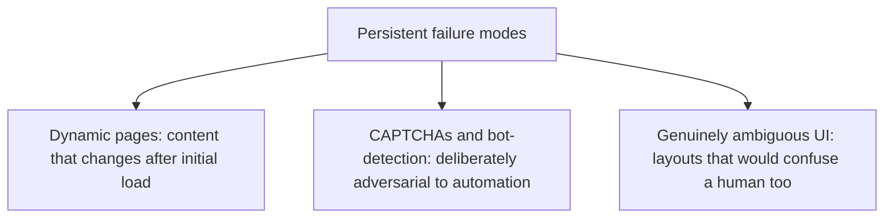
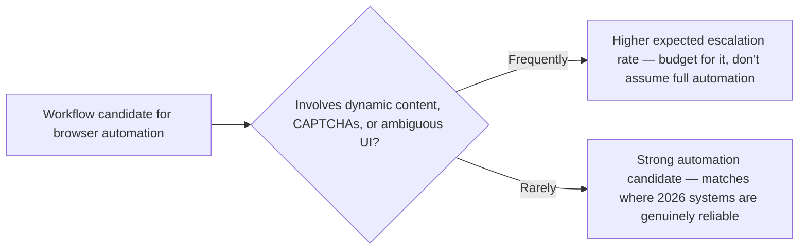

Earlier this week's posts covered real maturity gains in computer-use agents — memory, async execution, organizational adoption. In the interest of the same honesty this blog has applied to every other technology covered this year, this is the accounting of what hasn't been solved: specific, recurring failure categories that remain genuinely unreliable even in 2026's more mature systems.

## The Three Persistent Failure Categories



**Dynamic pages** — content that loads asynchronously, changes based on scroll position, or updates via websocket without a full page reload — break the perceive-then-act loop from earlier this week's tutorial post when the perception is stale by the time the action executes. This is a genuine engineering problem, not a solved one, and it recurs on any site with heavy client-side rendering.

**CAPTCHAs and bot-detection** are deliberately adversarial to automation by design — this isn't a capability gap that better models close, it's an intentional barrier, and any "solution" that reliably defeats it raises its own set of legitimate concerns about what that automation is actually being used for, distinct from the engineering question.

**Genuinely ambiguous UI** — layouts that would confuse a first-time human user too, not just an agent — is a harder category to fix because the ambiguity is real, not a perception limitation. No amount of better vision or reasoning resolves a form field with no clear label, because there's no unambiguous "correct" interpretation.

## Building Explicit Failure Detection Rather Than Assuming Success

```python
def detect_likely_failure_state(page_state: dict, expected_progress: dict) -> dict:
    signals = {
        "unexpected_captcha": detect_captcha_challenge(page_state),
        "content_still_loading": detect_loading_indicators(page_state),
        "no_progress_after_n_attempts": expected_progress["attempts"] > MAX_RETRY_BEFORE_ESCALATE,
        "ambiguous_element_match": expected_progress.get("element_confidence", 1.0) < AMBIGUITY_THRESHOLD,
    }
    return {"likely_failure": any(signals.values()), "signals": signals}
```

The engineering response to these categories isn't "try harder to solve them automatically" — it's detecting them explicitly and escalating, the same escalation design discipline from earlier on this blog applied to browser agents specifically. A CAPTCHA challenge or a low-confidence element match should trigger a defined escalation (pause and notify a human, or fail gracefully with a clear reason) rather than the agent guessing and potentially taking a wrong, hard-to-detect action.

## Why This Honesty Matters for Deployment Decisions



Choosing which workflows to automate with browser agents benefits directly from this honest failure taxonomy — a workflow that mostly touches static, well-structured pages is a strong 2026 automation candidate; a workflow that regularly hits dynamic content or CAPTCHA-protected sites should be scoped with a realistic escalation rate built into the plan from the start, not discovered as a disappointing surprise after deployment.

## Key Takeaways

1. **Dynamic pages, CAPTCHAs, and genuinely ambiguous UI remain real, unsolved failure categories in 2026** — the maturity gains elsewhere don't extend to these
2. **CAPTCHAs are an intentional barrier, not a capability gap** — "solving" them automatically raises its own separate concerns**
3. **Detect these failure signals explicitly and escalate**, rather than letting the agent guess through ambiguity and risk a wrong, hard-to-detect action
4. **Scope workflow automation decisions around this honest failure taxonomy** — match expectations to where 2026 systems are actually reliable

---

*Part of the [Agent Economy series](/tags/agent-economy-series/) — where agentic AI is actually showing up in commerce, work, and daily use in late 2026.*
