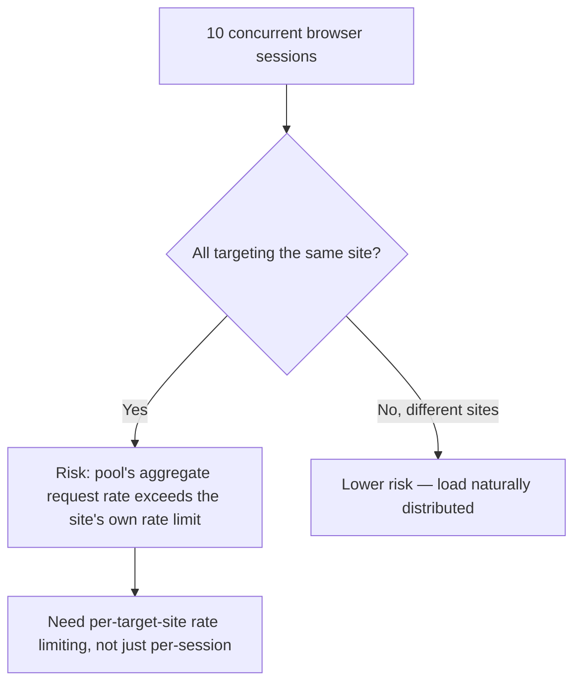

Naming "async multi-agent execution" as a maturity signal, as the earlier post in this week did, undersells the actual engineering involved — spawning ten browser sessions concurrently is the easy part. Doing it *safely*, without one session's failure cascading into others, without exceeding a target site's own rate limits, and without losing track of which session is doing what, is where the real work is.

## Resource Isolation Between Sessions

```python
class BrowserSessionPool:
    def __init__(self, max_concurrent: int = 10):
        self.semaphore = asyncio.Semaphore(max_concurrent)
        self.active_sessions: dict[str, dict] = {}

    async def run_session(self, session_id: str, task: dict) -> dict:
        async with self.semaphore:  # bounds actual concurrency, not just spawned tasks
            browser_context = await self.spawn_isolated_context()  # separate cookies/storage per session
            self.active_sessions[session_id] = {"status": "running", "started_at": time.time()}
            try:
                result = await execute_browser_task(browser_context, task)
                self.active_sessions[session_id]["status"] = "completed"
                return result
            except Exception as e:
                self.active_sessions[session_id]["status"] = "failed"
                raise
            finally:
                await browser_context.close()
```

Isolated browser contexts per session — separate cookie jars, separate storage — matter for correctness, not just for safety: sessions sharing state can cross-contaminate login sessions or form state in ways that produce subtly wrong results in one session because of what another session happened to do concurrently.

## Respecting Target Site Rate Limits Across the Whole Pool



This connects directly to the rate-limiting and fair-share infrastructure from earlier on this blog, applied here per target site rather than per internal team — ten sessions all hitting the same external site concurrently can trigger that site's own bot-detection or rate limiting, turning a throughput optimization into a self-inflicted reliability problem. A pool-level rate limiter, keyed by target domain, prevents this regardless of how many internal sessions are configured to run concurrently.

```python
domain_limiters: dict[str, TokenBucket] = defaultdict(lambda: TokenBucket(rate=2))  # per-domain, not per-session

async def rate_limited_request(domain: str, action):
    await domain_limiters[domain].acquire()
    return await action()
```

## Failure Isolation: One Session's Crash Shouldn't Affect Others

The `try/except/finally` structure in the pool implementation above matters specifically because browser automation crashes in ways that can leave zombie processes or hung contexts if not cleaned up explicitly — an unhandled exception in one session's task, without explicit cleanup, can leak resources that eventually degrade every other session in the pool, a much harder failure to diagnose than a single session's clean, contained failure.

## Observability Across the Pool, Not Just Per Session

```python
def pool_health_snapshot(pool: BrowserSessionPool) -> dict:
    return {
        "active_count": sum(1 for s in pool.active_sessions.values() if s["status"] == "running"),
        "failed_count_last_hour": count_recent_failures(pool.active_sessions, hours=1),
        "avg_session_duration": avg_duration(pool.active_sessions),
        "domain_rate_limit_utilization": {d: l.utilization() for d, l in domain_limiters.items()},
    }
```

The same tracing discipline from earlier posts on this blog — knowing which specific session did what, when a failure needs debugging — matters more, not less, at higher concurrency, since a pool-level metric alone ("failure rate: 8%") doesn't tell you whether that's evenly distributed or concentrated in sessions targeting one specific problematic site.

## Key Takeaways

1. **Concurrency limiting bounds actual parallel execution, not just how many tasks get spawned** — a semaphore or equivalent is required, not optional
2. **Isolate browser contexts per session** — shared state risks cross-contamination between concurrently running sessions, not just a safety concern but a correctness one
3. **Rate-limit per target domain across the whole pool**, not per session — otherwise aggregate concurrent load can trigger the target site's own bot defenses
4. **Explicit cleanup on failure prevents one session's crash from leaking resources that degrade the whole pool** over time

---

*Part of the [Agent Economy series](/tags/agent-economy-series/) — where agentic AI is actually showing up in commerce, work, and daily use in late 2026.*
