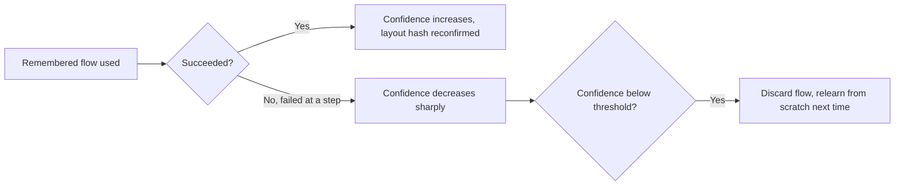

This week's posts referenced site-navigation memory repeatedly without fully specifying it. Closing out the browser-agent stretch of this series with the actual design — and where it needs to differ from the episodic/semantic memory architecture covered earlier this year for conversational agents, since a browser agent's memory problem has a different shape.

## What's Actually Worth Remembering About a Site

```python
@dataclass
class SiteNavigationMemory:
    domain: str
    element_selectors: dict[str, str]  # semantic name -> reliable selector, learned over time
    known_flows: dict[str, list[dict]]  # named task -> sequence of steps that worked
    layout_version_hash: str  # detects when the site has changed and memory may be stale
    last_verified: datetime
    confidence_score: float  # decays if a remembered flow starts failing
```

The **layout version hash** is the piece with no direct analog in conversational memory — a site's structure can change without warning (a redesign, an A/B test, a framework migration), and remembered navigation paths that were reliable last month can silently become wrong. This needs its own staleness-detection mechanism distinct from the time-based decay covered for conversational memory earlier this year.

## Detecting When Remembered Navigation Has Gone Stale

```python
def use_remembered_flow(memory: SiteNavigationMemory, task_name: str, page) -> dict:
    flow = memory.known_flows.get(task_name)
    if not flow:
        return execute_and_learn_from_scratch(page, task_name, memory)

    current_layout_hash = compute_layout_hash(page)
    if current_layout_hash != memory.layout_version_hash:
        # Site may have changed — attempt the remembered flow but verify each step,
        # don't blindly trust memory that might now be wrong
        return execute_with_verification(page, flow, memory, allow_relearn=True)

    return execute_flow(page, flow)  # high confidence — verified layout hasn't changed
```

This is a meaningfully different failure mode than the memory-conflict problem from earlier posts — it's not two contradictory facts competing, it's one previously-reliable fact (this selector, this flow) becoming silently wrong because the underlying reality changed. Verification-before-trust, rather than confidence-based retrieval alone, is the right pattern specifically because acting on stale navigation memory produces a wrong click, not just a suboptimal answer.

## Confidence Decay Tied to Actual Outcomes, Not Just Time



Unlike the time-based decay appropriate for some conversational memory, site-navigation memory should decay primarily on outcome — a flow that worked yesterday and fails today is a much stronger staleness signal than the mere passage of time, since a site that hasn't changed in six months might still have perfectly valid remembered navigation, while a site that changed an hour ago invalidates memory immediately regardless of how recently it was "verified."

## Sharing Memory Across Agent Instances, Carefully

For an organization running many browser agent instances against the same common sites, sharing this navigation memory across instances (rather than each instance relearning independently) is a real efficiency win — and it inherits the write-conflict considerations from the earlier agent-memory posts, since multiple instances might discover conflicting information about the same site's current layout around the same time a redesign ships.

## Key Takeaways

1. **Site-navigation memory needs a layout-change detection mechanism with no direct analog in conversational agent memory**
2. **Verify remembered navigation against current reality before trusting it**, rather than acting on memory confidence alone — a wrong click is a worse failure than a suboptimal answer
3. **Decay confidence based on actual outcome (did the remembered flow still work), not just elapsed time**
4. **Shared navigation memory across agent instances is a real efficiency win**, inheriting the same write-conflict handling from general agent memory architecture

---

*Part of the [Agent Economy series](/tags/agent-economy-series/) — where agentic AI is actually showing up in commerce, work, and daily use in late 2026.*
