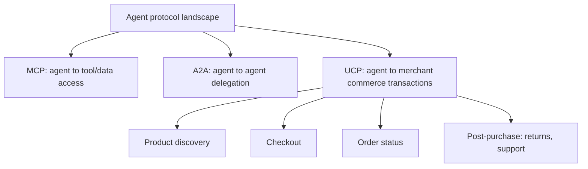

Earlier this year, this blog covered MCP (tool access) and A2A (agent-to-agent delegation) as the two protocols defining how agents interact with the world. The Universal Commerce Protocol, unveiled this year and co-developed across a coalition spanning Google, Shopify, Etsy, Wayfair, and Target, is a third, domain-specific protocol worth understanding on its own terms — standardizing the commerce journey specifically, from discovery through post-purchase, rather than being a general-purpose tool or delegation protocol.

## Where UCP Fits Relative to MCP and A2A



An agent could theoretically implement commerce interactions through generic tool calls (MCP) against a merchant's custom API — UCP's value is standardizing that interaction so a shopping agent doesn't need a bespoke integration per merchant, the same standardization argument that drove MCP's adoption for tool access generally, applied specifically to the commerce domain.

## What UCP Actually Defines

```json
{
  "product_discovery": {
    "query": "wireless noise-cancelling headphones under $200",
    "response_schema": ["product_id", "price", "availability", "merchant_id", "structured_attributes"]
  },
  "checkout_initiation": {
    "cart": [{"product_id": "...", "quantity": 1}],
    "delegated_payment_reference": "...",
    "response_schema": ["order_id", "confirmation_status", "estimated_delivery"]
  },
  "post_purchase": {
    "order_id": "...",
    "actions": ["check_status", "initiate_return", "contact_support"]
  }
}
```

The consistent schema across discovery, checkout, and post-purchase is what lets a shopping agent built against UCP work across any participating merchant without merchant-specific integration work — directly analogous to how MCP lets a tool-using agent work against any MCP-compliant server without a bespoke integration per tool provider.

## Why a Coalition of Competitors Co-Developed This

Shopify, Etsy, Wayfair, and Target compete with each other directly, and their joint involvement in UCP reflects the same standardization logic that drove card networks to agree on shared payment rails decades ago — a merchant that isn't reachable through the standard protocol agents are built against risks losing access to agent-mediated shopping traffic entirely, which is a stronger incentive to cooperate on a shared standard than any single merchant's incentive to build a proprietary, differentiated integration.

## The Payment Layer Is a Separate, Connected Standard

UCP standardizes the commerce interaction; the actual payment authorization runs through separate protocols — Visa's Trusted Agent Protocol and Mastercard's agentic payment support, covered in the next post in this series — that UCP references rather than reimplements. This separation of concerns (commerce interaction protocol vs. payment authorization protocol) mirrors the MCP/A2A separation covered earlier this year: different protocols for genuinely different concerns, designed to compose rather than each trying to cover everything.

## What This Means for Building a Shopping Agent Now

Building against UCP where a merchant supports it, rather than a custom integration, is the same forward-looking bet this blog has recommended for MCP and A2A adoption throughout the year — early enough that not every merchant supports it yet, and standardized enough that the integration investment should pay off as adoption grows, following the same trajectory MCP's adoption curve took over the past two years.

## Key Takeaways

1. **UCP standardizes the commerce journey specifically** — discovery, checkout, post-purchase — as a domain-specific complement to MCP and A2A, not a replacement for either
2. **A consistent schema across merchants is what avoids bespoke per-merchant integration**, the same value proposition that drove MCP adoption for tool access generally
3. **Competing merchants co-developing a shared standard reflects the same logic as historical shared payment rail agreements** — being unreachable by the standard risks losing agent-mediated traffic entirely
4. **UCP composes with separate payment authorization protocols** rather than reimplementing them — the same separation-of-concerns design as MCP and A2A

---

*Part of the [Agent Economy series](/tags/agent-economy-series/) — where agentic AI is actually showing up in commerce, work, and daily use in late 2026.*
