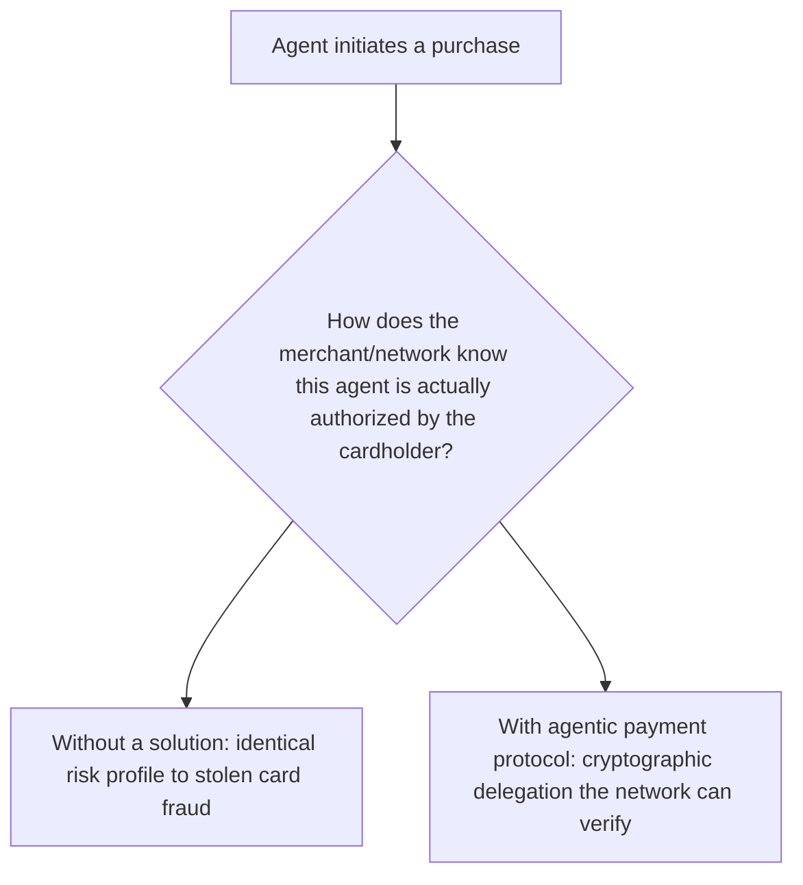
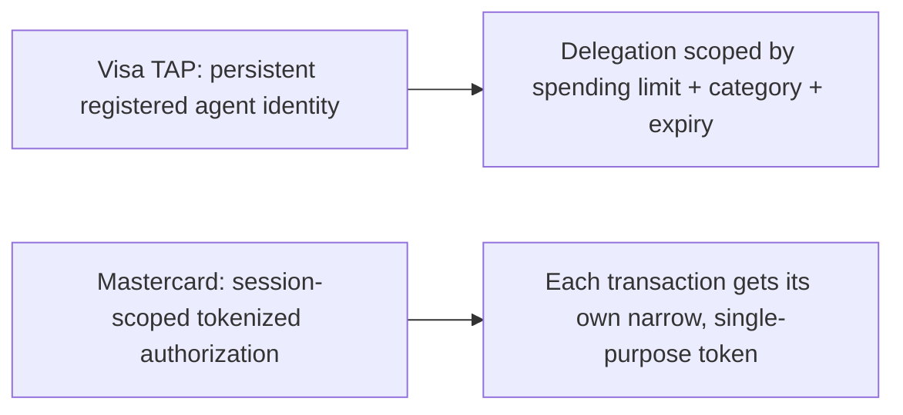

The previous post covered UCP as the commerce-interaction layer. Underneath it, actual payment authorization for an agent-initiated purchase runs through the card networks' own agentic payment protocols — Visa's Trusted Agent Protocol, now commercially launched, and Mastercard's agentic payment support, which completed its first live agentic transactions this year. Both solve the same underlying problem — proving an agent is authorized to spend on a specific user's behalf — with meaningfully different mechanisms worth understanding on their own terms.

## The Shared Underlying Problem



Without a specific mechanism for this, an agent-initiated payment looks identical to a merchant and network as a potentially fraudulent transaction — there's no way to distinguish "the cardholder's own agent, correctly authorized, is buying this" from "someone with stolen card details is buying this," which is exactly the ambiguity both protocols are built to resolve.

## Visa's Trusted Agent Protocol

Visa's approach centers on a registered, verifiable identity for the agent itself, with the cardholder explicitly delegating specific, scoped authority to that registered agent identity — connecting directly to the identity-and-trust patterns covered earlier this year for A2A cross-organization delegation, applied here to the agent-to-payment-network relationship specifically.

```python
delegation_scope = {
    "agent_id": "verified_agent_identity_xyz",
    "cardholder_id": "...",
    "spending_limit": 500.00,
    "merchant_category_restrictions": ["retail", "electronics"],
    "expiry": "2026-12-31",
}
```

## Mastercard's Agentic Payment Approach

Mastercard's live agentic transactions this year lean on a tokenized, session-scoped authorization model — rather than a persistent registered agent identity, each purchase session gets its own scoped token tied to the specific transaction intent, closer in shape to the idempotency-key and short-lived-credential patterns covered earlier on this blog for tool-call security, applied to payment authorization instead of API access.



## Why the Difference Matters for Integration

A merchant or shopping-agent platform integrating with both networks needs to handle these as genuinely different authorization models, not interchangeable variants of the same thing — the same abstraction-layer discipline from earlier posts on vendor lock-in applies directly, with a payment-authorization abstraction layer translating between network-specific models so the application logic above it doesn't need to special-case each network's approach.

```python
class PaymentAuthorizationAdapter:
    def authorize(self, network: str, purchase_intent: dict) -> dict:
        if network == "visa":
            return self.visa_tap_authorize(purchase_intent)
        elif network == "mastercard":
            return self.mastercard_session_authorize(purchase_intent)
```

## The Common Thread With Everything Else Covered This Year

Both approaches connect back to the same principle argued for throughout the agent infrastructure series earlier this year: the model deciding *to* make a purchase is a different concern from the deterministic, auditable mechanism that actually authorizes and executes the payment. Neither protocol lets the agent's own reasoning directly control payment credentials — both interpose a verifiable, scoped authorization layer between agent intent and actual money movement.

## Key Takeaways

1. **Both major card networks solve the same core problem — distinguishing authorized agent purchases from fraud — with different mechanisms**
2. **Visa's approach centers on persistent, registered agent identity with scoped delegation**; Mastercard's centers on session-scoped tokenized authorization
3. **These need to be handled as genuinely different models, not interchangeable variants**, behind an abstraction layer for any multi-network integration
4. **Both preserve the model-decides/infrastructure-authorizes boundary** established throughout this blog's agent infrastructure coverage — neither gives agent reasoning direct control over payment credentials

---

*Part of the [Agent Economy series](/tags/agent-economy-series/) — where agentic AI is actually showing up in commerce, work, and daily use in late 2026.*
