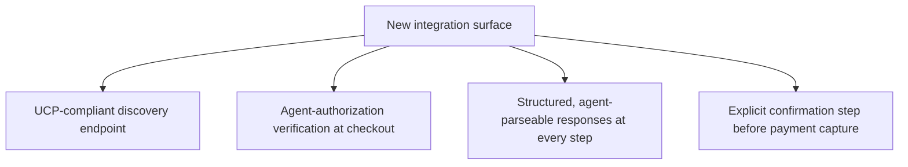
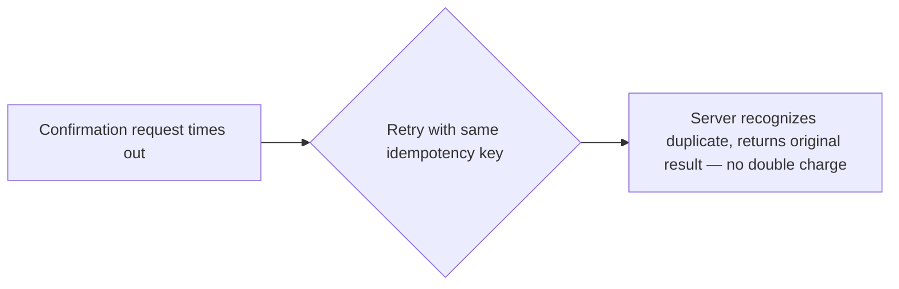

For a merchant deciding to support agent-initiated checkout, the practical question is how much of this is genuinely new engineering versus adapting existing checkout infrastructure. The honest answer: most of the checkout logic itself reuses what already exists; the new work concentrates in a few specific places this post walks through concretely.

## What Stays the Same

Inventory checks, pricing logic, tax calculation, order fulfillment — none of this changes based on whether a human or an agent initiated the checkout. A merchant's existing checkout backend handles the actual transaction the same way regardless of the initiator, which is by design: UCP and the payment protocols from the previous two posts are meant to plug into existing commerce infrastructure, not replace it.

## What's Actually New



**Structured, agent-parseable responses** matter more than they might seem — a checkout flow designed for a human reading a webpage often returns loosely-structured HTML with pricing and availability embedded in presentation markup. An agent needs the same information as clean, reliably-parseable structured data, the same schema-validation discipline from earlier posts on this blog applied to the checkout response path specifically.

```python
def checkout_response_for_agent(order: dict) -> dict:
    return {
        "order_id": order["id"],
        "status": order["status"],
        "total_amount": order["total"],
        "line_items": [{"product_id": li["id"], "quantity": li["qty"], "price": li["price"]} for li in order["items"]],
        "estimated_delivery": order["estimated_delivery"],
        # No presentation markup, no ambiguous natural-language pricing text
    }
```

## The Confirmation Step Is Not Optional

```python
def initiate_agent_checkout(cart: dict, agent_auth: dict) -> dict:
    verify_agent_authorization(agent_auth)  # from the previous post's payment protocols
    order_preview = build_order_preview(cart)
    return {
        "status": "awaiting_confirmation",
        "order_preview": order_preview,
        "confirmation_token": generate_confirmation_token(order_preview),
        # Payment is NOT captured yet — requires an explicit confirm step
    }

def confirm_and_capture(confirmation_token: str, agent_auth: dict) -> dict:
    order = validate_confirmation_token(confirmation_token)
    capture_payment(order, agent_auth)
    return {"status": "completed", "order_id": order["id"]}
```

Separating preview from confirmation applies the same policy-based escalation logic from earlier agent infrastructure posts to a merchant-side concern — even with a fully authorized agent, a two-step flow (preview the order, then explicitly confirm) gives a natural checkpoint for the agent's own logic to apply its own spending-limit or plausibility checks before money actually moves, and gives the merchant a clean audit point distinguishing "agent looked at this order" from "agent committed to this order."

## Handling Agent-Specific Failure Modes at Checkout

An agent checkout flow needs the same idempotency discipline covered earlier this year for any consequential tool call — a confirmation request that times out on the response but may have actually succeeded server-side needs an idempotency key, not a blind retry, to avoid double-charging a customer whose agent retried after an ambiguous network failure.



## Key Takeaways

1. **Most checkout logic (inventory, pricing, tax, fulfillment) is unchanged by whether an agent or human initiated the purchase**
2. **The new engineering concentrates in structured, agent-parseable responses and explicit authorization verification**, not the transaction logic itself
3. **A separate preview-then-confirm step gives both the agent and the merchant a checkpoint before payment actually captures**
4. **Agent checkout flows need the same idempotency discipline as any other consequential tool call** — an ambiguous failure shouldn't risk a duplicate charge

---

*Part of the [Agent Economy series](/tags/agent-economy-series/) — where agentic AI is actually showing up in commerce, work, and daily use in late 2026.*
