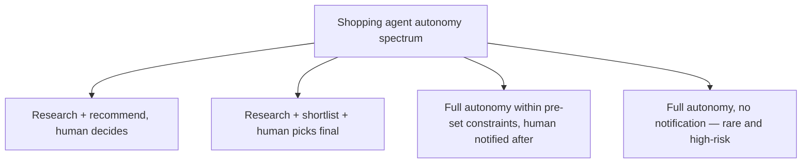
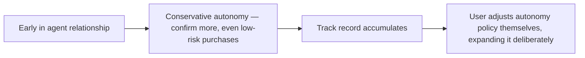

The distinction between a helpful shopping assistant and an agent that actually pursues a purchasing goal with limited supervision — researching, comparing, deciding, and authorizing the transaction — is exactly the autonomy question the escalation design posts covered earlier this year, now applied to a use case where the stakes are a consumer's own money and the audience is far less technical than an enterprise operations team.

## Autonomy Isn't Binary — It's a Spectrum With Real Checkpoints



Most deployed shopping agents in 2026 sit somewhere in the middle of this spectrum, not at either extreme — full research-then-human-decides autonomy undersells what makes an agent valuable (the whole point is reducing the user's own effort), while fully unsupervised purchasing with no user-set boundaries is both a poor user-trust proposition and, per the policy-based escalation principle from earlier this year, exactly the kind of consequential action that shouldn't be fully autonomous regardless of how capable the agent is.

## Applying Policy-Based Escalation to Consumer Purchasing

```python
PURCHASE_AUTONOMY_POLICY = {
    "under_threshold_amount": 50.00,       # auto-purchase allowed within this
    "category_allowlist": ["groceries", "household_essentials"],  # pre-approved categories
    "requires_confirmation_above_threshold": True,
    "requires_confirmation_for_new_merchant": True,  # first purchase from an unfamiliar merchant
}

def evaluate_purchase_autonomy(intended_purchase: dict, user_policy: dict) -> str:
    if intended_purchase["amount"] > user_policy["under_threshold_amount"]:
        return "requires_confirmation"
    if intended_purchase["category"] not in user_policy["category_allowlist"]:
        return "requires_confirmation"
    if intended_purchase["merchant_id"] not in get_known_merchants(user_policy):
        return "requires_confirmation"
    return "auto_approved"
```

This is the same policy-based-escalation-as-backstop principle from earlier this year, made concrete for a consumer context: dollar thresholds, category allowlists, and new-merchant flags are the consumer equivalent of the enterprise escalation triggers covered in that post, and they should govern autonomy regardless of how confident the agent itself is about a specific purchase decision.

## The User Trust Dimension Is Distinct From the Technical Risk Dimension

A purchase within a set spending limit, from a known merchant, in an approved category is technically low-risk *and* still might warrant a confirmation step purely for user trust and comfort reasons, especially early in a user's relationship with a shopping agent — trust in delegated purchasing is something that builds over a track record, the same way organizational trust in enterprise agents builds through the vertical-agent proving-ground pattern covered earlier in this series, applied here to an individual consumer relationship instead of an organization.



## Letting the User Own the Policy, Not the Platform

The autonomy policy itself should be user-configurable and legible — a user should be able to see and adjust their own spending thresholds and category allowlists directly, not have autonomy determined by an opaque platform default they never explicitly agreed to. This connects to the transparency obligations that become a regulatory requirement under the EU AI Act, covered later in this series — user-facing autonomy transparency isn't just good practice, it's increasingly a compliance requirement too.

## Key Takeaways

1. **Shopping agent autonomy is a spectrum, and most real deployments sit in the middle**, not at full-manual or full-autonomous extremes
2. **Dollar thresholds, category allowlists, and new-merchant flags are the consumer version of enterprise policy-based escalation** — they should override agent confidence, not defer to it
3. **User trust in delegated purchasing builds over a track record**, the same dynamic as organizational trust in enterprise agents — conservative defaults early, expanded deliberately later
4. **Autonomy policy should be user-owned and legible**, not an opaque platform default — this is both good practice and an emerging regulatory expectation

---

*Part of the [Agent Economy series](/tags/agent-economy-series/) — where agentic AI is actually showing up in commerce, work, and daily use in late 2026.*
