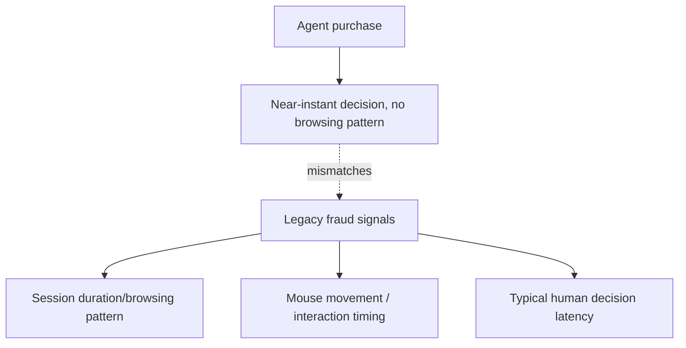
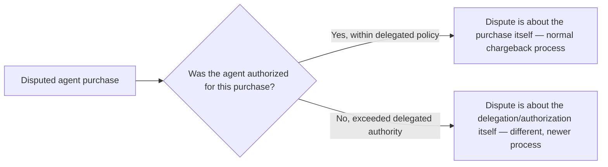

Fraud detection systems learned what "normal" purchasing behavior looks like from years of human shopping patterns — browsing time, mouse movement, session duration, time-of-day patterns. An agent purchasing on a user's behalf produces a behavioral signature that's fast, consistent, and lacks most of the signals fraud models were trained to expect from a legitimate human buyer, which creates a genuine, current tension: agent purchases can trigger fraud flags not because they're fraudulent, but because they don't look like the human behavior the model was trained on.

## Why Agent Purchase Patterns Look Anomalous to Legacy Fraud Models



A model flagging "purchase completed in 3 seconds with no browsing history" as suspicious was reasonably calibrated when that pattern almost always indicated a bot exploiting a stolen card — and now it also describes an entirely legitimate agent purchase authorized correctly through the Visa or Mastercard protocols covered earlier this week. The fraud model needs new signal, not just a blanket exemption for anything claiming to be agent-initiated.

## The Fix Is Verified Delegation, Not Behavioral Exemption

```python
def assess_fraud_risk(transaction: dict) -> dict:
    if transaction.get("agent_authorization_verified"):
        # Don't exempt from fraud checks entirely — check DIFFERENT signals
        return assess_agent_transaction_risk(transaction)
    return assess_human_transaction_risk(transaction)  # existing behavioral model

def assess_agent_transaction_risk(transaction: dict) -> dict:
    return {
        "authorization_chain_valid": verify_delegation_chain(transaction),  # per the payment protocol
        "within_delegated_limits": check_spending_policy_compliance(transaction),
        "merchant_reputation": check_merchant_risk_score(transaction["merchant_id"]),
        "velocity_anomaly": check_purchase_velocity(transaction, baseline="agent_typical"),  # different baseline than human
    }
```

The key shift: verify the *authorization chain* (was this agent actually delegated to spend on this user's behalf, within what limits, per the Visa/Mastercard protocols from earlier this week) rather than trying to make an agent purchase's behavioral pattern look human. A verified, correctly-scoped delegation is a strong legitimacy signal in its own right, one that doesn't exist in the pre-agentic-commerce fraud model at all.

## Chargebacks Get More Complicated, Not Less



A chargeback dispute on an agent-initiated purchase now has two distinct possible categories: an ordinary dispute about the purchase itself (wrong item, not as described — same as any human purchase dispute), or a dispute about whether the agent was actually authorized to make that purchase at all (exceeded a spending limit, purchased outside an approved category). The second category is genuinely new, and the dispute-resolution process for it — verifying what the delegation policy actually said at the time of purchase — didn't exist before agentic commerce and is still maturing across the industry in 2026.

## What Merchants Should Be Building Now

Logging the full authorization chain at time of purchase — not just "payment succeeded" but the specific delegation scope that authorized it — is what makes the second category of dispute resolvable at all. A merchant that only logs successful payment capture, without the authorization details, has no way to adjudicate an "agent exceeded its authority" dispute months later.

## Key Takeaways

1. **Agent purchase behavior genuinely doesn't match the human behavioral patterns legacy fraud models were trained on** — this produces real false positives, not a solved problem
2. **The fix is verifying the delegation authorization chain, not exempting agent purchases from fraud checks or trying to make them look human**
3. **Chargeback disputes on agent purchases split into two categories** — ordinary purchase disputes, and a genuinely new "was the agent actually authorized" category
4. **Log the full authorization chain, not just payment success**, or the second dispute category becomes unadjudicable after the fact

---

*Part of the [Agent Economy series](/tags/agent-economy-series/) — where agentic AI is actually showing up in commerce, work, and daily use in late 2026.*
