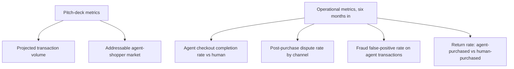

The metrics that justify greenlighting an agentic commerce pilot — projected transaction volume, addressable agent-shopper market size — are consistently different from the metrics retailers actually end up watching once the pilot is live. This is a common pattern across new technology rollouts generally, and worth naming specifically for agentic commerce because the gap between pitch-deck metrics and operational metrics is wide enough to catch teams off guard.

## The Metrics That Actually Get Watched



**Agent checkout completion rate versus human** is the first thing operational teams check, and it's a direct application of the execution-outcome measurement principle from earlier this series — not "did the agent visit the checkout page" but "did the transaction actually complete," compared against the retailer's existing human checkout completion baseline.

**Return rate for agent-purchased items** turned out to be an unexpectedly important early signal — a meaningfully higher return rate for agent-initiated purchases relative to human ones would indicate the agent is making purchase decisions that don't actually match user intent well, a quality signal distinct from whether the transaction mechanically succeeded.

## A Practical Pilot Dashboard

```python
def agentic_commerce_pilot_metrics(transactions: list[dict], window_days: int = 30) -> dict:
    agent_txns = [t for t in transactions if t["initiated_by"] == "agent"]
    human_txns = [t for t in transactions if t["initiated_by"] == "human"]
    return {
        "agent_completion_rate": pct(t["completed"] for t in agent_txns),
        "human_completion_rate": pct(t["completed"] for t in human_txns),
        "agent_return_rate": pct(t["returned"] for t in agent_txns),
        "human_return_rate": pct(t["returned"] for t in human_txns),
        "agent_fraud_false_positive_rate": pct(
            t["flagged_as_fraud"] and not t["actually_fraudulent"] for t in agent_txns
        ),
        "authorization_dispute_count": count_disputes_by_type(agent_txns, "authorization"),
    }
```

Comparing agent metrics directly against the existing human baseline, rather than evaluating agent performance in isolation, is what makes this dashboard actually decision-useful — an 85% agent completion rate sounds concerning in isolation and might be perfectly reasonable if the human baseline for the same checkout flow is 82%.

## The Metric Retailers Report Being Surprised By

Consistently, the operational surprise isn't fraud or completion rate — it's the **authorization dispute count** from the previous post's chargeback discussion, specifically because most retailers' initial pilot planning didn't anticipate this as a distinct dispute category at all, having modeled agentic commerce disputes as a subset of ordinary chargebacks rather than recognizing the genuinely new "was this agent actually authorized" category.

## Revising the Pilot's Success Criteria Mid-Flight

Several retailers running early pilots report revising their defined success criteria after the first month, once the operational metrics revealed which of the original pitch-deck assumptions held up and which didn't — a healthy, expected pattern for any genuinely new technology rollout, and worth planning for explicitly (a defined checkpoint to revisit success criteria) rather than treating the original pitch-deck metrics as fixed regardless of what real operational data shows.

## Key Takeaways

1. **Pitch-deck metrics (projected volume, market size) and operational metrics (completion rate, dispute rate) consistently diverge in practice**
2. **Compare agent metrics directly against the existing human baseline**, not in isolation — that's what makes the numbers decision-useful
3. **Return rate is an underused early quality signal** — a gap versus human purchases suggests the agent's decisions don't match user intent well, distinct from mechanical transaction success
4. **Plan an explicit checkpoint to revisit pilot success criteria** once real operational data reveals which pitch-deck assumptions held up

---

*Part of the [Agent Economy series](/tags/agent-economy-series/) — where agentic AI is actually showing up in commerce, work, and daily use in late 2026.*
