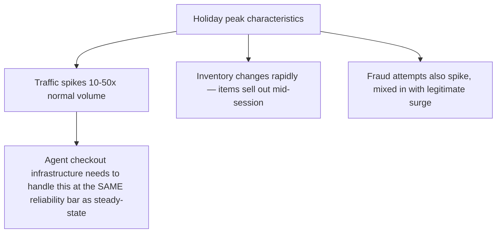
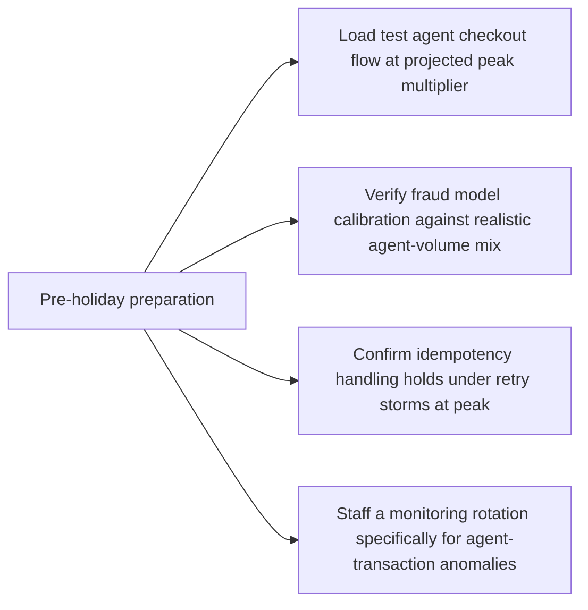

Industry projections for this holiday season point to millions of consumers letting shopping agents handle purchases end to end for the first time at real scale — a genuine first large-scale stress test for the commerce infrastructure covered throughout this week, under the highest-traffic, highest-stakes conditions the retail calendar produces. Closing out this series' commerce stretch with what that stress test actually demands.

## Why Holiday Traffic Is a Different Kind of Load Than Steady-State



The capacity planning discipline from earlier this year — provisioning for the tail, not the average, and modeling in compute-equivalent units rather than raw request counts — applies directly here, with holiday-specific compounding: not just more requests, but more requests each involving more agent-side reasoning (comparing options, checking availability, handling out-of-stock substitutions) than a steady-state purchase typically requires.

## Inventory Race Conditions Get Sharper Under Agent-Speed Transactions

```python
def agentic_checkout_with_inventory_check(cart: dict) -> dict:
    # Under holiday load, availability can change between the agent's
    # discovery query and its checkout attempt — much more likely at
    # peak than in steady-state, given both higher traffic and faster
    # agent decision cycles than human browsing
    current_availability = check_live_inventory(cart)
    if not current_availability["available"]:
        return {
            "status": "unavailable",
            "alternative_suggestions": find_substitutes(cart, current_availability),
        }
    return proceed_to_confirmation(cart)
```

An agent's near-instant decision speed, called out earlier this week as a fraud-signal mismatch, becomes an inventory-race-condition amplifier under holiday load — a product that showed as available at discovery time can sell out in the seconds before an agent completes checkout, at a rate high-volume holiday traffic makes much more likely than steady-state traffic. Returning a clear, structured "unavailable" response with alternatives (rather than a confusing failure) is what lets the agent's own reasoning handle this gracefully instead of the user experiencing an opaque error.

## Fraud Detection Under Peak Load, With Legitimate Agent Volume Mixed In

The fraud-model recalibration from earlier this week gets stress-tested specifically at holiday peak — a fraud system that's been tuned against a moderate volume of agent transactions needs to hold up against a much larger volume without either missing a proportionally larger absolute number of real fraud attempts or generating enough false positives on legitimate agent purchases to create a real customer-experience problem during the highest-revenue period of the year.

## What Merchants Are Actually Doing to Prepare



The idempotency discipline from earlier this week matters more, not less, under peak load — a retry storm during a brief capacity constraint is exactly the condition where a checkout flow without solid idempotency handling risks duplicate charges at real scale, compounding a capacity problem into a customer-trust problem.

## Key Takeaways

1. **Holiday peak isn't just more of the same traffic — it compounds volume with more agent-side reasoning per transaction and faster inventory turnover**
2. **Agent decision speed amplifies inventory race conditions under peak load** — return clear, structured unavailability responses the agent can reason about, not opaque failures
3. **Fraud model calibration needs to hold up at a much larger agent-transaction volume**, not just the moderate volume it may have been tuned against
4. **Idempotency handling matters most exactly when it's hardest to maintain — under peak-load retry storms**, not just steady-state operation

---

*Part of the [Agent Economy series](/tags/agent-economy-series/) — where agentic AI is actually showing up in commerce, work, and daily use in late 2026.*
