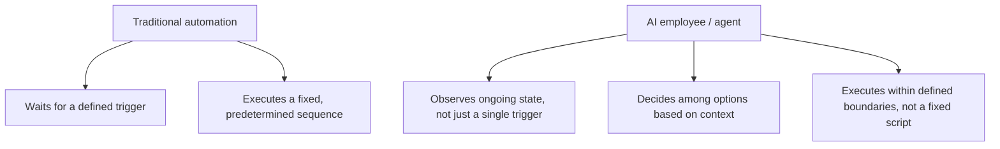
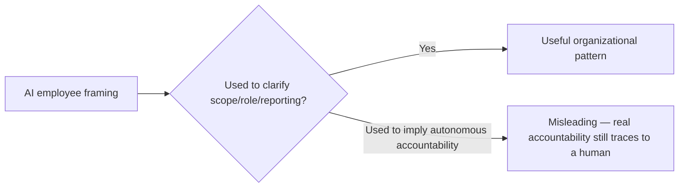

"AI employee" gets used broadly enough in 2026 marketing material to mean almost anything from a chatbot to a fully autonomous vertical agent. Stripped of the marketing framing, the term describes something specific and worth defining precisely, because the precision matters for deciding what to actually build and how to govern it — this isn't just semantics, the definition determines the guardrail and escalation requirements that apply.

## The Distinction From Traditional Automation



Traditional RPA-style automation waits for a trigger and executes a fixed sequence — reliable, and brittle the moment reality deviates from what the sequence assumed. What's meaningfully different about an "AI employee" in the 2026 usage that actually holds up to scrutiny: it observes ongoing state, makes a decision among genuinely different possible actions based on that state, and executes within boundaries rather than following one predetermined path — closer to the narrow vertical agent architecture covered at the start of this series than to legacy automation, even though both get called "automation" colloquially.

## Why the Term Persists Despite Being Overused

The marketing appeal of "employee" framing — implying something that can be onboarded, managed, and evaluated the way a human role would be — reflects a real underlying shift even if the specific term gets diluted by overuse: organizations are increasingly structuring these systems around role-based responsibility (a "support triage AI employee" owning a defined scope of work) rather than treating them purely as tooling embedded inside an existing human workflow.

```python
@dataclass
class AgentRoleDefinition:
    role_name: str
    scope_of_responsibility: list[str]
    decision_authority: dict  # what it can decide autonomously vs. escalate
    reporting_relationship: str  # which human role reviews its work/escalations
    success_metrics: dict  # per the execution-outcome discipline from earlier this series
```

Modeling an agent deployment as a role definition, rather than just a technical integration spec, is a genuinely useful organizational pattern independent of whether "AI employee" is the right marketing term for it — it forces the same questions a human role definition forces: what's actually in scope, who does this report to, how is success measured.

## Where the Framing Breaks Down and Becomes Actively Misleading

The employee metaphor stops being useful, and becomes actively misleading, the moment it implies accountability structures that don't actually exist — an "AI employee" cannot be held accountable the way a human employee can, and treating the metaphor too literally risks under-specifying the actual human accountability chain (who is responsible when this agent's decision causes harm) that has to exist regardless of how the system is marketed or framed internally.



## What to Actually Call This Internally

Whatever the external marketing term, internal documentation (the behavior-documentation format covered earlier this year for compliance purposes) should be precise about the actual accountability chain — which human role owns the outcomes of this agent's actions, which is a question the "AI employee" framing can obscure if taken too literally, and one that governance frameworks like the EU AI Act, covered later in this series, require answering explicitly regardless of internal terminology.

## Key Takeaways

1. **"AI employee" as marketing shorthand obscures a real, specific distinction worth naming precisely**: observing state and deciding among options within boundaries, not just executing a fixed triggered sequence
2. **Modeling agent deployments as role definitions (scope, decision authority, reporting relationship, success metrics) is a genuinely useful pattern**, independent of the marketing term
3. **The metaphor breaks down when it implies autonomous accountability** — real accountability always traces to a human, and internal documentation needs to be explicit about that regardless of external framing
4. **Precision here isn't pedantry** — it determines what guardrail and escalation requirements actually apply to a given deployment

---

*Part of the [Agent Economy series](/tags/agent-economy-series/) — where agentic AI is actually showing up in commerce, work, and daily use in late 2026.*
