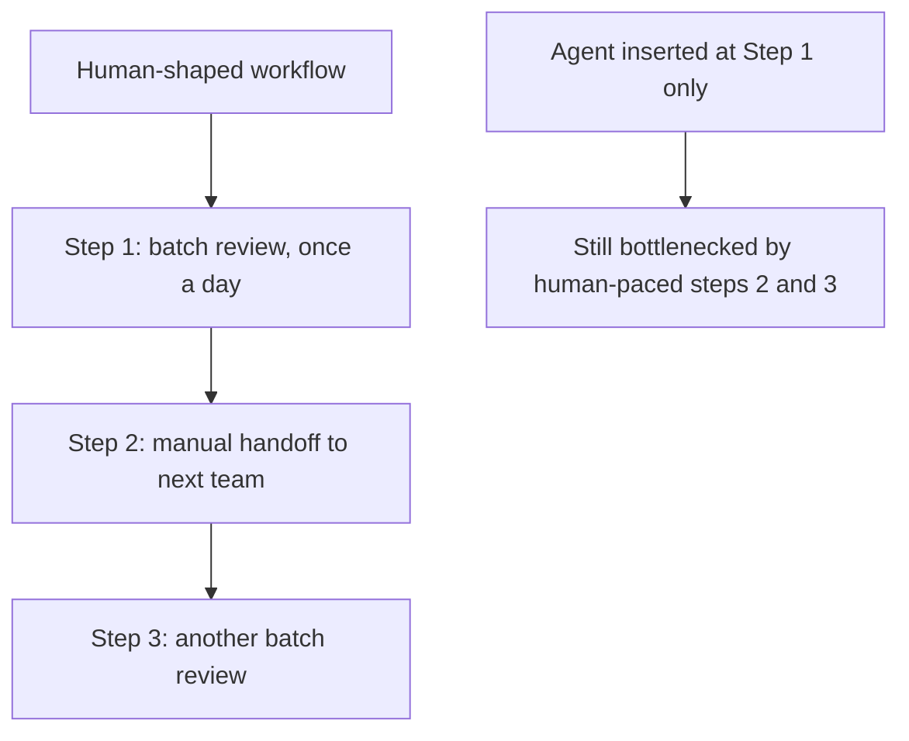
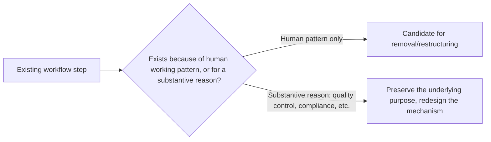

The most common, and most avoidable, mistake in digital workforce deployments this year: taking an existing workflow, designed around human working patterns and constraints, and inserting an agent into one step of it unchanged — instead of redesigning the workflow around what an agent actually does differently, which is usually where most of the available value sits and gets left uncaptured.

## Why Inserting an Agent Into a Human-Shaped Workflow Underdelivers



A workflow designed around human working patterns has batch processing points, handoff delays, and review cadences calibrated to how humans actually work — once-a-day batch review, handoffs that wait for someone's availability. An agent inserted at just one step of that workflow inherits every downstream human-paced bottleneck, capturing only the local speedup at its own step while the end-to-end workflow timeline barely moves, because the slowest steps were never touched.

## What Redesigning Actually Looks Like

```python
# Human-shaped: batch review once a day, then manual handoff
def legacy_workflow(items: list[dict]):
    daily_batch = collect_items_for_daily_review(items)
    reviewed = human_review_batch(daily_batch)  # once a day
    handoff_to_next_team(reviewed)  # waits for team availability

# Redesigned around continuous agent processing
def agent_native_workflow(item: dict):
    result = agent_process_immediately(item)  # no batching needed — agent has no batch-efficiency reason
    if result["confidence"] >= AUTO_APPROVE_THRESHOLD:
        route_directly_to_next_step(result)  # no handoff delay
    else:
        queue_for_human_review(result)  # only the genuinely uncertain cases wait for a human
```

The redesign removes batching (a human efficiency pattern with no equivalent benefit for an agent processing items individually) and removes the blanket handoff delay (only genuinely uncertain cases need to wait for human availability, not every item regardless of confidence). This is where the bulk of the actual speedup lives — not in the agent being faster at the original single step, but in restructuring the workflow to not carry forward bottlenecks that only existed because humans needed them.

## Why This Requires Actually Understanding the Original Workflow's Purpose

Removing a batching step blindly, without understanding *why* it existed, risks removing something that was serving a real purpose beyond human convenience — a daily batch review might exist partly for quality-control sampling reasons, not purely as a human-pacing artifact. Redesign requires distinguishing which parts of the existing workflow exist because humans need them versus which parts exist for a substantive reason that should carry forward regardless of who's executing the step.



## The 84% Gap This Closes

This directly addresses the finding referenced in the next post's title — the large majority of organizations that haven't redesigned jobs or workflows around agent capability are, by definition, in the "inserted an agent into an unchanged workflow" category, capturing a fraction of the available value while carrying forward every human-paced bottleneck the original workflow was built around.

## Key Takeaways

1. **Inserting an agent into one step of an unchanged, human-shaped workflow captures only local speedup, bottlenecked by every remaining human-paced step**
2. **Redesigning removes batching and blanket handoff delays that existed for human convenience**, routing confidently-handled items straight through and reserving human review for genuinely uncertain cases
3. **Distinguish workflow steps that exist for human convenience from those serving a substantive purpose** (quality control, compliance) before removing them
4. **This redesign work, not agent capability alone, is where most of the actually available value sits** — and it's the step most deployments skip

---

*Part of the [Agent Economy series](/tags/agent-economy-series/) — where agentic AI is actually showing up in commerce, work, and daily use in late 2026.*
