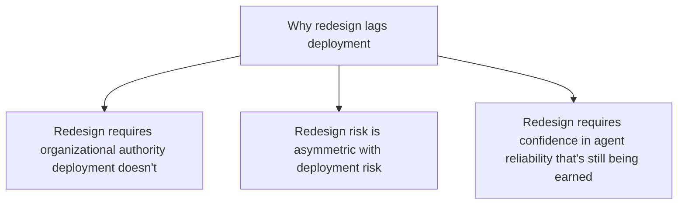
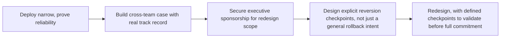

Industry survey data this year puts a striking figure on the redesign gap covered in the previous post: 84% of organizations deploying AI agents haven't actually redesigned the jobs or workflows around them. The number itself is less useful than understanding why it's so high, because the reasons are structural, not simply a matter of organizations not getting around to it yet.

## Three Structural Reasons Redesign Lags Deployment



**Redesign requires different authority than deployment.** A team can deploy an agent into an existing step without needing sign-off from every team downstream in the workflow. Redesigning the full workflow — removing batching, restructuring handoffs — usually touches multiple teams' processes and requires coordination and authority that a single deploying team often doesn't have.

**Redesign risk is asymmetric.** If an inserted agent underperforms, reverting is simple: route back through the original human-paced step. If a redesigned workflow underperforms, reverting is much harder, because the original workflow's steps and handoffs may no longer exist in their prior form. This asymmetry pushes toward the conservative, lower-risk "insert without redesigning" choice even when the redesigned version would deliver more value.

**Redesign requires reliability confidence the deployment itself is still building.** The vertical-agent trust-building pattern from earlier in this series — narrow deployment first, expanded scope once trust is earned — applies directly: an organization reasonably wants to see an agent perform reliably at its inserted step before committing to a workflow redesign that assumes that reliability more broadly.

## Why This Gap Is Closing Slower Than Capability Is Improving

```python
def redesign_readiness_assessment(agent_deployment: dict) -> dict:
    return {
        "reliability_track_record_sufficient": agent_deployment["months_in_production"] > 3,
        "cross_team_authority_secured": agent_deployment.get("redesign_sponsor_level") == "executive",
        "reversion_plan_exists": agent_deployment.get("has_documented_rollback_plan", False),
    }
```

The gap persists not because organizations don't see the value case from the previous post — most do — but because closing it requires all three conditions above simultaneously, and the third (a documented reversion plan for a redesigned, not just an inserted, workflow) is the one most commonly missing, since it requires thinking through what "reverting a redesign" actually means in a way that reverting a simple insertion doesn't.

## What Closes the Gap in Practice



Organizations that have successfully closed this gap consistently follow this sequence rather than attempting redesign immediately alongside initial deployment — the reliability track record from narrow deployment is what secures the executive sponsorship needed for cross-team redesign authority, and explicit reversion checkpoints (not just "we can always go back") are what make the redesign risk asymmetry from above actually manageable.

## Key Takeaways

1. **The 84% redesign gap is structural, not simply organizational slowness** — it requires authority, tolerates less risk-reversal flexibility, and requires reliability confidence that deployment itself is still earning
2. **Redesign risk is asymmetric with deployment risk**: reverting an insertion is easy, reverting a redesign is hard, which biases organizations toward the conservative choice by default
3. **A documented reversion plan, not just general rollback intent, is the condition most commonly missing** before organizations attempt redesign
4. **The gap closes through sequencing**: prove reliability narrowly first, use that track record to secure redesign authority, then redesign with explicit checkpoints — not by attempting redesign and deployment simultaneously

---

*Part of the [Agent Economy series](/tags/agent-economy-series/) — where agentic AI is actually showing up in commerce, work, and daily use in late 2026.*
