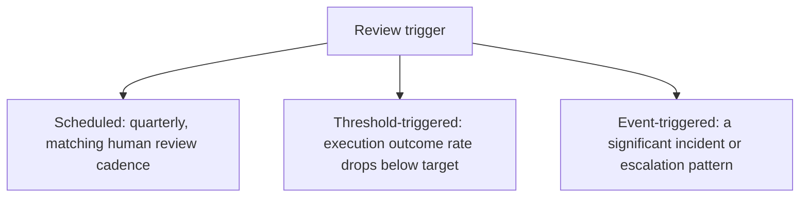
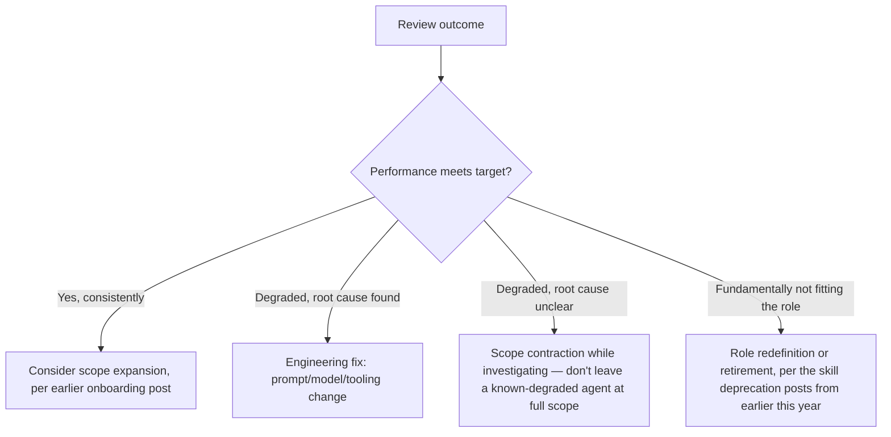

The previous post sketched what an agent performance review measures. The harder operational questions — what triggers a review, who conducts it, and what actually happens based on the outcome — determine whether this is a real management practice or just a metrics dashboard nobody acts on, the same gap covered earlier this year between a dashboard that exists and one that actually changes behavior.

## What Triggers a Review



Scheduled review alone misses the same gap the cost-anomaly-detection posts from earlier this year warned against for spend — waiting for a quarterly checkpoint to notice a degrading execution outcome rate means weeks of degraded performance go unaddressed. Threshold-triggered review, firing automatically when a tracked metric crosses a defined line, catches degradation between scheduled checkpoints, the same principle as automated cost or quality-regression alerting applied to ongoing role performance specifically.

## Who Conducts It

```python
REVIEW_RESPONSIBILITY = {
    "execution_metrics_review": "line_manager",          # same as a human report's metrics
    "root_cause_of_degradation": "platform_engineering",  # requires technical investigation
    "scope_or_policy_adjustment": "line_manager_with_platform_input",
    "underlying_model_or_prompt_change": "platform_engineering",
}
```

This division matters because it avoids two failure modes: a line manager without engineering context trying to diagnose *why* performance degraded (usually not productively, since the cause is often a model version change, a prompt drift, or an upstream data issue outside their visibility), and platform engineering unilaterally deciding to adjust an agent's scope or role without the line manager's operational context about what the business actually needs from that role.

## What Actually Happens Based on the Outcome



The **scope contraction while investigating** branch is the one most organizations skip, defaulting instead to leaving a degraded agent at full scope while root-causing in the background — this is a real risk, not a neutral choice, since it means a known-underperforming agent continues operating at full authority during exactly the period when its reliability is least trusted. Contracting scope (routing more cases to human review, tightening escalation thresholds) during investigation is the more conservative and defensible default.

## The Retirement Path Reuses Existing Infrastructure

When a review concludes an agent role should be retired or fundamentally redefined, this is mechanically the skill deprecation process from earlier this year — a phased lifecycle with a deprecation window, not an abrupt cutoff, applied to a full agent role rather than a single skill, with the same call-volume monitoring determining when it's actually safe to complete the retirement.

## Key Takeaways

1. **Combine scheduled and threshold-triggered review** — a quarterly-only cadence misses degradation between checkpoints
2. **Split review responsibility between line manager (operational metrics) and platform engineering (technical root cause)** — neither should own both halves alone
3. **Contract scope during investigation of a degraded agent**, rather than defaulting to full scope while root-causing in the background
4. **Role retirement reuses the existing skill-deprecation lifecycle** — a phased window with call-volume monitoring, not an abrupt cutoff

---

*Part of the [Agent Economy series](/tags/agent-economy-series/) — where agentic AI is actually showing up in commerce, work, and daily use in late 2026.*
