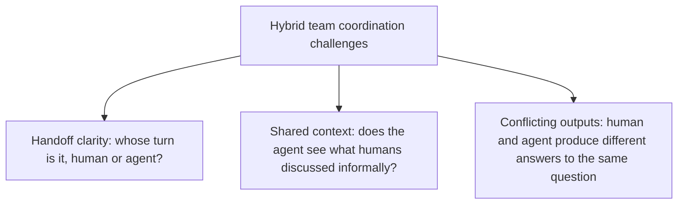
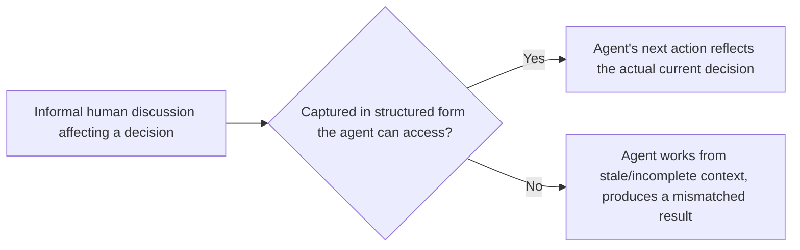

Everything earlier this week focused on a single agent in a single defined role. Real projects increasingly involve several human roles and several agent roles collaborating on the same deliverable — and that composition introduces coordination questions that don't show up when reasoning about one agent in isolation.

## Where Coordination Actually Gets Hard



**Handoff clarity** matters more in a hybrid team than in a single-agent deployment, because a project with multiple contributors (some human, some agent) needs an explicit state machine for whose turn it is — without one, work either stalls waiting for a handoff nobody triggered, or duplicates because both a human and an agent worked the same item independently, unaware of each other's progress.

```python
class ProjectItemState:
    status: str  # "awaiting_agent", "awaiting_human", "in_review", "complete"
    assigned_to: str  # specific agent instance or human, not just a role
    last_updated: datetime

def route_next_action(item: ProjectItemState) -> str:
    if item.status == "awaiting_agent":
        return dispatch_to_agent(item)
    if item.status == "awaiting_human":
        return notify_assigned_human(item)
    # No ambiguous "either could pick this up" state — every item has one clear owner at a time
```

## Shared Context Is Not Automatic

A human team's informal, unstructured communication — a hallway conversation, a quick Slack aside — carries context that shapes decisions without ever being formally documented. An agent has no access to that informal channel by default, which means a hybrid team needs a deliberate practice of capturing decisions that affect the agent's work into a structured form it can actually access, rather than assuming shared understanding the way a fully human team might.



## Resolving Conflicting Outputs

When a human contributor and an agent produce genuinely different answers to the same sub-question within a project, the resolution process needs to be defined in advance, not improvised in the moment — whose output takes precedence by default (and under what conditions that default gets overridden) is a policy decision, following the same escalation-design discipline from earlier this year, now applied to human-vs-agent output conflicts specifically rather than agent autonomy thresholds.

```python
CONFLICT_RESOLUTION_POLICY = {
    "factual_disagreement": "escalate_to_human_reviewer",  # neither side is automatically trusted
    "stylistic_disagreement": "human_preference_wins",      # low-stakes, defer to human judgment
    "domain_expertise_required": "route_to_domain_expert",  # neither the general agent nor a non-expert human
}
```

## The Practical Takeaway

Hybrid team structure benefits from the same upfront-design discipline argued for throughout this blog's spec-driven development series — define the handoff state machine, the context-capture practice, and the conflict-resolution policy before the project starts, not as ad hoc decisions made under deadline pressure once a coordination failure has already happened.

## Key Takeaways

1. **A hybrid team needs an explicit handoff state machine** — without one, work stalls on unclear ownership or duplicates on unclear ownership
2. **Informal human context doesn't reach an agent automatically** — deliberate capture into structured form is required, not assumed
3. **Define a conflict-resolution policy for human-vs-agent disagreement in advance**, distinguishing factual, stylistic, and expertise-dependent disagreements
4. **Design this coordination structure before the project starts**, applying the same upfront-spec discipline as this blog's earlier series on spec-driven development

---

*Part of the [Agent Economy series](/tags/agent-economy-series/) — where agentic AI is actually showing up in commerce, work, and daily use in late 2026.*
