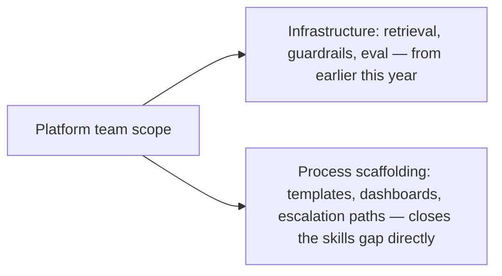

Skills shortages are named consistently across 2026 industry surveys as the single biggest barrier to AI adoption — a real finding worth being specific about, because "skills gap" as a phrase is vague enough to mean almost anything. Closing out this week's stretch on digital workforce topics with what's actually missing, concretely, based on the patterns covered across this week's posts.

## The Skills Actually Missing, Named Specifically

```mermaid
flowchart TD
    A[The actual skills gap] --> B[Workflow redesign — not just deployment]
    A --> C[Role-definition thinking for a non-human "employee"]
    A --> D[Reading execution-outcome metrics, not conversation quality]
    A --> E[Diagnosing whether a review-flagged issue is a policy problem or an engineering problem]
```

None of these are deep technical AI skills — they're organizational and managerial skills applied to a genuinely new kind of thing, which is exactly why the gap is as widespread as the survey data suggests. A manager who's excellent at managing human teams doesn't automatically have the mental model for the role-definition and escalation-policy thinking covered earlier this week; that's a distinct skill, not an extension of existing management skill by default.

## Where This Gets Built: Not Primarily Training Programs

```python
def skill_building_approach(gap: str) -> str:
    approaches = {
        "workflow_redesign": "cross-functional practice: manager works directly with platform engineering on one real redesign",
        "role_definition_thinking": "template + guided first use, per the onboarding checklist from earlier this week",
        "execution_outcome_literacy": "dashboard design that makes the right metric the obvious one to look at",
        "policy_vs_engineering_diagnosis": "clear escalation path removes the need for the manager to diagnose alone",
    }
    return approaches[gap]
```

The pattern across all four: closing this specific skills gap is less about formal training curricula and more about designing the surrounding process (templates, dashboards, escalation paths) so the skill required of any individual manager is smaller — the role-definition template from earlier this week and the metrics-dashboard design principles from the cost-dashboard post earlier this year both do real work reducing how much a manager needs to independently know versus how much the surrounding system does for them.

## The Platform Team's Role in Closing This Gap

This connects directly to the platform-team scope covered earlier this year — providing not just infrastructure but the templates, guided workflows, and escalation paths that reduce the skill burden on individual line managers is a legitimate and valuable platform-team responsibility, distinct from the pure infrastructure ownership (retrieval, guardrails, eval tooling) that platform team scope was originally defined around.



## Why This Matters More Than It Might Seem

Given the vertical-agent trust-building thesis running throughout this series — narrow deployment, proven track record, expanded trust — an organization-wide skills gap in managing that process is a direct constraint on how fast trust can actually be earned and scope actually expanded, regardless of how capable the underlying agent technology is. Closing the skills gap isn't a nice-to-have alongside better agents; it's a rate-limiting factor on how much value better agents can actually deliver.

## Key Takeaways

1. **The 2026 skills gap is organizational and managerial, not primarily technical** — workflow redesign, role-definition thinking, execution-outcome literacy, and issue diagnosis
2. **Closing it is more about designing surrounding process (templates, dashboards, escalation paths) than formal training curricula**
3. **This is a legitimate platform-team responsibility**, extending beyond pure infrastructure ownership into process scaffolding that reduces the skill burden on individual managers
4. **The skills gap is a direct rate-limiter on how fast agent trust and scope can expand**, regardless of underlying agent capability — closing it matters as much as improving the technology itself

---

*Part of the [Agent Economy series](/tags/agent-economy-series/) — where agentic AI is actually showing up in commerce, work, and daily use in late 2026.*
