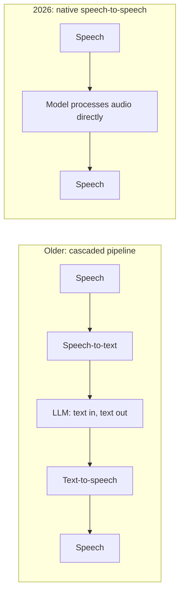
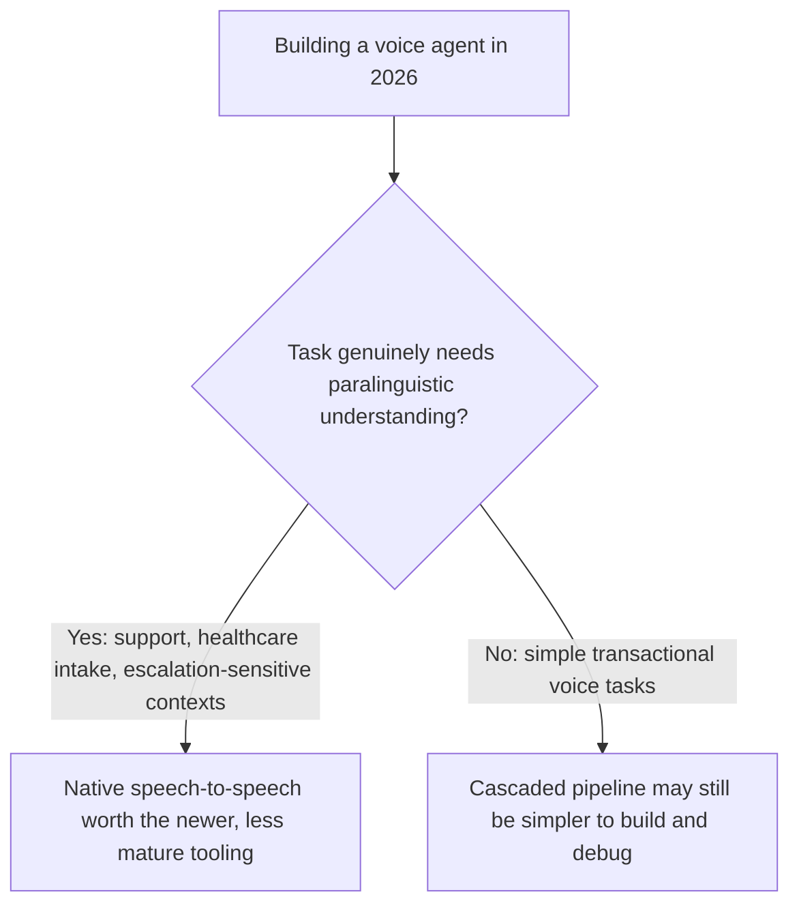

The older architecture for a voice agent — transcribe speech to text, run the text through an LLM, synthesize the response back to speech — treats voice as an input/output wrapper around a fundamentally text-based system. Native speech-to-speech models, now integrated into platforms like Azure's Voice Live and similar offerings across the industry this year, process and generate audio more directly, and the difference is a real architectural shift, not just a latency optimization on the same underlying approach.

## The Pipeline Difference



The cascaded pipeline loses information at each conversion boundary — tone, emphasis, and pacing in the original speech don't survive transcription to plain text, and the synthesized response has to reconstruct appropriate tone from text alone, without ever having "heard" how the user actually said what they said. A native speech-to-speech model, processing audio more directly, can preserve and respond to that paralinguistic information in a way the cascaded pipeline structurally can't.

## Why This Matters Beyond Just Sounding More Natural

```python
def cascaded_pipeline_loses_context(user_audio) -> dict:
    text = speech_to_text(user_audio)  # "that's just great" -- tone information already gone
    # The LLM sees only "that's just great" with no signal about whether
    # this was said sincerely or sarcastically
    return {"text": text, "tone_lost": True}

def native_speech_model_preserves_context(user_audio) -> dict:
    # The model processes the actual audio, where sarcastic tone is
    # detectable, and can respond appropriately rather than taking
    # the transcribed text at face value
    return process_audio_directly(user_audio)
```

This isn't a minor UX nicety — a customer support voice agent responding to genuine frustration as if it were a straightforward positive statement, because tone was lost in transcription, is a real service-quality failure with a specific technical cause that native speech-to-speech architecture directly addresses.

## The Latency Benefit Is Real Too, and Separate

Beyond preserving paralinguistic information, collapsing four sequential model calls (STT, LLM, TTS, plus any intermediate processing) into a more directly integrated pipeline reduces the number of round trips and model invocations in the critical path — a real latency improvement independent of the tone-preservation benefit, and the combination of both is what's driving adoption across enterprise voice deployments this year.

## What This Means for Building on Top of These Models



The cascaded pipeline isn't obsolete for every use case — it's more mature tooling, easier to debug (you can inspect the intermediate text), and perfectly adequate for transactional voice tasks where tone genuinely doesn't carry much decision-relevant information. The next two posts in this series cover the specific engineering (interruption handling) and deployment (regulated industries) considerations that follow from choosing native speech-to-speech for the contexts where it actually matters.

## Key Takeaways

1. **Native speech-to-speech models process audio more directly, preserving paralinguistic information a cascaded STT-LLM-TTS pipeline structurally loses**
2. **Lost tone information is a real service-quality risk**, not just a naturalness nicety — a support agent misreading sincere frustration as positive sentiment has a specific, addressable technical cause
3. **The latency benefit from fewer sequential model calls is real and separate** from the tone-preservation benefit
4. **Match the architecture to the task** — native speech-to-speech earns its newer, less mature tooling specifically where paralinguistic understanding matters to the outcome

---

*Part of the [Agent Economy series](/tags/agent-economy-series/) — where agentic AI is actually showing up in commerce, work, and daily use in late 2026.*
