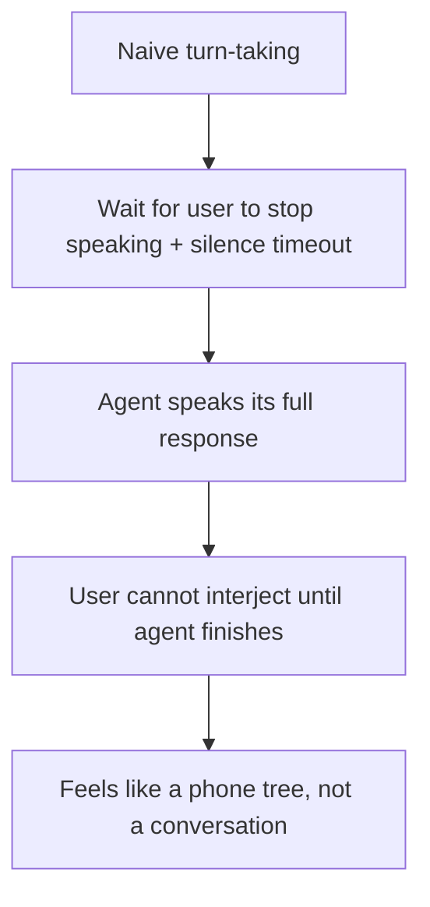

Turn detection and interruption handling are named as core capabilities of modern real-time voice APIs, and it's worth being specific about why they matter as much as they do — this is the single feature that most determines whether a voice agent feels like a natural conversation or a phone tree with a nicer voice, more than the underlying model's raw language capability.

## Why Naive Turn-Taking Feels Robotic



Human conversation is full of natural interruption — a listener saying "right, right" while the other person is still talking, or cutting in with a clarifying question mid-sentence. A voice agent that can't be interrupted, that always finishes its full planned response regardless of what the user does, breaks this fundamental conversational pattern in a way users notice immediately even if they can't articulate exactly why the interaction feels stilted.

## What Real Interruption Handling Requires

```python
class InterruptibleVoiceSession:
    async def handle_turn(self, audio_stream):
        agent_speaking = False
        async for chunk in audio_stream:
            if self.detect_user_speech_start(chunk) and agent_speaking:
                await self.stop_agent_speech_immediately()  # not at the next sentence boundary — immediately
                agent_speaking = False
                self.log_interruption_point()  # what was cut off, for context continuity

            if self.detect_end_of_user_turn(chunk):
                response = await self.generate_response(context=self.get_conversation_state())
                agent_speaking = True
                await self.stream_speech(response)
```

The critical detail: stopping agent speech **immediately** on detected interruption, not waiting for a natural pause point in the agent's own planned response. A half-second delay before actually stopping feels obviously wrong to a user who just started talking — human conversational interruption is close to instantaneous, and the agent needs to match that responsiveness.

## Distinguishing a Real Interruption From Background Noise or a Backchannel

```mermaid
flowchart TD
    A[Detected user audio while agent speaking] --> B{Backchannel — "mm-hmm", "right" — or genuine interruption?}
    B -->|Backchannel| C[Agent continues speaking, doesn't stop]
    B -->|Genuine interruption| D[Agent stops immediately, yields the turn]
```

This distinction is genuinely hard and a common source of failure in earlier-generation voice agents — a system that stops speaking every time the user says "mm-hmm" feels just as unnatural as one that never stops for a real interruption. Turn-detection models trained specifically on this distinction (backchannel acknowledgment versus genuine turn-taking intent) are what modern real-time voice APIs are actually providing as a managed capability, rather than something most teams should attempt to build from scratch.

## Context Continuity After an Interruption

```python
def resume_after_interruption(cut_off_response: str, user_interjection: str) -> str:
    # The agent needs to know what it was saying when cut off, to either
    # complete the thought if still relevant or abandon it cleanly if
    # the user's interjection changed the direction of the conversation
    return generate_response(
        context=f"You were saying: '{cut_off_response}' when interrupted with: '{user_interjection}'. "
                f"Respond to the interjection, and only return to your prior point if still relevant."
    )
```

An agent that gets interrupted and then either awkwardly resumes exactly where it left off (ignoring what the user just said) or completely loses track of what it was originally saying both feel wrong. Passing the cut-off context explicitly into the next generation call is what lets the agent handle this the way a human naturally would — acknowledge the interjection, and return to the original point only if it's still relevant.

## Key Takeaways

1. **The inability to be interrupted is what most breaks a voice agent's naturalness**, more than raw language model capability
2. **Stop agent speech immediately on detected interruption**, not at the next natural pause point — human interruption timing is close to instantaneous
3. **Distinguishing genuine interruption from a backchannel acknowledgment is a hard, specific problem** modern real-time voice APIs solve as a managed capability
4. **Pass cut-off context explicitly into the next response generation**, so the agent can handle resumption the way a human naturally would

---

*Part of the [Agent Economy series](/tags/agent-economy-series/) — where agentic AI is actually showing up in commerce, work, and daily use in late 2026.*
