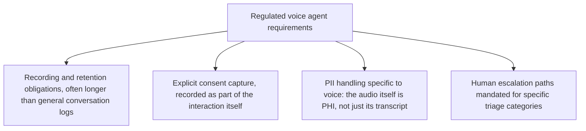
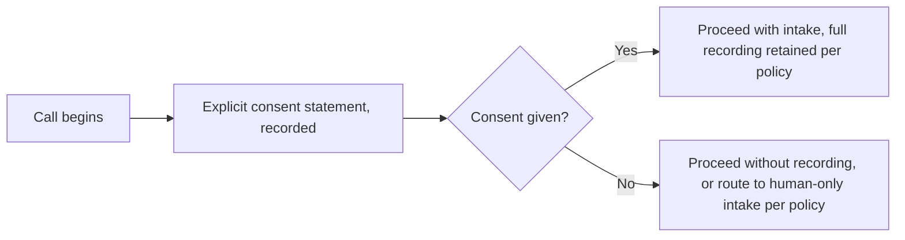

The previous two posts in this series covered voice agent architecture and interruption-handling UX in general terms. Healthcare intake and other regulated voice contexts add a layer of requirements that general-purpose voice agent design doesn't address — a fitting close to October's series, since next month's series turns to governance and compliance across agentic AI broadly, and voice-specific compliance is a concrete preview of that theme.

## What's Specifically Different About Regulated Voice Contexts



**The audio itself is protected health information**, not just its transcript — a distinction easy to miss if voice-specific compliance thinking is bolted onto a text-based PII framework built for the transcript alone. The PII redaction discipline covered earlier this year for RAG pipelines needs a voice-specific extension: the raw audio recording requires the same access control and retention policy as the transcript, and deleting a transcript while retaining the original audio doesn't actually satisfy a deletion request.

```python
def handle_voice_data_deletion_request(session_id: str):
    delete_transcript(session_id)
    delete_raw_audio_recording(session_id)  # easy to miss — the audio itself is the PHI, not just its text
    delete_derived_artifacts(session_id)  # any embeddings, extracted facts, or memory derived from this session
    log_deletion_completion(session_id, deleted_at=time.time())
```

## Consent Capture as Part of the Interaction, Not a Separate Step



Consent for a regulated voice interaction needs to be captured as part of the recorded interaction itself — an "I agree to the terms" checkbox somewhere else in a separate flow doesn't satisfy the same evidentiary requirement as a recorded, explicit verbal consent statement at the start of the call, which is what most healthcare compliance frameworks actually require for this specific data category.

## Mandatory Human Escalation for Specific Triage Categories

```python
MANDATORY_ESCALATION_CATEGORIES = {
    "expressed_medical_emergency": "immediate_human_transfer",
    "expressed_self_harm_risk": "immediate_human_transfer",
    "requests_outside_agent_authorized_scope": "route_to_appropriate_human_specialist",
}

def check_mandatory_escalation(intake_conversation: dict) -> str | None:
    for category, action in MANDATORY_ESCALATION_CATEGORIES.items():
        if detect_category(intake_conversation, category):
            return action
    return None
```

This is the policy-based escalation principle from earlier this year applied to healthcare voice intake specifically, with the stakes made explicit: these categories are not the agent's judgment call to make, regardless of how confident it is handling the conversation, because a missed emergency escalation in a healthcare context has consequences well beyond a typical enterprise agent's error cost.

## Closing October: Where This Series Goes Next

This month covered where agentic AI is actually showing up — vertical agents, browser automation, commerce, digital workforce, voice. Regulated-industry compliance, touched here specifically for voice, becomes the explicit focus of next month's series: the eval reality gap, real security breaches, and the EU AI Act's enforcement deadline that governs exactly this kind of agentic system across every domain, not just voice and not just healthcare.

## Key Takeaways

1. **Regulated voice data compliance needs to treat the raw audio as PHI in its own right**, not just its transcript — deletion and access control both need to cover it explicitly
2. **Consent for a regulated interaction should be captured as part of the recorded interaction itself**, not a separate, disconnected step
3. **Mandatory escalation categories (emergency, self-harm risk) should never be the agent's judgment call**, regardless of its confidence — this is policy-based escalation with genuinely high stakes
4. **Voice-specific compliance is a preview of next month's broader governance series**, applying the same underlying principles across every agentic domain, not just voice

---

*Part of the [Agent Economy series](/tags/agent-economy-series/) — where agentic AI is actually showing up in commerce, work, and daily use in late 2026.*
