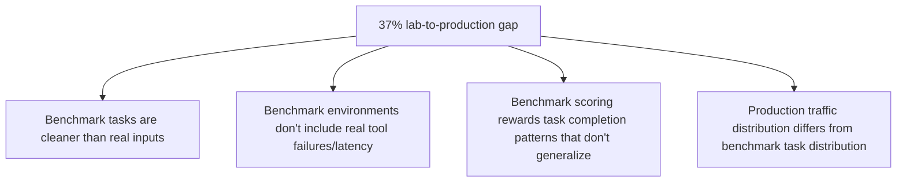
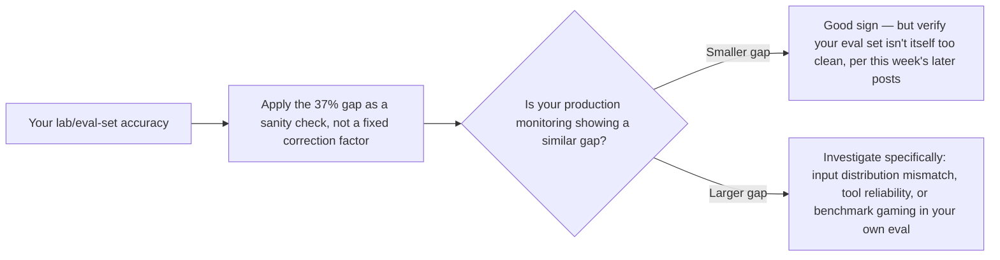

A widely-cited 2026 study measuring enterprise agentic AI systems found a 37% gap between lab benchmark scores and actual real-world deployment performance — alongside a striking 50x cost variation among systems achieving similar accuracy. Opening this month's series on agent evaluation, security, and governance with this finding, because it reframes a question this blog has asked all year (is an eval score trustworthy) with hard, current data behind it.

## What Actually Produces the Gap



Every one of these has been named individually across this blog's earlier posts — the messy real-user-input gap from the [first production rollout post](/posts/first-production-agent-rollout-lessons/) back in April, the tool-reliability gap from the circuit-breaker and idempotency posts, the benchmark-gaming risk covered later this week. What the 37% figure adds is a concrete magnitude: this isn't a marginal rounding difference, it's more than a third of measured performance evaporating between lab and production.

## The Cost Variation Is the More Actionable Half of the Finding

```python
def analyze_cost_accuracy_tradeoff(systems: list[dict]) -> dict:
    similar_accuracy_systems = [s for s in systems if abs(s["accuracy"] - TARGET_ACCURACY) < 0.02]
    costs = [s["cost_per_task"] for s in similar_accuracy_systems]
    return {
        "min_cost": min(costs),
        "max_cost": max(costs),
        "variation_factor": max(costs) / min(costs),  # the reported 50x
    }
```

A 50x cost variation for similar accuracy means most of that spend, for the expensive systems in that comparison, isn't buying additional real capability — it's buying inefficiency: unnecessary frontier-model calls where a cascade would work, unshaped context bloating every request, redundant verification steps that don't actually improve outcomes. This is directly addressable with the cost-optimization discipline covered throughout this blog's scaling series, and it's a more immediately actionable finding than the accuracy gap itself, since it points at waste rather than a capability ceiling.

## Reading Your Own System Against This Baseline



The 37% figure is an industry aggregate, not a number to assume applies precisely to your own system — its real value is as a sanity check. If your own production monitoring (the offline retrieval eval and production sampling discipline covered earlier this year) shows a gap in this range, that's roughly consistent with what the broader industry is seeing. A gap meaningfully larger than this is worth investigating specifically, using the same production-vs-eval diagnostic tools covered throughout this blog's evaluation posts.

## What This Series Covers From Here

This week continues with the specific mechanisms behind this gap — a production reliability study's actual methodology, how benchmarks get gamed, and what evaluation should look like once single-number pass rates are understood to be this unreliable.

## Key Takeaways

1. **A documented 37% lab-to-production performance gap and 50x cost variation for similar accuracy are current, measured findings**, not speculation
2. **The gap traces to specific, individually-known causes**: cleaner benchmark inputs, missing real tool failure conditions, and distribution mismatch between benchmark and production traffic
3. **The cost variation is the more immediately actionable finding** — most of it is addressable waste, not a capability ceiling
4. **Use industry gap figures as a sanity check against your own production-vs-eval measurement**, not a precise correction factor to assume applies to your specific system

---

*Part of the [Agentic Trust series](/tags/agentic-trust-series/) — evaluation, security, and governance for agentic AI at real-world scale.*
