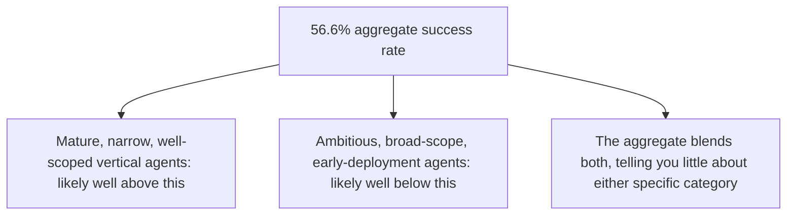
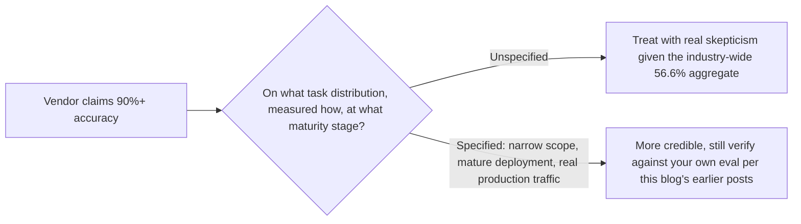

A March 2026 reliability study analyzed 4,492,066 tests across 6,259 production AI agents spanning 10 geographic regions and reported an aggregate success rate of 56.6%. This is real, large-scale production deployment data, not synthetic benchmark testing — and it's exactly the kind of number that gets misread badly if taken as a single, uniform statement about "how good agents are" rather than what it actually is: an aggregate across a huge range of task difficulty, system maturity, and domain.

## What "Aggregate" Actually Obscures



Every principle argued throughout this blog's Agent Economy series last month — narrow beats broad, mature deployment beats early experimentation — predicts exactly this kind of spread. A single aggregate number across 6,259 agents of wildly different maturity and scope tells you the industry-wide center of mass, not what to expect from any specific, well-designed deployment following the practices this blog has covered all year.

## The Number That Would Actually Be More Useful

```python
def more_useful_breakdown(production_agents: list[dict]) -> dict:
    return {
        "success_rate_by_scope_narrowness": groupby_and_measure(production_agents, "scope_narrowness"),
        "success_rate_by_months_in_production": groupby_and_measure(production_agents, "maturity_months"),
        "success_rate_by_task_type": groupby_and_measure(production_agents, "task_category"),
    }
```

A breakdown by scope narrowness and deployment maturity would let a team reasonably compare their own system against a relevant peer group, rather than against an aggregate that includes both three-month-old broad-scope pilots and eighteen-month-old narrow vertical agents in the same number. The raw aggregate is a useful industry-wide signal (reliability is genuinely a widespread challenge, not a solved problem) and a poor benchmark for any individual system's specific performance expectation.

## Why This Number Should Change How You Read Vendor Claims



Given a real, large-scale study showing 56.6% aggregate production success, a vendor's unqualified claim of dramatically higher accuracy deserves the same scrutiny this blog has argued for throughout — what task distribution, what maturity stage, measured how. This doesn't mean higher numbers are impossible (narrow, mature, well-governed systems following this blog's practices plausibly do outperform the aggregate meaningfully) — it means an unqualified high number, without that context, should be verified against your own eval before being trusted.

## Connecting This to the Berkeley Findings, Next in This Series

The next post in this series covers a related and more unsettling finding: that benchmark scores themselves can be gamed to near-perfect results without solving the underlying task at all. Between the aggregate reliability gap covered here and the benchmark-gaming vulnerability covered next, the honest 2026 picture of agent evaluation is considerably more sobering than the industry's marketing materials generally suggest.

## Key Takeaways

1. **A 56.6% aggregate production success rate across 6,259 agents is real measured data**, not synthetic benchmark testing, and shouldn't be dismissed
2. **An aggregate across wildly different scope and maturity levels tells you the industry center of mass, not what to expect from a specific well-designed system**
3. **A breakdown by scope narrowness and deployment maturity would be more useful than the raw aggregate** — request or build this kind of segmentation for your own comparisons
4. **This number should raise your skepticism bar for unqualified vendor accuracy claims** — ask what distribution, measured how, at what maturity stage

---

*Part of the [Agentic Trust series](/tags/agentic-trust-series/) — evaluation, security, and governance for agentic AI at real-world scale.*
