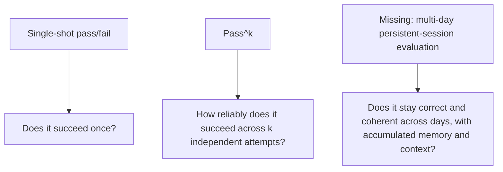
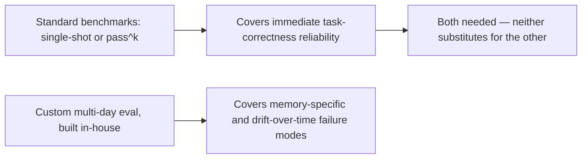

Tau squared's pass^k metric — measuring the probability an agent succeeds at a task across k independent attempts, rather than a single pass/fail — is a real improvement over single-shot evaluation, capturing something closer to reliability under repeated real-world use than a one-shot benchmark run ever could. Current research is explicit that even this improved metric doesn't test an agent over a genuinely long-horizon, multi-day session with persistent memory — a gap this blog's agent memory posts from earlier this year anticipated without this specific evaluation vocabulary to name it.

## What Pass^k Actually Measures, and What It Still Misses



Pass^k is a real advance because k independent attempts surfaces reliability variance a single pass/fail score hides entirely — a system that succeeds 9 times out of 10 looks identical to a system that succeeds every time under single-shot measurement, and pass^k distinguishes them. What it still doesn't test: a session that persists across days, accumulating memory, where errors or drift from day 3 might not surface as a failure until day 7 — the exact scenario the memory-eviction, conflict-resolution, and staleness posts from earlier this year were built around, and one current benchmarks don't yet cover.

## Why This Gap Specifically Matters for Agent Memory Architecture

```python
def why_multi_day_eval_matters_for_memory(agent_system: dict) -> str:
    if agent_system.get("uses_persistent_memory"):
        return (
            "A single-session or even pass^k benchmark can't surface memory-specific "
            "failure modes: eviction policy errors, write conflicts accumulating over "
            "days, or semantic fact staleness — these only manifest across sustained sessions"
        )
    return "Single-session evaluation may be sufficient if the system has no persistent memory"
```

This connects directly to concrete failure modes covered earlier this year — a memory eviction policy that's too aggressive doesn't show up as a bug on day one; it shows up as "the agent forgot something it should have remembered" on day five, after the memory that would have prevented the error was already evicted. No current standard benchmark captures this failure class, because doing so requires actually running an agent over a multi-day span with realistic, evolving context — expensive and slow relative to a single-shot benchmark run.

## Building Your Own Long-Horizon Eval, Given the Gap



Given that no standard benchmark yet covers this, a team running a memory-dependent agent in production has to build this evaluation category itself — simulating a multi-day session with realistic intervening events, checking not just immediate task success but whether earlier-session context is still correctly available and correctly weighted days later. This is a genuine extension of the golden-dataset discipline from earlier this year: golden *sessions*, not just golden single-turn cases.

## The Cost-Aware Benchmark Gap, Named in the Same Research

The same research identifying this multi-day gap also names cost-aware benchmarking — a Pareto frontier of pass rate versus dollars-per-task — as a similarly missing piece, doing for agent evaluation what MLPerf did for inference benchmarking. The next post in this series covers this specifically, since it connects directly to the 50x cost variation finding from earlier this week.

## Key Takeaways

1. **Pass^k is a real improvement over single-shot pass/fail, surfacing reliability variance across repeated attempts**
2. **It still doesn't test genuinely long-horizon, multi-day sessions with persistent memory** — a documented, current gap in standard benchmarking**
3. **This gap specifically hides memory-related failure modes**: eviction errors, staleness, and drift that only manifest across sustained sessions, not single interactions
4. **Building golden multi-day sessions, not just golden single-turn cases, is currently a build-it-yourself extension of standard eval practice** — no standard benchmark covers this yet

---

*Part of the [Agentic Trust series](/tags/agentic-trust-series/) — evaluation, security, and governance for agentic AI at real-world scale.*
