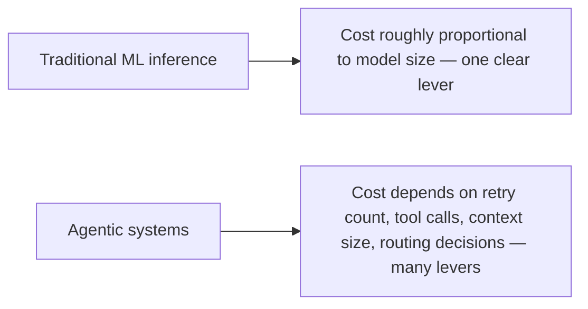

Current agent evaluation research names a specific missing piece: a benchmark that publishes a Pareto frontier of pass rate versus dollars-per-task, rather than pass rate alone — with the explicit comparison that this would do for agent evaluation what MLPerf did for inference benchmarking, forcing cost into the conversation as a first-class evaluation dimension rather than an afterthought reported separately, if at all.

## Why Pass Rate Alone Was Always Incomplete

```mermaid
flowchart TD
    A[System A: 92% pass rate, $0.40/task] --> C{Which is "better"?}
    B[System B: 94% pass rate, $4.00/task] --> C
    C --> D[Pass rate alone says B — ignores a 10x cost difference for 2 points of accuracy]
    C --> E[Pareto frontier view: depends entirely on the use case's actual accuracy/cost tradeoff tolerance]
```

A single pass-rate number, ranked on a leaderboard, systematically favors whatever configuration squeezes out marginal accuracy gains regardless of cost — connecting directly to this week's opening post on the 50x cost variation for similar accuracy across production systems. A Pareto-frontier view makes that tradeoff explicit and lets a team choose the point on the frontier that actually matches their use case's cost sensitivity, rather than defaulting to whatever ranks highest on a cost-blind leaderboard.

## Building a Pareto-Frontier View for Your Own System Selection

```python
def pareto_frontier_analysis(candidates: list[dict]) -> list[dict]:
    """candidates: [{"name": ..., "pass_rate": ..., "cost_per_task": ...}]"""
    frontier = []
    for candidate in sorted(candidates, key=lambda c: c["cost_per_task"]):
        # A candidate is on the frontier if no other candidate has both
        # lower cost AND equal-or-higher pass rate
        dominated = any(
            other["cost_per_task"] <= candidate["cost_per_task"] and other["pass_rate"] >= candidate["pass_rate"]
            for other in candidates if other != candidate
        )
        if not dominated:
            frontier.append(candidate)
    return frontier
```

This directly extends the model-swap evaluation discipline from earlier this year — rather than asking "is the cheaper model good enough," a Pareto-frontier comparison across several candidates (different models, different prompt configurations, different routing strategies) shows the actual set of non-dominated options, letting the decision be "which point on this frontier fits our cost tolerance" rather than a single binary threshold check.

## Why This Matters More for Agentic Systems Than Traditional ML



MLPerf's inference benchmarking had a comparatively simple cost story — larger models cost more, roughly proportionally. An agentic system's cost is shaped by many more levers covered throughout this blog's scaling series — retry policy, cascade routing, context budget, caching hit rate — which means the accuracy/cost tradeoff space for agents is genuinely richer and more worth mapping explicitly than it was for traditional inference, not less.

## What to Do Until a Standard Cost-Aware Benchmark Exists

Given this remains a documented gap rather than a solved standard, building this Pareto-frontier comparison for your own candidate systems, using your own golden dataset and your own measured cost data (the attribution infrastructure from earlier this year), is currently a build-it-yourself practice — the same situation as the multi-day evaluation gap from the previous post, and one worth investing in directly rather than waiting for an industry-standard benchmark to catch up.

## Key Takeaways

1. **Pass rate alone systematically favors marginal accuracy gains regardless of cost** — a documented gap in standard agent benchmarking
2. **A Pareto-frontier view of pass rate vs. cost-per-task makes the real tradeoff explicit**, connecting directly to the 50x cost variation finding covered earlier this week
3. **Agentic systems have a richer cost-lever space than traditional ML inference** — retry policy, routing, context budget, caching — making this comparison more valuable, not less, for agents specifically
4. **Build this comparison yourself using your own golden dataset and cost attribution data** — no standard benchmark yet covers it

---

*Part of the [Agentic Trust series](/tags/agentic-trust-series/) — evaluation, security, and governance for agentic AI at real-world scale.*
