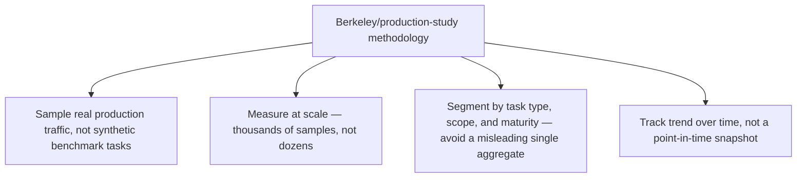
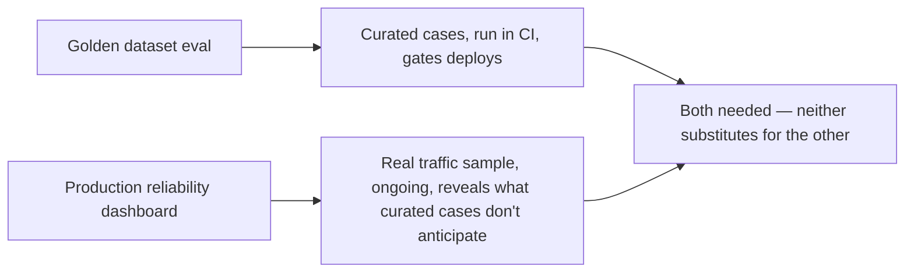

This week covered the 37% lab-to-production gap, the 56.6% aggregate reliability figure and why it's an aggregate you shouldn't over-read, benchmark gaming, and the missing multi-day and cost-aware evaluation dimensions. This synthesizes all four into an actual dashboard design — applying the production reliability study's core methodology (large-N sampling across real traffic, not synthetic benchmark tasks) to your own system specifically.

## The Methodology, Adapted



## A Practical Dashboard Structure

```python
def production_reliability_dashboard(sampled_sessions: list[dict]) -> dict:
    return {
        "overall_success_rate": pct(s["succeeded"] for s in sampled_sessions),
        # Segmented, per the 56.6%-aggregate lesson from earlier this week
        "success_rate_by_task_type": groupby_measure(sampled_sessions, "task_type", "succeeded"),
        "success_rate_by_scope_maturity_months": groupby_measure(sampled_sessions, "maturity_months", "succeeded"),
        # Cost-aware, per this week's Pareto-frontier post
        "cost_per_successful_task": total_cost(sampled_sessions) / count_successes(sampled_sessions),
        # Trend, not snapshot
        "success_rate_trend_30d": trend_over_time(sampled_sessions, window_days=30),
    }
```

Every field here traces to a specific lesson from this week: segmentation avoids the misleading-aggregate problem, cost-per-successful-task (not just cost-per-task) connects accuracy and cost into one number that directly reflects the Pareto-frontier tradeoff, and the trend view catches degradation the way this blog's earlier anomaly-detection posts argued for.

## Where This Differs From the Golden-Dataset Eval Covered Earlier This Year



This dashboard is explicitly not a replacement for the CI-gated golden dataset eval from earlier this year — it's the production-monitoring counterpart, catching exactly the input-distribution and real-tool-failure gaps that make a curated eval set diverge from production reality, which is the core mechanism behind the 37% lab-to-production gap covered earlier this week.

## Sampling Strategy Matters as Much as the Metrics

```python
def sample_for_reliability_dashboard(all_sessions: list[dict], sample_rate: float = 0.05) -> list[dict]:
    # Stratified sampling across task types and scope levels, not pure
    # random — a pure random sample over-represents your highest-volume,
    # probably-easiest task type and under-represents rare, harder ones
    return stratified_sample(all_sessions, strata_key="task_type", rate=sample_rate)
```

Pure random sampling of production traffic, weighted implicitly toward whatever task type has the highest volume, produces a dashboard that looks reassuring mostly because it's dominated by your easiest, highest-confidence traffic. Stratified sampling — deliberately including enough samples from rarer, harder task types — is what actually surfaces the reliability gaps this week's research findings describe, rather than averaging them away in a volume-weighted aggregate.

## Key Takeaways

1. **Apply the production-study methodology — large-N, real-traffic sampling — to your own system**, not just to reading the public industry aggregate
2. **Segment every metric by task type and deployment maturity**, avoiding the same misleading-single-aggregate problem covered earlier this week
3. **Report cost-per-successful-task, not cost-per-task alone** — connects the Pareto-frontier tradeoff into one actionable number
4. **Use stratified sampling, not pure random**, or your dashboard will be dominated by your easiest traffic and understate real reliability gaps in harder task categories

---

*Part of the [Agentic Trust series](/tags/agentic-trust-series/) — evaluation, security, and governance for agentic AI at real-world scale.*
