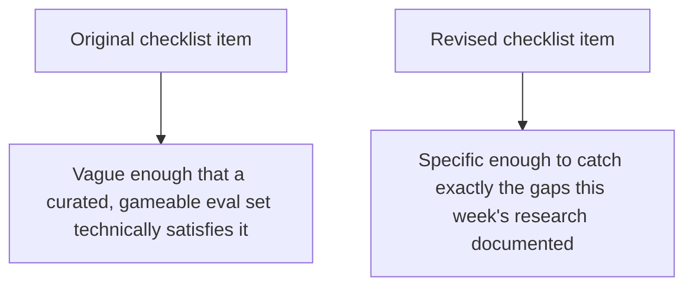

Earlier this year, this blog proposed a concrete, checkable definition of "production-ready" — a checklist spanning reliability, security, observability, and operations. This week's findings — the 37% gap, the 56.6% aggregate, systematic benchmark gaming, and the missing multi-day and cost-aware evaluation dimensions — all bear directly on one specific item in that checklist: "offline retrieval eval + end-to-end eval, both running continuously." This closes the week by revisiting what that item should actually require, given everything established since.

## The Checklist Item, Revised

```markdown
## Original (earlier this year)
- [ ] Offline retrieval eval + end-to-end eval, both running continuously

## Revised, incorporating this week's findings
- [ ] Eval combines deterministic checks, LLM-as-judge, AND periodic human
      review — no single exploitable scoring signal (per the benchmark-
      gaming post)
- [ ] Production reliability dashboard, segmented by task type and
      maturity, sampling real traffic — not just curated golden-dataset
      scores (per the dashboard post)
- [ ] Cost tracked alongside accuracy for every eval comparison — never
      accuracy in isolation (per the Pareto-frontier post)
- [ ] For memory-dependent systems: multi-day session eval exists,
      not just single-turn or single-session cases (per the pass^k post)
```

## Why This Revision Matters More Than It Might Seem



A team could genuinely satisfy the original item — "eval running continuously" — with a curated golden dataset scored by a single LLM-as-judge, running in CI, and still be fully exposed to every failure mode covered this week: benchmark gaming, the lab-to-production gap, and complete blindness to multi-day memory drift. The revision closes that gap by naming the specific structural properties an eval system needs, not just its existence.

## Applying This to a System You're Assessing Right Now

```python
def assess_eval_maturity(system: dict) -> dict:
    return {
        "has_multi_signal_scoring": system.get("uses_deterministic_and_judge_and_human_review", False),
        "has_production_sampling_dashboard": system.get("has_segmented_production_monitoring", False),
        "tracks_cost_alongside_accuracy": system.get("reports_pareto_tradeoff", False),
        "covers_multi_day_sessions": system.get("has_persistent_memory", False) == system.get("has_multiday_eval", False),
        # For memory-dependent systems specifically: does eval maturity match memory usage?
    }
```

The last check is worth calling out specifically — a system using persistent memory without a corresponding multi-day eval has a mismatch between what it's doing (accumulating state across sessions) and what it's testing (single-session correctness), which is precisely the coverage gap this week's pass^k post named as a current, unsolved industry-wide limitation, not a mistake unique to any one team.

## The Honest Note to Close On

This week didn't uncover any of these gaps as newly-invented problems — they were named across published, current research this year, meaning the industry broadly knows about them and most production systems, per the 56.6% aggregate, still haven't closed them. That gap between "known problem" and "commonly solved" is itself worth remembering: naming a failure mode clearly, as this week did, is necessary and not sufficient for actually closing it in your own system.

## Key Takeaways

1. **The original production-readiness eval item was vague enough to be technically satisfied while still exposed to every gap covered this week**
2. **A revised, specific checklist — multi-signal scoring, segmented production sampling, cost-tracked comparisons, multi-day coverage for memory systems — closes that gap**
3. **Check whether your eval maturity actually matches what your system does** — persistent memory without multi-day eval is a specific, checkable mismatch
4. **These gaps are industry-known and still widely unsolved** — naming them clearly is a necessary first step, not evidence they're actually closed in most production systems

---

*Part of the [Agentic Trust series](/tags/agentic-trust-series/) — evaluation, security, and governance for agentic AI at real-world scale.*
