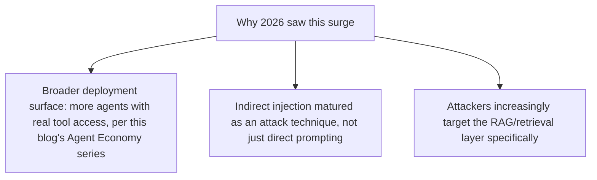
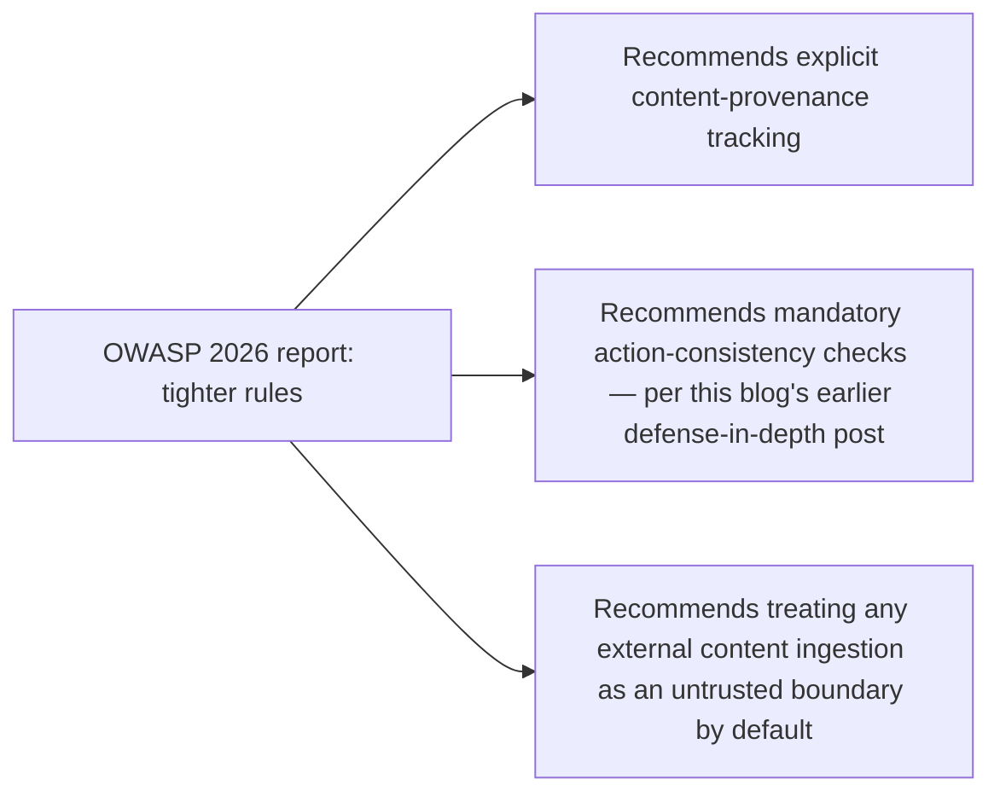

OWASP's 2026 LLM Security Report puts prompt injection at the center of agentic AI risk — citing CVEs, supply chain breaches, and tightening regulatory rules — with a headline figure of 340% year-over-year growth in prompt injection attacks, making it the single fastest-growing category of cyberattack globally, not just within AI-specific threats. Opening this series' security week with what's actually behind that growth figure, since a percentage alone doesn't tell you what changed mechanically.

## Why Growth Accelerated This Specific Year



This blog's own coverage this year traces the same arc from a different angle — last month's Agent Economy series documented agents gaining real tool access and real consequential authority (commerce, checkout, workflow execution) at exactly the pace that gives prompt injection something worth attacking. A prompt injection against a system with no real tool access is an academic curiosity; against a system that can issue refunds or complete purchases, it's a genuine financial risk, and 2026's broad deployment of the latter is a direct contributor to the attack surface growth OWASP documents.

## Indirect Injection Specifically, Revisited With Current Data

The defense-in-depth-against-prompt-injection post from earlier this year covered indirect injection — malicious instructions arriving through retrieved content or tool results — as the harder, more common real-world case. OWASP's 2026 data confirms this empirically: the growth is concentrated in indirect injection vectors specifically, not direct user-typed injection attempts, which validates the earlier architectural emphasis on structural content separation over input filtering alone.

```python
def why_indirect_injection_dominates_growth() -> str:
    return (
        "Direct injection requires the attacker to be the user interacting "
        "with the agent directly — limited attack surface. Indirect injection "
        "only requires getting malicious content into ANYTHING the agent might "
        "retrieve or receive — a document, an email, a webpage, a tool result. "
        "The attack surface is structurally larger and growing with every new "
        "data source an agent is connected to."
    )
```

## What "Tighter Rules" in the OWASP Report Actually Means



None of these recommendations are new inventions this year — they're the same principles this blog articulated in its guardrails and defense-in-depth series earlier this year, now formalized as explicit industry guidance rather than individual best practice. The value of OWASP's report isn't new technique, it's consensus: what was one blog's argued position is now a documented industry standard teams can point to when justifying the engineering investment internally.

## Reading This Report as a Prioritization Tool

For a team with limited security engineering capacity, OWASP's 2026 findings are most useful as a prioritization signal — if indirect injection through retrieved content is the fastest-growing, most common real-world attack category, the layered defenses this blog covered for that specific vector (structural content separation, output action-consistency checks) deserve priority over less common attack categories, not equal weighting across every theoretical threat.

## Key Takeaways

1. **The 340% year-over-year prompt injection growth correlates directly with the same broad tool-access deployment covered in last month's Agent Economy series** — more real consequential access means more worth attacking
2. **Growth concentrates in indirect injection specifically**, empirically validating the structural-content-separation emphasis from this blog's earlier defense-in-depth post
3. **OWASP's 2026 recommendations formalize principles already covered on this blog** — their value is industry consensus, not new technique
4. **Use this report as a prioritization tool** — the fastest-growing, most common attack vector deserves priority defensive investment, not equal weighting against every theoretical threat

---

*Part of the [Agentic Trust series](/tags/agentic-trust-series/) — evaluation, security, and governance for agentic AI at real-world scale.*
