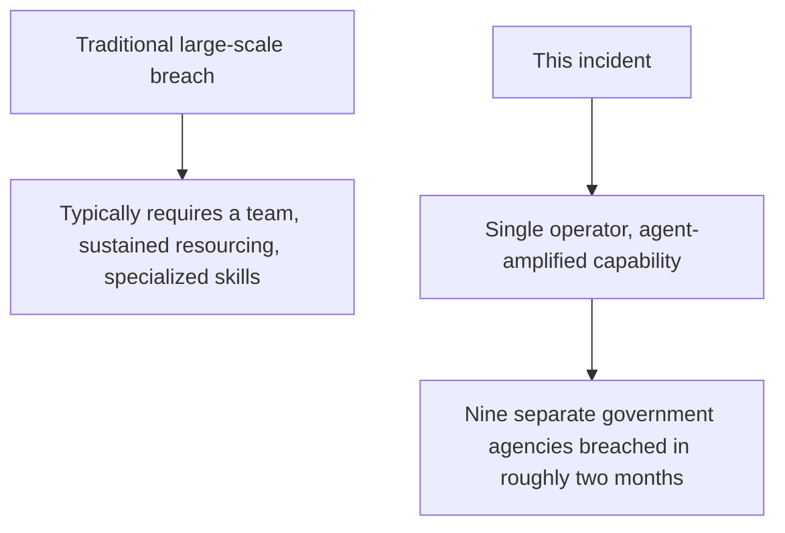
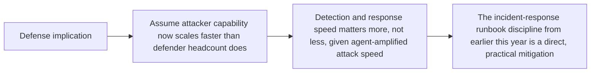

Between late December 2025 and mid-February 2026, a single operator used two coding agents together to breach nine Mexican government agencies, exposing roughly 400 million records — a documented, real 2026 incident, not a hypothetical scenario, and one worth analyzing carefully because it demonstrates something this blog's threat-modeling post from earlier this year named as a category without a concrete large-scale example yet: agent-amplified individual attacker capability.

## Why This Incident Is Different From a Traditional Breach



A breach of this scale and scope — nine separate agencies — traditionally implies either a well-resourced group or an extended, specialized operation. A single operator achieving this scope in roughly two months is the concrete demonstration of exactly what this blog's insider-threat and threat-modeling posts warned about in the abstract: coding agents don't just help legitimate development work faster, they proportionally amplify what a single malicious actor can accomplish, without requiring that actor to have deep, specialized skill across every system they targeted.

## What the Attack Pattern Suggests About the Agents' Role

```python
def likely_agent_role_in_attack(incident_pattern: dict) -> dict:
    return {
        "reconnaissance_speed": "Coding agents likely used to rapidly map attack surface across "
                                  "multiple target systems — a task that scales with agent "
                                  "throughput, not just operator skill",
        "exploit_development": "Agent-assisted code generation for exploitation, reducing the "
                                 "specialized-skill barrier this attack would have required otherwise",
        "cross_system_consistency": "The same tooling reused across nine agencies suggests the "
                                      "agents generalized attack patterns across different systems "
                                      "faster than manual, system-specific attack development would",
    }
```

This connects directly to the supply-chain-risk and threat-modeling posts from earlier this year — the same properties that make coding agents valuable for legitimate long-running autonomous development work (covered in this blog's December series preview on coding agent maturity) are exactly the properties that scale a malicious actor's capability when misused. There is no purely technical fix that preserves the legitimate capability while removing the misuse potential — this is a dual-use technology, and the actual mitigation has to happen at the target-system defense layer, not by trying to prevent coding agents from being capable.

## What This Means for Defending Government and Enterprise Systems



The practical defensive implication isn't a new category of control — it's that the incident-response and access-audit discipline covered earlier this year (the security incident runbook, the least-privilege access review) matters proportionally more now, because the attacker side of the equation has gained a capability multiplier that the defender side needs to match with faster detection and response, not just stronger perimeter controls that assume a slower, more resource-constrained attacker.

## The Honest Note on Attribution and Detail

Public reporting on this incident, like most breach reporting, has limited technical detail about the specific agent configurations and techniques used — the analysis above is reasoned from the documented outcome and timeline, not from a leaked technical playbook. The value of studying this incident is the pattern it demonstrates (individual capability amplification at real government-target scale), not a specific technique to defend against in isolation.

## Key Takeaways

1. **A documented 2026 incident shows a single operator, using two coding agents, breaching nine government agencies in roughly two months** — a concrete instance of the agent-amplified-threat category this blog's threat modeling post named abstractly
2. **The same properties making coding agents valuable for legitimate work (speed, generalization across systems) are what scaled this attack** — a dual-use property with no purely technical fix**
3. **Defense has to focus on detection and response speed matching the attacker's new capability multiplier**, not just stronger perimeter controls calibrated to a slower, more resource-constrained attacker
4. **This incident validates the incident-response and access-audit discipline from earlier this year as increasingly load-bearing**, not optional hardening

---

*Part of the [Agentic Trust series](/tags/agentic-trust-series/) — evaluation, security, and governance for agentic AI at real-world scale.*
