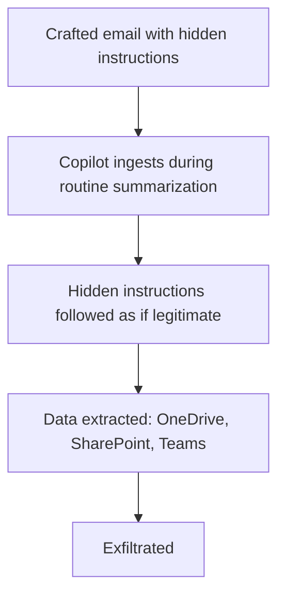

CVE-2025-32711 is a documented zero-click prompt injection vulnerability in Microsoft 365 Copilot: an attacker sent one crafted email with hidden instructions, and when Copilot ingested that email during routine summarization, it followed the hidden instructions — extracting data from OneDrive, SharePoint, and Teams, then exfiltrating it. This is as clean an illustration as exists of the indirect-injection architecture this blog described in the abstract earlier this year, now with a specific, named, real vulnerability to walk through concretely.

## Mapping the Attack to the Defense-in-Depth Framework



Every step of this maps directly onto the layered defense framework from earlier this year. **Structural content separation** (Layer 2 in that framework) is exactly the layer that should have prevented "instructions" embedded in email content from being treated as instructions at all — a properly delimited untrusted-content boundary, with the model explicitly told to treat email content as data regardless of what it appears to instruct, is the specific mitigation this exact attack pattern calls for.

## Zero-Click Is the Detail That Makes This Especially Dangerous

```python
def why_zero_click_matters(vulnerability: dict) -> str:
    return (
        "A vulnerability requiring the user to click something, open an "
        "attachment, or take an explicit action has a natural friction point "
        "where user caution or security training can intervene. Zero-click "
        "means the vulnerable action (email summarization) is something the "
        "system does automatically, as part of routine operation — there is "
        "no user decision point to interrupt the attack chain at all."
    )
```

This is the sharpest possible illustration of why user-education-based defenses (train users not to click suspicious links, don't open unexpected attachments) are structurally insufficient against indirect injection specifically — the user in this attack pattern never made a decision that could have been trained away, because the vulnerable action was the system's own automatic behavior.

## What the Actual Fix Required

```mermaid
flowchart LR
    A[Fix approach] --> B[Content provenance: tag email content as untrusted at ingestion]
    A --> C[Action consistency check: does extracting OneDrive/SharePoint/Teams data match "summarize this email"?]
    A --> D[Output-side data-exfiltration guardrail: unusual cross-service data aggregation flagged]
```

The action-consistency check from this blog's earlier defense-in-depth post is particularly relevant here — a request to "summarize this email" resulting in an action that touches OneDrive, SharePoint, and Teams simultaneously is dramatically inconsistent with the stated task, exactly the kind of mismatch that check is designed to catch as a backstop even when upstream content-separation defenses are bypassed.

## Why This Specific Case Study Matters for This Blog's Readers

This isn't a hypothetical scenario constructed to illustrate a principle — it's a named CVE against a widely-deployed enterprise product, demonstrating that the abstract architecture covered earlier this year addresses a real, exploited vulnerability class, not a theoretical one. Any system doing automatic content ingestion and summarization (email, document processing, any RAG pipeline touching external content) has the same structural exposure until the same layered defenses are actually implemented, not just understood conceptually.

## Key Takeaways

1. **CVE-2025-32711 is a real, named, zero-click prompt injection against a major enterprise product**, not a hypothetical scenario
2. **The attack maps precisely onto the indirect-injection pattern this blog covered architecturally earlier this year** — structural content separation is the specific missing mitigation
3. **Zero-click removes the user-decision friction point that user-education-based defenses depend on** — this attack class requires system-level defense, not user training
4. **Action-consistency checking (does the action match the stated task) is a real, applicable backstop** — this specific incident shows exactly the kind of task/action mismatch that check is built to catch

---

*Part of the [Agentic Trust series](/tags/agentic-trust-series/) — evaluation, security, and governance for agentic AI at real-world scale.*
