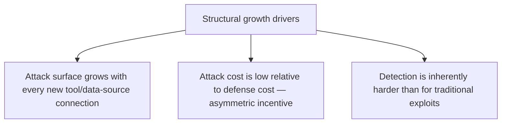
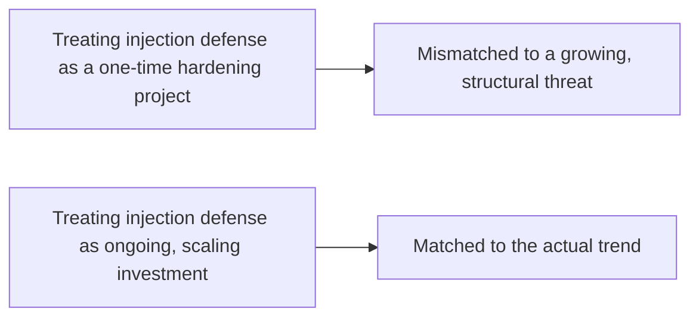

Beyond the 340% year-over-year growth figure covered earlier this week, current research puts the actual prompt-injection rate among deployed agents at 34% — meaning this isn't a rare, theoretical attack; it lands on roughly one in three deployed agents. Understanding why this trend is structural, not a temporary spike likely to plateau on its own, matters for how much ongoing investment this deserves relative to other priorities.

## The Structural Reason Growth Continues



**Attack surface growth is tied to legitimate adoption**, not something separate from it — every new MCP server connection, every new RAG data source, every new tool integration covered throughout this blog's Agent Infrastructure series is simultaneously a new legitimate capability and a new potential injection vector. As long as agentic capability keeps expanding (and last month's Agent Economy series documented exactly that expansion, into commerce, browsers, and digital workforce), the injection attack surface expands proportionally, with no natural ceiling in sight.

**The attack/defense cost asymmetry favors attackers structurally** — crafting an injection payload is comparatively cheap; building and maintaining the layered defenses this blog has covered (structural content separation, output validation, action-consistency checks, ongoing red-teaming) is comparatively expensive and requires sustained engineering investment. This asymmetry is inherent to the threat category, not a temporary gap that closes as defenses mature.

## Why Detection Is Harder Than for Traditional Exploits

```python
def why_detection_is_hard() -> str:
    return (
        "A traditional exploit (SQL injection, buffer overflow) typically "
        "has a detectable signature — malformed input matching known "
        "patterns. A prompt injection is natural language, and the line "
        "between a legitimate instruction-like sentence in a document and "
        "a malicious one is genuinely fuzzy, not a clean signature match. "
        "This is why every guardrail layer covered this year is probabilistic, "
        "not a deterministic filter — and probabilistic defenses have an "
        "inherent, non-zero miss rate."
    )
```

This directly explains why this blog's guardrail posts throughout the year consistently argued for layered defense rather than any single strong filter — a fuzzy, natural-language attack category doesn't have a clean deterministic signature to filter against, which is a structural property of the threat, not a current limitation expected to resolve with better classifiers alone.

## What "Isn't Slowing Down" Should Change About Planning



The practical implication: injection defense budget and engineering attention should scale with agent capability expansion, not be treated as a fixed line item established once during initial security hardening. The red-teaming cadence post from earlier this year — recurring, not one-time — was written for exactly this reason, and this week's data makes the case for it more concretely than the abstract argument alone did.

## The One Genuinely Positive Signal in This Data

A 34% injection rate landing on deployed agents, while high, also means the majority of deployed agents aren't currently experiencing a detected injection — which is consistent with layered defenses working partially, not failing completely. The goal realistically isn't zero injection attempts (structurally impossible given the cost asymmetry above) — it's keeping the successful-exploitation rate low and the blast radius bounded through the sandboxing and policy-based escalation covered throughout this blog's infrastructure series, even when individual injection attempts land.

## Key Takeaways

1. **A 34% prompt-injection rate among deployed agents means this is common, not rare** — one in three deployed agents has faced this
2. **Growth is structural**: attack surface scales with legitimate capability expansion, and the attack/defense cost asymmetry inherently favors attackers
3. **Detection is inherently harder than for traditional exploits** because natural-language injection has no clean deterministic signature — this is why layered, probabilistic defense is the right model, not a temporary compromise
4. **Injection defense investment should scale with agent capability expansion**, not be fixed as a one-time hardening project — the realistic goal is bounded blast radius, not zero attempts

---

*Part of the [Agentic Trust series](/tags/agentic-trust-series/) — evaluation, security, and governance for agentic AI at real-world scale.*
