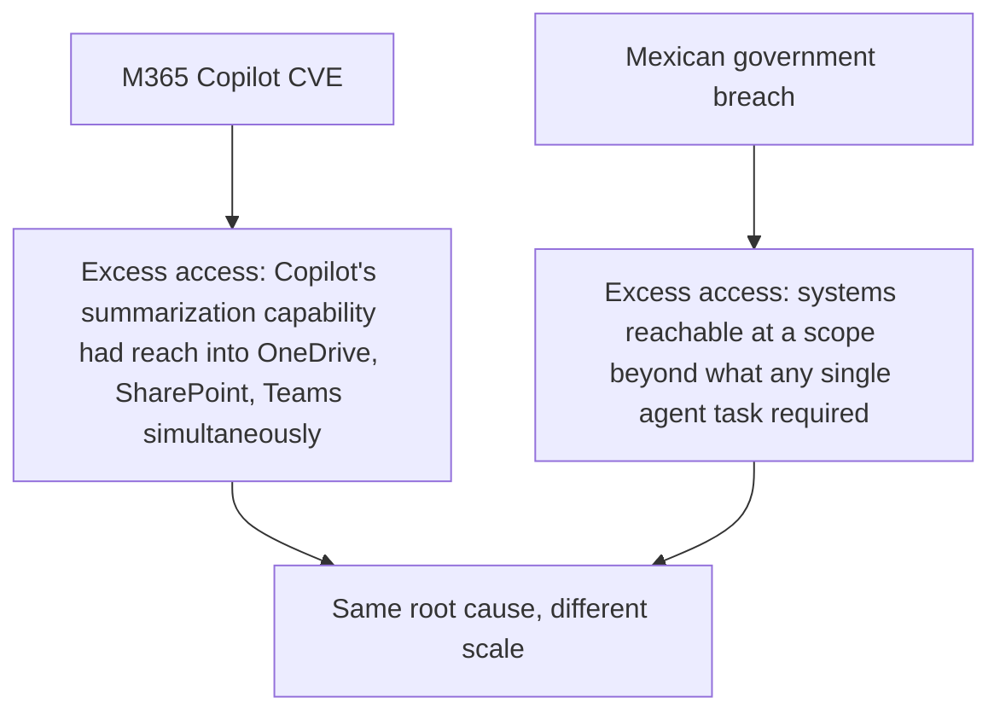
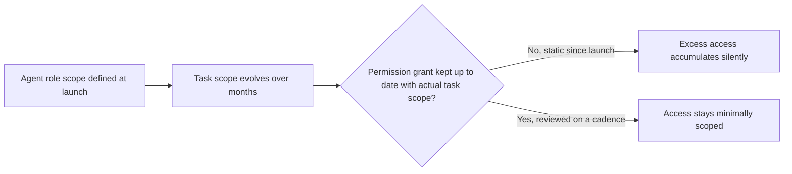

Current research analyzing 2026 agent security incidents traces most failures back to two root causes, not a long tail of exotic exploitation techniques: agents granted more access than they actually need, and agents acting on data they should never have been able to touch in the first place. Both the M365 Copilot vulnerability and, at a larger scale, the Mexican government breach covered earlier this week fit this pattern precisely — this post makes that connection explicit and turns it into an actionable audit.

## Mapping This Week's Case Studies to the Root Cause



Neither case required a fundamentally novel exploitation technique once you look past the specific attack mechanics — both succeeded because the compromised or manipulated agent had reach into more systems and data than its actual immediate task required. A summarization task didn't need simultaneous access to three separate data stores; the vulnerability's damage radius was defined by the access Copilot had, not by anything specific to how the injection was delivered.

## Why "Excess Access" Is a More Tractable Root Cause Than It Sounds

```python
def why_this_is_tractable() -> str:
    return (
        "Preventing every possible injection technique is an arms race with "
        "no finish line, per the structural-growth post from earlier this "
        "week. Scoping access to the minimum a specific task actually needs "
        "is a bounded, auditable engineering problem — closer to a standard "
        "IAM least-privilege review than to keeping pace with novel attack "
        "techniques."
    )
```

This reframes the security problem in a genuinely useful way: rather than treating every agent breach as evidence that injection defenses failed, the more actionable question is whether the *access scope* was appropriately minimal in the first place — a defense that doesn't depend on catching every injection attempt, because even a successful injection against a properly-scoped agent has a bounded, limited blast radius.

## A Concrete Access Audit, Applying This Lesson

```python
def audit_agent_access_scope(agent_role: dict, task_history: list[dict]) -> dict:
    granted_permissions = set(agent_role["permissions"])
    actually_used_permissions = set()
    for task in task_history:
        actually_used_permissions.update(task["permissions_exercised"])

    unused_permissions = granted_permissions - actually_used_permissions
    return {
        "granted": granted_permissions,
        "actually_used": actually_used_permissions,
        "excess_access": unused_permissions,  # candidates for revocation
        "excess_ratio": len(unused_permissions) / len(granted_permissions) if granted_permissions else 0,
    }
```

This is a direct, mechanical extension of the "auditing agent tool permissions like you'd audit IAM roles" discipline from earlier this year — running it specifically against real task-execution history (not just the permission grant list) surfaces exactly the gap between what an agent was given and what it actually needs, which is precisely the gap that turned two very different 2026 incidents into large-scale breaches.

## Why This Audit Needs to Be Recurring, Not One-Time



An agent's permission grant, set once at deployment, tends to stay static while its actual task scope evolves — new capabilities get added to what an agent does without a corresponding review of whether its permission grant should also be narrowed elsewhere. This connects to the red-teaming cadence argument from earlier this year: recurring, scheduled review, not a one-time hardening pass at launch.

## Key Takeaways

1. **Most 2026 agent security failures trace to two root causes — excess access and improper data reach — not a long tail of exotic techniques**
2. **Both major case studies covered this week fit this pattern**: the damage radius was defined by what the agent could reach, not by injection sophistication alone
3. **Scoping access to actual task need is a bounded, auditable problem**, unlike the unbounded arms race of catching every injection technique
4. **Run the access-vs-actual-usage audit on a recurring cadence**, not once at launch — permission grants tend to stay static while actual task scope evolves

---

*Part of the [Agentic Trust series](/tags/agentic-trust-series/) — evaluation, security, and governance for agentic AI at real-world scale.*
