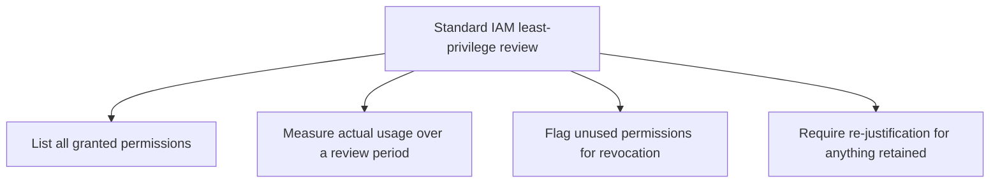
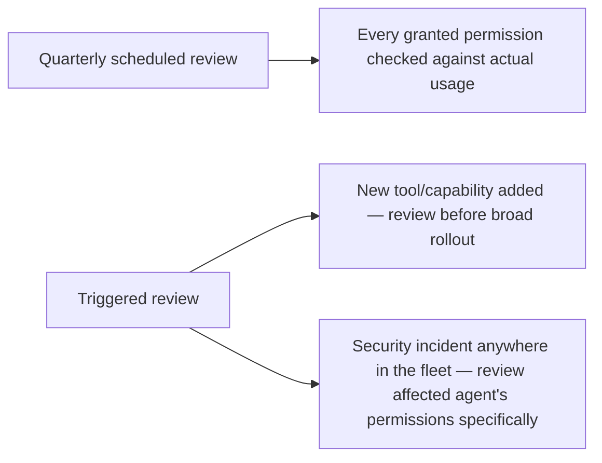

The previous post referenced auditing agent tool permissions "like you'd audit IAM roles" without fully specifying what that adaptation actually requires. This walks through it concretely — standard IAM least-privilege review practice transfers substantially to agent tool permissions, with a few adaptations specific to how agents actually use access, distinct from how a human user or service account does.

## Standard IAM Review, as a Starting Point



This is the standard practice, and it transfers directly to agent tool permissions — the previous post's audit function already implements exactly this pattern, treating tool access grants the same way an IAM review treats a service account's role bindings.

## Where the Adaptation Is Needed

```python
def agent_specific_review_additions(agent_role: dict, task_history: list[dict]) -> dict:
    return {
        # Standard IAM asks "was this permission used" — agent review
        # additionally needs "was this permission used APPROPRIATELY"
        "usage_appropriateness": [
            check_usage_matched_task_intent(t) for t in task_history
            if t["permissions_exercised"]
        ],
        # Agent permissions often compose (a "search" tool might expose
        # broader data than a human user would ever manually query for)
        "composite_exposure": measure_composite_data_exposure(agent_role["permissions"]),
        # Standard IAM assumes a human decides when to use a permission —
        # agent review needs to check the MODEL's decision logic, not just
        # whether a human process gates the access
        "decision_logic_gates_high_value_actions": check_policy_based_escalation_coverage(agent_role),
    }
```

**Usage appropriateness**, beyond simple usage frequency, matters specifically for agents because a permission can be technically "used" in a way that doesn't match what it was granted for — the M365 Copilot case from earlier this week is exactly this: OneDrive/SharePoint/Teams access was "used," but not appropriately, for a stated summarization task.

**Composite exposure** matters because an agent's tools often compose into broader reach than any single tool's permission grant suggests in isolation — a search tool with broad query access, combined with an export tool, composes into a data exfiltration path that neither tool alone represents, and a standard per-permission IAM review can miss this compositional risk if it only evaluates each grant independently.

## A Concrete Review Cadence



This mirrors the same scheduled-plus-triggered cadence this blog argued for red-teaming earlier this year, applied here to access review specifically — a quarterly baseline catches slow accumulation of excess access, while triggered reviews (new capability, related incident) catch risk introduced between scheduled cycles.

## Documenting the Review for Compliance Purposes

```python
def review_record(agent_role: dict, findings: dict, reviewer: str) -> dict:
    return {
        "agent_role": agent_role["name"],
        "review_date": time.time(),
        "reviewer": reviewer,
        "excess_access_found": findings["excess_access"],
        "revocations_applied": findings.get("revocations", []),
        "retained_with_justification": findings.get("retained_and_why", {}),
    }
```

This record format directly feeds the compliance behavior-documentation pattern from earlier this year — an auditor asking "how do you know access is appropriately scoped" gets a specific, dated review record rather than a general architectural description, which is exactly the kind of evidence artifact the EU AI Act coverage later this series argues auditors actually want.

## Key Takeaways

1. **Standard IAM least-privilege review (list, measure usage, flag unused, require re-justification) transfers directly to agent tool permissions**
2. **Add usage-appropriateness checking**, not just usage frequency — a permission can be technically used in a way that doesn't match its granted purpose
3. **Check for compositional exposure** — tools that compose into broader reach than any single permission grant represents in isolation
4. **Combine scheduled and triggered review cadence**, and document findings in a format that directly serves as compliance evidence later

---

*Part of the [Agentic Trust series](/tags/agentic-trust-series/) — evaluation, security, and governance for agentic AI at real-world scale.*
