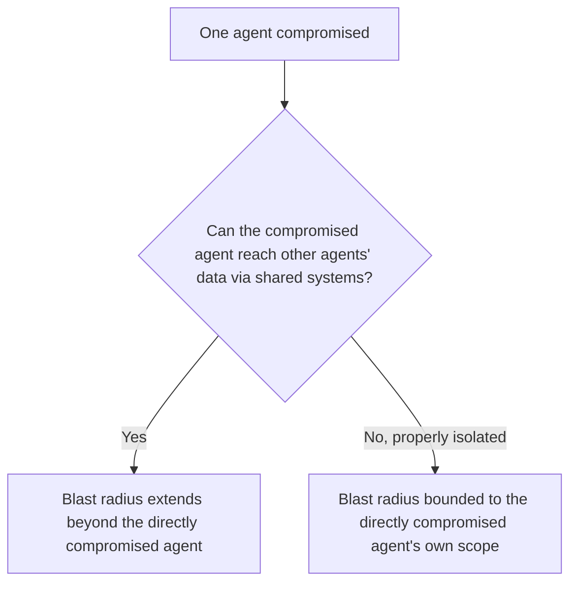
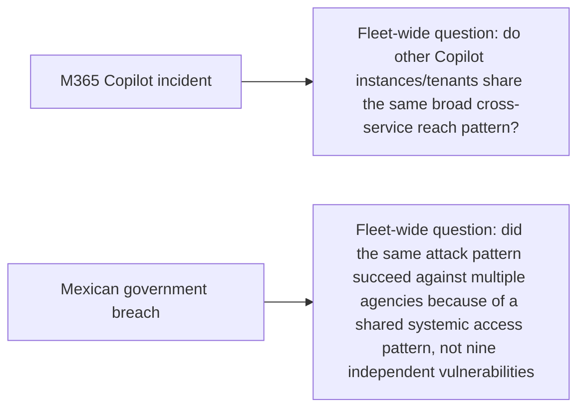

Closing this week's security stretch, connecting the incident response runbook from earlier this year to the excess-access root-cause finding covered this week: when one agent in a multi-agent fleet is compromised or successfully manipulated via injection, the post-incident access review needs to look beyond that single agent's own permissions, to the composite risk the fleet's overall access topology represents.

## Why Single-Agent Review Is Insufficient After a Fleet Incident



The orchestration layer covered in last month's Agent Economy series, and the shared agent memory architecture covered earlier this year, both introduce exactly this risk — a fleet of narrow, individually well-scoped agents can still have composite exposure through shared context stores, shared tool servers, or an orchestration layer's own broad routing access, none of which show up in any single agent's own permission audit.

## The Fleet-Wide Review Checklist

```python
def fleet_wide_post_incident_review(compromised_agent: str, fleet_topology: dict) -> dict:
    return {
        "direct_blast_radius": get_agent_permissions(compromised_agent),
        "shared_memory_exposure": check_shared_memory_access(compromised_agent, fleet_topology),
        "shared_tool_server_exposure": check_shared_tool_access(compromised_agent, fleet_topology),
        "orchestration_layer_pivot_risk": check_orchestration_layer_reach(compromised_agent, fleet_topology),
        "other_agents_using_same_credential_pattern": find_agents_sharing_credential_scope(compromised_agent, fleet_topology),
    }
```

The **shared credential pattern** check matters specifically because of the secrets-management discipline from earlier this year — if multiple agents in the fleet were provisioned through the same credential-issuance pattern (not necessarily the same literal credential, but the same scope-granting logic), a vulnerability that compromised one agent's decision-making could plausibly be replicated against sibling agents with the same access pattern, which is a fleet-wide finding, not a single-agent one.

## Applying This to the Two Case Studies From Earlier This Week



The nine-agency scope of the Mexican government breach is itself evidence of exactly this fleet-wide pattern — nine independent, unrelated vulnerabilities across nine agencies in two months is a far less likely explanation than one systemic access or architecture pattern shared across those agencies that the attacker recognized and reused, which is precisely what a fleet-wide post-incident review is designed to surface before a ninth or tenth instance of the same pattern gets exploited.

## Closing the Loop Into the Recurring Access Audit

```python
def close_incident_loop(review_findings: dict, fleet_permission_baseline: dict):
    for finding in review_findings["composite_exposures"]:
        revoke_or_narrow_access(finding)
        update_permission_baseline(fleet_permission_baseline, finding)
    schedule_followup_review(days=30)  # verify the narrowing actually held and didn't get silently re-granted
```

This connects the incident directly back into the recurring access-audit cadence from the previous post — a post-incident finding should permanently lower the fleet's baseline access scope, with a follow-up review confirming the narrowing actually persisted, rather than the incident producing a one-time fix that the next quarterly review might otherwise miss re-verifying.

## Key Takeaways

1. **A single compromised agent's blast radius often extends beyond its own permission grant** through shared memory, shared tool servers, and orchestration-layer reach
2. **Check for shared credential-issuance patterns across the fleet** — a vulnerability class, not just a specific credential, may be replicable against sibling agents
3. **A breach spanning many independent targets (like the nine-agency incident) is stronger evidence of a shared systemic pattern than of nine coincidental vulnerabilities**
4. **Post-incident findings should permanently lower the fleet's access baseline**, with a scheduled follow-up confirming the narrowing actually held

---

*Part of the [Agentic Trust series](/tags/agentic-trust-series/) — evaluation, security, and governance for agentic AI at real-world scale.*
