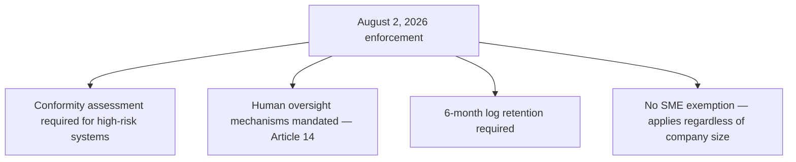
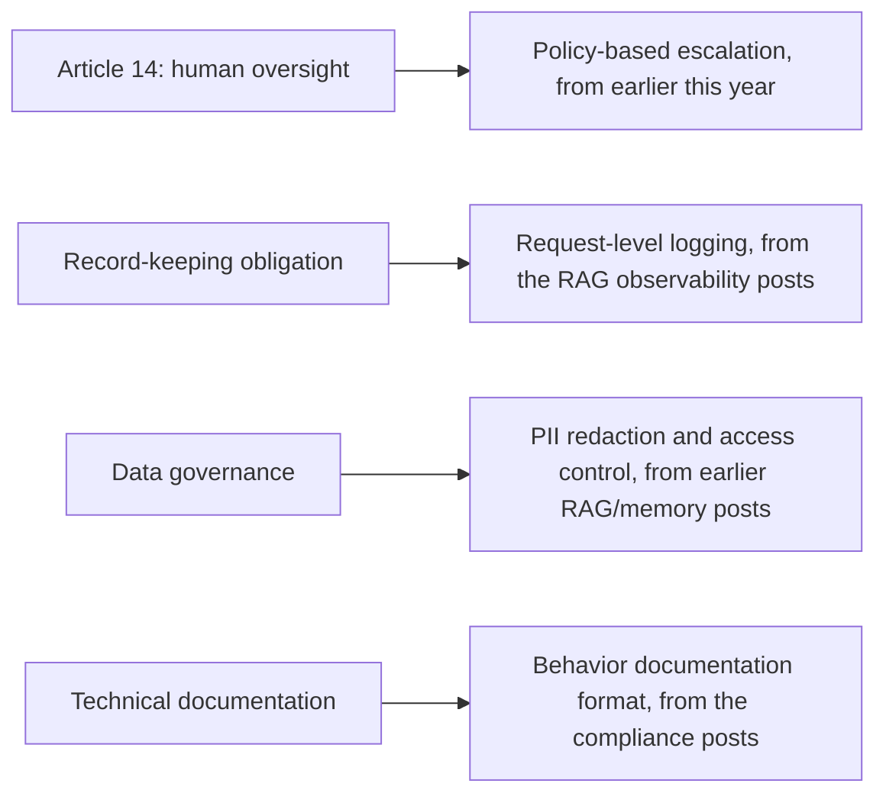

August 2, 2026 was enforcement day for the EU AI Act's Articles 8-17 covering high-risk AI obligations — risk management, data governance, technical documentation, record-keeping, transparency, human oversight, and robustness. Three months past that deadline, opening this series' governance week with what it actually required, and specifically how agentic AI's distinct autonomy characteristics interact with obligations largely written with more traditional AI systems in mind.

## What Changed on August 2nd, Concretely



Unlike GDPR, which carved out meaningful accommodation for smaller organizations, the EU AI Act's high-risk obligations apply without a company-size exemption — a real, specific difference from the compliance framework most engineering teams are more familiar with, and one that catches teams off guard if they assume AI Act compliance follows the same size-based tiering that GDPR familiarized them with.

## Why Agentic AI's Autonomy Specifically Complicates This

```python
def why_agentic_autonomy_complicates_compliance() -> str:
    return (
        "The Act's obligations were largely conceived around systems that "
        "produce a prediction or classification for human review — a credit "
        "scoring model, a resume screener. An agentic system's capacity to "
        "independently plan, execute, and adapt a SEQUENCE of actions with "
        "minimal human intervention generates heightened data-access and "
        "human-oversight obligations that don't map cleanly onto the "
        "single-decision-point model the obligations were written around."
    )
```

This is a real, currently-being-worked-out tension, not a solved problem — Article 14's human oversight requirement is comparatively straightforward to satisfy for a system making one discrete decision a human reviews before it takes effect; it's considerably less straightforward for a genuinely autonomous multi-step agent, where "the decision" isn't a single point but a sequence, and meaningful human oversight has to be designed into that sequence explicitly rather than bolted onto a single output.

## Mapping This to Infrastructure Already Covered on This Blog



The genuinely useful finding, three months into enforcement: teams that had already built the infrastructure this blog covered throughout the year for entirely operational reasons — escalation design, request logging, PII handling, behavior documentation — found themselves substantially closer to compliant than teams that hadn't, independent of whether compliance was ever the original motivation. This isn't coincidental; good operational practice and regulatory compliance evidence turn out to require largely the same underlying infrastructure, a point this blog made explicitly in the regulated-industries post from earlier this year.

## What Teams Are Actually Discovering Three Months In

For teams that hadn't built this infrastructure proactively, the August deadline forced a compressed retrofit — building request-level logging, access audits, and escalation design under regulatory deadline pressure rather than as deliberate engineering investment, which is a considerably worse position than building it proactively, both in engineering quality and in the actual compliance risk carried during the retrofit period itself.

## Key Takeaways

1. **The EU AI Act's high-risk obligations took effect August 2, 2026 with no SME exemption** — a real difference from the more familiar GDPR framework
2. **Agentic AI's multi-step autonomy doesn't map cleanly onto obligations written around single-decision-point systems** — this tension is still being actively worked out, not resolved
3. **Infrastructure built for operational reasons (escalation design, logging, PII handling, behavior documentation) turns out to substantially overlap with compliance evidence** — this wasn't coincidental, and this blog argued for exactly this connection earlier in the year
4. **Teams without this infrastructure faced a compressed, higher-risk retrofit under deadline pressure** — a strong argument for building compliance-adjacent infrastructure proactively, not reactively

---

*Part of the [Agentic Trust series](/tags/agentic-trust-series/) — evaluation, security, and governance for agentic AI at real-world scale.*
